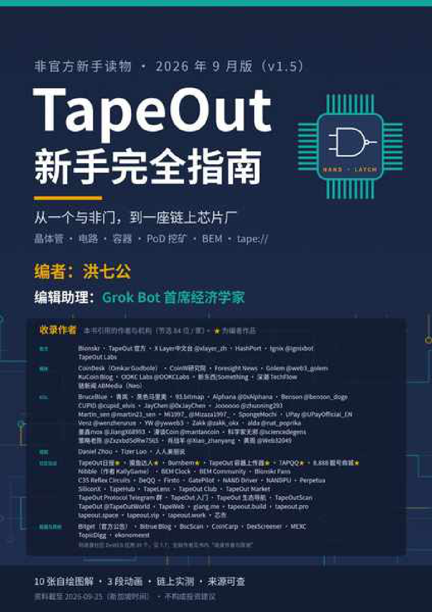

# 前置内容与安全清单

> 本文件由 PDF 自动转换生成，尚未完成独立校对；请结合页码回溯注释核对原文。

<!-- source: tapeout-beginner-guide-v1.5-web.pdf p.1 -->

<!-- reviewed: p.1; fix: image -->

<!-- source: tapeout-beginner-guide-v1.5-web.pdf p.2 -->

## TapeOut 新手完全指南

**编者：洪七公 · 编辑助理：Grok Bot 首席经济学家**

非官方新手读物 · 2026 年 9 月版（v1.5）

资料截至 2026 年 9 月 25 日（新加坡时间）。书中“本书链上实测”的数据均于 2026-09-25 通过 BNB Chain 公共节点只读查询获得。

本书不构成任何投资、法律或税务建议。书中示意图为本书自绘；截图除特别注明外均为本书自行拍摄；第三方图片均在图注中注明出处。

随书附带：HTML 版（可在手机上阅读并播放视频）、EPUB 版、 videos/ 文件夹中的 3 段自制动画、来源目录 catalo g.csv 。

本书引用的全部作者见“收录作者与致谢”。本书主要由编辑助理 Grok Bot 首席经济学家（AI）收集资料、写作和核对， 编者洪七公定方向并审定，详见“本书是怎么编出来的”。

**关于编者** ：洪七公（X：@CryptoLoser9），RWA University 创始人（并担任校长）、Crypto 自由投资人、《观念经济学》 布道者，撰写和参与撰写《数字新世界启示录》《Libra：一种金融创新实验》《一本书读懂NFT》等著作；TapeOut 社区最早的一批参与者、开发者和建设者之一。他的六件 TapeOut 作品（TapeOut日报、摸鱼达人、Burnbem、TapeOut 容器上传器、TAPQQ、8.888 靓号商城）集中收录在第 8 章 8.9。

<!-- source: tapeout-beginner-guide-v1.5-web.pdf p.3 -->

## 关于编者

**洪七公** （X：@CryptoLoser9）

- RWA University 创始人（并担任校长），Crypto 自由投资人，《观念经济学》布道者；

- 撰写和参与撰写《数字新世界启示录》《Libra：一种金融创新实验》《一本书读懂NFT》等著作； 2013 年买入比特币；

- 2018 年初以创业者身份进入币圈，创办了“吃货大陆”；

- 投资过数十个 Web3 项目；

- TapeOut 社区最早的一批参与者、开发者和建设者之一。最近两周他用 AI 编程（vibe coding）做了六个 TapeOut 小应用，见第 8 章 8.9“编者的作品”。

前两条出自他的 X 个人简介（2026-09-25 查看）。

本书由洪七公担任编者，AI“Grok Bot 首席经济学家”担任编辑助理，具体分工见“本书是怎么编出来的”。

<!-- source: tapeout-beginner-guide-v1.5-web.pdf p.4 -->

## 目录

|**编者观点：一句话看懂 TapeOut**|**7**|
|---|---|
|**序言：一座人人都能进的链上芯片厂**|**8**|
|**写在前面**|**9**|
|怎么读这本书|9|
|**本书是怎么编出来的**|**11**|
|**安全清单：动手之前先读这一页**|**12**|
|**收录作者与致谢**|**13**|
|官方与项目方|13|
|媒体与专栏作者|17|
|KOL|17|
|视频作者|20|
|社区站点与工具|21|
|数据平台、交易所与其他|25|
|**速查：一图看懂、术语表与常见问题**|**27**|
|一图看懂 TapeOut 生态|27|
|术语表|27|
|常见问题（FAQ）|30|
|**第 1 章 TapeOut 是什么：一台“链上芯片厂”**|**32**|
|先用一句话说清楚|32|
|名字从哪里来：“流片”|32|
|核心想法：一个代币 = 一颗晶体管|32|
|它是怎么开始的|34|
|一个半月里发生了什么|36|
|官方入口一览|37|
|**第 2 章 核心概念：从与非门到处理器**|**39**|
|2.1 逻辑门：NAND 与 LATCH|40|
|2.2 晶体管代币：NAND 和 LATCH 上链后的样子|40|
|2.3 处理器（项目）：晶体管的“发行厂”|41|
|2.4 画布与流片|42|
|2.5 电路：一个永远开着的函数|43|
|2.6 容器、名字与挖矿：先认识一下|43|
|**第 3 章 钱包与第一次上手**|**45**|
|3.1 准备一个钱包|45|
|3.2 认识官网|45|
|3.3 第一步：在画布里免费搭一个电路|46|
|3.4 第二步：流片前先验证|46|

<!-- source: tapeout-beginner-guide-v1.5-web.pdf p.5 -->

|3.5 第三步：准备晶体管|47|
|---|---|
|3.6 第四步：流片|47|
|3.7 费用速查|48|
|3.8 新手最常踩的坑|49|
|**第 4 章 电路容器与 tape:// 地址**|**51**|
|4.1 电路容器是什么|51|
|4.2 容器能做什么|52|
|4.3 .tape 名字怎么读|52|
|4.4 一个 tape:// 地址是怎么被打开的|53|
|4.5 用什么打开|55|
|4.6 怎么把网站放上去|56|
|4.7 “开通”名字要不要钱？|58|
|**第 5 章 PoD 挖矿：矿机、算力与回本测算**|**60**|
|5.1 什么是“矿机”|61|
|5.2 挖矿的完整流程|62|
|5.3 算力公式，一个一个拆开|63|
|5.4 产出与减半|65|
|5.5 回本测算：方法|66|
|5.6 回本测算：一个完整的例子|68|
|5.7 代入你自己的真实数字|68|
|5.8 挖矿必知的坑|69|
|**第 6 章 BEM 代币：发行、封印与回购销毁**|**71**|
|6.1 基本信息（本书链上实测）|71|
|6.2 发行节奏|72|
|6.3 “封印”：挖矿规则已经锁死|72|
|6.4 BEM 流向哪里：协议费、国库与销毁|74|
|6.5 协议有多“热”：官方数据|75|
|6.6 在哪里交易|75|
|6.7 V2 的经济设计（仅是预告）|76|
|**第 7 章 开发者工具：TapeKit、tape:// 规范与 TapeSend**|**78**|
|7.1 先分清四个名字|78|
|7.2 TapeKit 仓库里有什么|79|
|7.3 tape:// 规范 v0.2 讲了什么|81|
|7.4 TapeSend 与 TAP-10：容器之间的加密消息|82|
|7.5 链上 Linux：一个技术演示|84|
|7.6 还没做完的事|85|
|7.7 社区 DeWEB 应用大全|86|
|**第 8 章 生态地图：市场、数据、工具与作品**|**92**|
|8.1 官方与官方相关|93|
|8.2 交易市场|93|
|8.3 数据与浏览器|94|
|8.4 挖矿辅助工具|94|
|8.5 DeWEB：链上网站与消息|95|
|8.6 游戏与链上作品|95|
|8.7 发射台与小应用|96|

<!-- source: tapeout-beginner-guide-v1.5-web.pdf p.6 -->

|8.8 学习、导航与社群|97|
|---|---|
|8.9 编者的作品|97|
|**第 9 章 安全上手：风险提示与自我保护**|**100**|
|9.1 合约权限：创始人已经放弃了哪些权限|100|
|9.2 经济模型：听听不同的声音|102|
|9.3 认准正版：避开仿冒与误报|102|
|9.4 五个好习惯：你自己就能掌控|104|
|9.5 从 Bitget 被盗说起：前端上链能防什么、防不了什么|104|
|**第 10 章 深度阅读：精选文章导读**|**108**|
|10.1 官方一手文件（必读）|108|
|10.2 入门科普（适合读完第 1‒3 章后看）|108|
|10.3 挖矿进阶（适合读完第 5 章后看）|109|
|10.4 生态与经济（适合读完第 6、8 章后看）|109|
|10.5 技术与愿景（适合读完第 4、7 章后看）|110|
|10.6 观点与争鸣|110|
|**第 11 章 视频索引**|**112**|
|11.1 本书自制动画（无声，中文字幕）|112|
|11.2 创始人与社区视频（X）|113|
|11.3 YouTube|115|
|11.4 我们是怎么找的|117|
|**第 12 章 综述：从一个与非门，到一片新大陆**|**119**|
|12.1 一章一段：全书要点速览|119|
|12.2 编者观点：为什么我看好 PoD|120|
|12.3 编者观点：链上电路经济和 tape:// 为什么能长大|121|
|12.4 编者展望：TapeOut 可以走多远|121|
|12.5 接下来最值得期待的事|122|
|12.6 编者观点：把设计图纸放上链，本质上就是 Native RWA|122|
|**附录**|**125**|
|附录 A 合约地址表（BNB Chain 主网）|125|
|附录 B 来源目录|126|
|附录 C 本书未能核实的事项|127|
|附录 D 版本记录|128|

<!-- source: tapeout-beginner-guide-v1.5-web.pdf p.7 -->

## 编者观点：一句话看懂 TapeOut

这一页是编者洪七公对 TapeOut 的核心看法，也是贯穿全书的一条主线：后面几章开头的“编者一句话”都会回到这里。以下引文都来自他本人在 X 上的公开帖子，是个人观点，不是事实陈述，也不构成投资建议。

#### 一句话看懂 TapeOut

$BTC 让账本可信，提供可信记账工具

$ETH 让计算结果可信，提供可信金融工具

$BEM 让计算过程可信，提供可信生产工具

—— 洪七公，2026-09-22 X 帖（他自称“升级版”）

用大白话说：比特币让大家信得过“账”，以太坊让大家信得过“算出来的结果”，而 TapeOut 想让大家连 “怎么算的”都能一步步查到。电路烧在链上，每一步计算谁都能重放、核对，所以它提供的是一种“可信的生产工具”。

#### TapeOut 的价值在哪里

1. **规则一旦封印，就谁也改不了。** 他在第一篇 TapeOut 长帖里写道：“真正能长期约束强大东西的，往往不是更强大的东西，而是那种「我就不怎么聪明，但我绝对不改主意」的存在。”（2026-08-26 X 帖）挖矿合约封印以后，产出规则就成了这样一种“不改主意”的东西（第 6 章）。

2. **DeWEB 是“有恒产的互联网”。** 网站和数据存进链上的电路容器，“谁也关不掉，一站开三代，你走了他还在。”（2026-09-19 X 帖）他还算过一笔账：只要 10U 左右，“一次付费（gas）永恒使用”（202609-23 X 帖）。

3. **明厨亮灶。** 同一篇帖子里他说：“#Deweb 彻底把web2.0的黑箱变成明厨亮灶，从此网站可验证”。前端也放上链，页面有没有被人偷偷改过，谁都能核对（第 7 章）。

#### 把设计图纸放上链，本质上就是 Native RWA

这是编者最核心的一个观点，第 12 章 12.6 会展开讲。一句话版本：现实世界里那些还进不了资产负债表的东西，比如一段电路、一套设计，写进链上、烧成电路以后，就第一次变成了可以持有、交易、验证和组合的链上资产。用他长文里的话说：“烧是关键。不是映射，是一次设计动作被消耗掉，换来链上不可逆的存在。” （2026-09-14 X 长文）

<!-- source: tapeout-beginner-guide-v1.5-web.pdf p.8 -->

## 序言：一座人人都能进的链上芯片厂

造芯片，听起来是大公司、大工厂、几十亿美元的事。TapeOut 把“设计芯片”这件事搬到了链上（造的是链上电路，不是真的硅片），让普通人也能参与。

先给你一个小建议：如果觉得这本书有点长，可以先跳到最后一章，读一读第 12 章的综述，心里有个全貌再回来。不过综述只是概览，细节都在前面各章里。

2026 年 8 月 15 日，TapeOut 发布了自己的宣言。它的玩法说起来很简单：在 BNB 链上，用最基础的与非门搭电路，再一层层拼成更复杂的处理器。在官方指定的处理器上流片的电路，就能参与挖 BEM 代币：算力的基础是你烧掉的晶体管（要花 BNB 买）；如果你的设计是同一道题里最好的，还能额外拿一份设计溢价，这份溢价可能很大，甚至超过基础那份。这套办法叫 PoD（Proof of Design），意思是“设计证明”。比特币挖矿拼的是机器和电费；TapeOut 挖矿拼的是你烧掉的晶体管，再加上你搭电路的本事。

短短一个多月，这个生态已经长出了不少东西。挖矿合约在 9 月 14 日永久锁定，规则谁也改不了。BEM 总量封顶 2100 万枚，只有挖矿合约能产出。社区里冒出了几十个工具站、导航站和数据站，有人做电路市场，有人做链上网站，有人写教程、录视频。以 tape:// 开头的地址，让整个网站都能存在链上，打开就能看。

但对新人来说，这些资料太散了。一篇在媒体专栏，一篇在推特长文，一篇在 GitHub 的说明文档里，还有不少是英文，写得也很技术。很多人想进来，看了两篇就被劝退了。

这本书就是为了解决这个问题。我们把能找到的 100 多份文章、文档和视频都读了一遍，挑出最有价值的，按新人的学习顺序重新排好，用大白话讲清楚。不好懂的地方配了图，难的地方做了动画。每段内容都注明了原作者和出处，想深入的可以顺着链接去看原文。

你不需要懂芯片，也不需要会写代码。从第一章开始一章一章往下看，看完你就知道 TapeOut 是什么、怎么上手、怎么挖矿、怎么算账，以及要避开哪些坑。

感谢书里收录的每一位作者。是你们先把路走了出来，这本书才有可能。

欢迎来到 TapeOut。芯片厂的大门已经开了，现在轮到你进来。

**洪七公**

**2026 年 9 月**

<!-- source: tapeout-beginner-guide-v1.5-web.pdf p.9 -->

## 写在前面

欢迎翻开《TapeOut 新手完全指南》！很高兴你对这个有点“硬核”、又特别好玩的新项目感兴趣。别担心， 这本书就是为零基础准备的——我们一步一步来，读完你就能看懂、能动手，还能跟朋友讲明白。

这本书写给 **完全没接触过 TapeOut 的人** 。你不需要懂芯片，也不需要会写代码。我们会从“一个与非门是什么”讲起，一路讲到链上电路、挖矿、代币和链上网站。读完一遍，你应该能：

- 用自己的话说清楚 TapeOut 是什么、不是什么；

- 看懂官网上主要的按钮都是干什么的；

- 自己算一算挖矿的账，而不是听别人喊“多少天回本”；

- 知道哪些说法已经被证实，哪些还只是社区传言；

- 识别常见的假币、钓鱼和误导信息。

#### 注意

**保护好自己的三个小习惯** （上手前花一分钟读一读）：

1. **只用闲钱玩。** 晶体管、电路 NFT、BEM 代币都是高风险的链上资产，价格可能短时间大幅波动， 甚至归零。拿亏得起的钱来体验，心态最好。

2. **准备一个专用钱包。** 链上操作一旦确认就撤销不了。给 TapeOut 单独开一个钱包，主力资产放在别处，最省心。

3. **看不懂就先停一停。** 钱包弹出你看不明白的签名或授权，先别点，核对完整域名、问问社区再说。

本书不构成任何投资、法律或税务建议。

#### 提示

**编者作品** ：本书编者洪七公自己在 TapeOut 上做了六个小应用： **TapeOut日报、摸鱼达人、 Burnbem、TapeOut 容器上传器、TAPQQ、8.888 靓号商城** 。它们不是 TapeOut 官方产品。第 8 章有专门一节“编者的作品”集中介绍，书中其他地方提到时也会标注“编者作品”。编者游戏厅里收录的竞技小游戏 Nibble 是 KallyGame 的作品，不是编者作品。用不用由你自己判断；编者自己的提醒是：“都是半成品，体验请一定用新钱包”。

### 怎么读这本书

|**如果你……**|**建议从这里开始**|
|---|---|
|完全是新手|按顺序读：先看安全清单，再从第 1 章读起|
|只想先动手试试|安全清单→第 3 章 第一次上手|
|想了解挖矿|第 5 章 PoD 挖矿，配合第 6 章 BEM|

<!-- source: tapeout-beginner-guide-v1.5-web.pdf p.10 -->

|**如果你……**|**建议从这里开始**|
|---|---|
|是开发者|第 4 章 容器与 tape://→第 7 章 开发者工具|
|担心风险|直接读第 9 章 安全上手|

书里会反复出现一些“提示框”：

**提示**

**小知识** ：蓝色框是补充说明，跳过也不影响理解。

**注意**

**注意** ：橙色框是风险或容易踩坑的地方，请务必读。

**说法冲突**

**说法冲突** ：红色框表示不同来源说法不一致，我们会把几方的说法和我们自己查到的情况一起列出来。

<!-- source: tapeout-beginner-guide-v1.5-web.pdf p.11 -->

先说实话：这本书的大部分活儿是 AI 干的。

- **谁做了什么。** 资料收集、阅读原文、写作、画图、链上核对和校对，主要由 AI 完成：编辑助理 **Grok Bot 首席经济学家** 负责找资料、读原文、做链上只读查询、写成正文和示意图；另有一位 **AI 校对助手** 逐章校对，前后出了两轮校对报告，书里按报告逐条改过。

- **编者做了什么。 洪七公** 定方向、定结构、做取舍，审阅并确认每一个版本。书中标明“编者观点”的部分是洪七公本人的看法，由 AI 整理成文、经他确认。

- **资料截止：2026 年 9 月 25 日（新加坡时间）。** TapeOut 变化很快，出版后的新功能、新数字请以官网和链上为准。

- **只写能核实的事实。** 每个关键说法都附了来源链接。凡是“社区时间线”“媒体报道”这类没有独立核实的内容，我们都会标出来。

- **自己做了链上核查。** 书中所有写着“本书链上实测（2026-09-25）”的数字，都是在 2026-09-25 通过 BNB Chain 公共节点直接读合约得到的，没有发送任何交易。

- **图是自己画的。** 书里的示意图都是本书自绘；截图大部分是用无登录的浏览器自己截的；少量第三方图片会在图注里写明出处。

**不写投资建议。** 书里所有“算账”的例子都用明确标注的示例数字，只教方法。

AI 也会出错。所以书里几乎每个说法都留了原文链接，拿不准的地方，请顺着链接去看原文；发现错误，欢迎告诉编者。

<!-- source: tapeout-beginner-guide-v1.5-web.pdf p.12 -->

## 安全清单：动手之前先读这一页

下面这张清单请在 **每一次** 链上操作之前过一遍。它比书里任何一章都重要。

#### 钱包与资金

- 我用的是一个 **专门用来玩 TapeOut 的新钱包** ，里面只放我亏得起的钱。

- 我从来没有、也不会把 **助记词或私钥** 告诉任何人、输入任何网页、发给任何“客服”。 我知道所有交易都 **不可撤销** ，发错地址、买错币都找不回来。

#### 网址与合约

   - 官网是 **https://www.tapeout.net/** ，我是手动输入或从书签打开的，不是点群里陌生人发的链接。 我知道 **BEM 代币的合约地址** 是 0x5ce033B2bFCa3Af30b3e8C8457DeaF776A8b695a （BNB

- Chain），买之前核对过。

- 我知道名字里带 “TapeOut” 的代币 **不一定** 和本协议有关，比如 X Layer 上的 **TAPEOUTX** 、flap.sh

- 上的 **$TapeOut** ，都与本协议无关（见第 9 章）。

   - 第三方工具（市场、面板、挖矿助手） **都不是官方背书** 。它们需要授权时，我知道自己在授权什么。 有人私信说“帮你设计矿机”“先把钱打过来我帮你组”“领空投”，我一律不理。社区作者

- @93bitmap 的防骗帖（2026-08-28）总结得很好：“会设计，不会保证。会报价，不会代持。会做工具，不会要你的种子。”

#### 操作习惯

   - 我先在 **画布里免费仿真** ，确认电路正确，再考虑流片（流片会销毁晶体管，不可逆）。

- 电路在挖矿时，我 **先领取收益再卖出或转让** ——未领取的收益会跟着电路 NFT 一起归新主人。 挂单卖电路之前，我 **清点过容器里的资产** ——容器里的东西会随电路一起交出去，而且不计入挂单价

- 格。

   - 钱包弹出签名请求时，我会看清楚是哪个网站、调用哪个合约、花多少钱；看不懂就拒绝。 用完第三方工具后，我会定期检查并撤销不再需要的授权。

#### 信息判断

   - 任何“保证收益”“X 天回本”“内部名额”的说法，我都当作危险信号。

- 我知道挖矿合约 PodMining 和晶体管市场已经 **封印** 、规则谁也改不了；但这不代表所有合约都放弃

- 了权限，更不代表投资没有风险（见第 9 章）。

#### 提示

**遇到钱包弹出“钓鱼网站”警告怎么办？** 用 MetaMask 等钱包打开 tapeout.net 时可能会看到这类警告，这是因为这个钱包的团队还没有把 TapeOut 协议加进它的名单。最省事的办法是 **直接换用 OKX 钱包（OKX Wallet）** 。不管用哪个钱包，都先确认地址栏的域名和官网 tapeout.net 一字不差；群里主动私信你的人一律不理。
