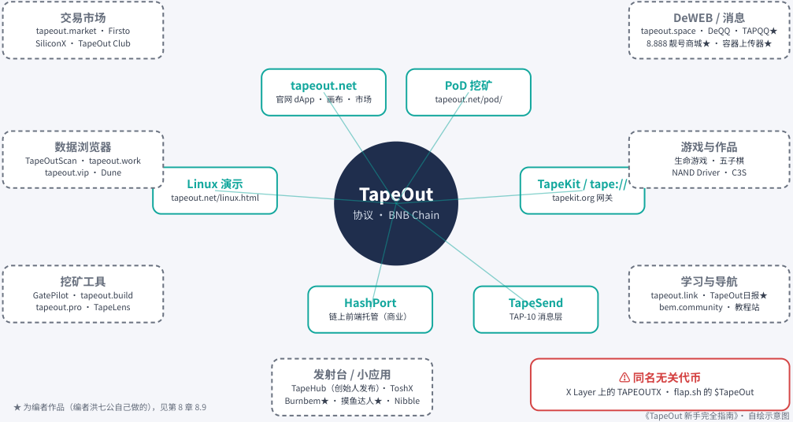

# 速查、生态图与常见问题

> 本文件由 PDF 自动转换生成，尚未完成独立校对；请结合页码回溯注释核对原文。

<!-- source: tapeout-beginner-guide-v1.5-web.pdf p.27 -->

## 速查：一图看懂、术语表与常见问题

### 一图看懂 TapeOut 生态

### TapeOut 生态地图（2026-09）

内圈：官方 / 官方相关；外圈：社区与第三方（非官方背书）；红框：同名无关项目

<!-- Start of picture text -->
交易市场 DeWEB / 消息 tapeout.market · Firsto tapeout.space · DeQQ · TAPQQ★ SiliconX · TapeOut Club 8.888 靓号商城★ · 容器上传器★ tapeout.net PoD 挖矿 官网 dApp · 画布 · 市场 tapeout.net/pod/ 数据浏览器 游戏与作品 TapeOutScan · tapeout.work 生命游戏 · 五子棋 tapeout.vip · Dune NAND Driver · C3S Linux 演示 TapeKit / tape:// tapeout.net/linux.html TapeOut tapekit.org 网关 协议 · BNB Chain 挖矿工具 学习与导航 GatePilot · tapeout.build tapeout.link · TapeOut日报★ tapeout.pro · TapeLens HashPort TapeSend bem.community · 教程站 链上前端托管（商业） TAP-10 消息层 发射台 / 小应用 ⚠ 同名无关代币 TapeHub（创始人发布）· ToshX X Layer 上的 TAPEOUTX · flap.sh 的 $TapeOut Burnbem★ · 摸鱼达人★ · Nibble ★ 为编者作品（编者洪七公自己做的），见第 8 章 8.9 《TapeOut 新手完全指南》· 自绘示意图 <!-- End of picture text -->

TapeOut 生态地图（本书自绘，2026-09）。内圈是官方或官方相关产品，外圈是社区与第三方工具，红框是同名但无关的代币。 详细介绍见第 8 章。

一句话版本： **TapeOut 是 BNB Chain 上的一套“链上造芯片”协议** 。你用“晶体管代币”在画布上搭电路， 把电路“流片”成 NFT；合格的电路可以参与 **PoD 挖矿** 产出 **BEM** 代币；每个电路还能开一个 **容器** ，容器可以存资产、挂一个 **tape://** 链上网站、收发加密消息。

### 术语表

按大致的学习顺序排列。第一次在正文出现时，我们也会再解释一遍。

|**术语**|**一句话解释**|**详见**|
|---|---|---|
|**TapeOut（协议）**|BNB Chain 上的链上电路协议，官网 tapeout.net。名字借用了芯片行业“流 片”的说法|第 1 章|
|**流片（Tape-out）**|把画布上的设计正式写上链：销毁所用 的晶体管，生成一枚电路 NFT。不可逆|第 2、3 章|

<!-- source: tapeout-beginner-guide-v1.5-web.pdf p.28 -->

|**术语**|**一句话解释**|**详见**|
|---|---|---|
|**NAND（与非门）**|最基础的逻辑门：两个输入都是 1 时输 出 0，否则输出 1。任何计算都能用它搭 出来|第 2 章|
|**LATCH（锁存器）**|能记住 1 位状态的元件，每次“心跳” 更新。有了它，电路才有记忆|第 2 章|
|**晶体管代币**|NAND 和 LATCH 在链上的形态，是 ERC- 1155 代币，可以铸造、买卖|第 2 章|
|**ERC-1155 / ERC-721**|以太坊系的两种代币标准。前者适合 “同一种东西很多份”（晶体管），后者 是“独一无二”的 NFT（电路）|第 2 章|
|**处理器（项目）**|由工厂合约创建的“晶体管发行厂”，每 台有自己的晶体管和电路编号。0 号是 Genesis CPU|第 2 章|
|**工厂合约（Factory）**|创建处理器的合约|第 2 章|
|**Behemoth（巨兽）**|官网把 1 号处理器（链上名 Blonskr_No1）叫作 Behemoth，挖矿 系数 P=6。这个名字来自宣言里创始人 那台对标 Intel 4004 的链上 CPU|第 2、5 章|
|**画布（Canvas）**|官网上的电路设计工具，在你的浏览器 里实时仿真，免费|第 3 章|
|**电路 NFT**|流片后得到的 ERC-721 NFT，电路逻辑 以数据形式存在链上，任何人都能免费 调用|第 2 章|
|**测试向量**|官方给每道题准备的“标准考题”：一组 组“输入 → 标准答案”。挖矿时合约从 里面抽几道来核对你的电路|第 5 章|
|**REF（引用）**|在新电路里把别人已有的电路当“黑盒” 复用。当前版本的挖矿规则**禁止**带引用 的电路参与|第 5 章|
|**电路容器**|绑定在电路 NFT 上的链上账戶（ERC- 6551），没有私钥，谁持有电路谁控制它|第 4 章|
|**ERC-6551**|让一枚 NFT 拥有自己的智能合约账戶的 标准，也叫“代币绑定账戶”|第 4 章|
|**tape://**|TapeOut 链上网站的地址格式，例如 ta pe://4246.0.tape/|第 4 章|
|**.tape 名字**|写作 <电路#ID>.<处理器编号>.tape ，例 如 4246.0.tape|第 4 章|
|**TapeKit**|官方开源工具包：读链、校验并打开 tape:// 网站的内核、网关、扩展|第 7 章|
|**HashPort**|基于 TapeKit 的商业托管服务，帮你把 网站上传到容器|第 4、7 章|

<!-- source: tapeout-beginner-guide-v1.5-web.pdf p.29 -->

|**术语**|**一句话解释**|**详见**|
|---|---|---|
|**TapeSend / TAP-10**|容器之间收发加密消息的“DeWEB 消息 层”，TAP-10 是它的规范编号|第 7 章|
|**端点（Endpoint）**|TapeSend 里的收件地址，由链 ID 和容 器地址拼成|第 7 章|
|**DeWEB**|官方对“去中心化网站 + 消息”这一层 的叫法|第 4、7 章|
|**PoD（Proof of Design，设计证明）**|TapeOut 的挖矿机制：按你烧掉的晶体 管和设计质量分配 BEM|第 5 章|
|**矿机**|社区对“正在参与 PoD 挖矿的电路”的 俗称|第 5 章|
|**算力 H**|你的电路在挖矿中的权重，由官方公式 计算|第 5 章|
|**最优首创**|某道题在某台处理器上设计成本最低的 那一枚电路，能额外拿“设计溢价”|第 5 章|
|**已验证池 / 未验证池**|每日产出的 99% 和 1%。解出题并通过 抽检的进前者|第 5 章|
|**BEM**|PoD 挖矿产出的代币，上限 2,100 万枚|第 6 章|
|**封印（seal）**|合约管理员永久放弃升级权。封印后规 则不能再改|第 6、9 章|
|**Timelock（时间锁）**|让管理操作必须等待一段时间（这里是 48 小时）才能执行的合约|第 6 章|
|**内存池 / MEV**|交易正式上链前要在公开的“排队区” （内存池）里等几秒；有人趁这时偷 看、抢先下单，这类行为统称 MEV|第 3 章|
|**salt**|一串只有你知道的随机数。流片时官网 把它存在你电脑上的备份文件里，用来 证明设计是你先做的|第 3、5 章|
|**gas**|在 BNB Chain 上执行交易要付的手续 费，用 BNB 支付|第 3 章|
|**流片协议费**|每次流片要额外付给协议的一小笔 BNB （2026-09-12 起；本书 9 月 25 日链上读 到 0.0002 BNB），进协议国库|第 3、6 章|
|**PancakeSwap / DEX**|DEX 是“去中心化交易所”，在链上直接 兑换代币；PancakeSwap 是 BNB Chain 上最大的一家|第 6 章|
|**TapeHub**|创始人 2026-09-15 发布的矿币发射平台 （tapehub.ai），国库收入的 50% 用于 回购并销毁 BEM|第 6、8 章|

<!-- source: tapeout-beginner-guide-v1.5-web.pdf p.30 -->

|**术语**|**一句话解释**|**详见**|
|---|---|---|
|**X Layer / Base**|另外两条区块链。2026-09-19 TapeOut|第 4、7 章|
||已部署到 X Layer 主网（区号 2），Base||
||（区号 3）还在计划中。BEM 挖矿仍只 在 BNB Chain 上||

### 常见问题（FAQ）

**问：TapeOut 是在区块链上造真的芯片吗？** 答：不是。它造的是“链上电路”：逻辑门是代币，电路是 NFT， 运行靠链上合约。“流片”只是借用了芯片行业的说法。它和半导体行业里真正的芯片流片没有关系。（第 1、2 章）

**问：谁做的？是官方团队吗？** 答：创始人是 X（推特）用戶 @Blonskr，自述 16 岁。GitHub 组织 TapeOutProtocol 的公司字段是 “TapeOut Labs”。其他团队信息主要来自社区整理，未独立核实。（第 1 章）

**问：参与要花多少钱？** 答：画布仿真免费。真正上链的操作都要花 BNB：买晶体管（能挖矿的两台处理器晶体管已铸满，要按市场成交价买，另付 1% 手续费）、流片（流片协议费 + gas；协议费本书 9 月 25 日链上读到 0.0002 BNB）、创建处理器（官网标 0.001 BNB）、开容器（BNB Chain 上官网标 0.012 BNB；X Layer 上是 0.08 OKB）等。入场前把成本算清楚，别低估。具体以官网当时显示为准。（第 3、4 章）

**问：挖矿需要显卡或矿机吗？** 答：不需要显卡。官方的说法是“唯一的成本是你在链上不可逆地销毁掉的晶体管”——这些晶体管要花 BNB 买，每一份算力背后都要有烧掉的晶体管。所谓“矿机”就是一枚合格的电路 NFT；设计是某道题里最好的，还能额外拿一份设计溢价，这份溢价可能很大，甚至超过基础那份。（第 5 章）

**问：挖矿多少天能回本？** 答：没人能保证。收益取决于全网算力、你的设计质量和 BEM 价格，这三样每天都在变。第 5 章教你自己算，并用 **示例数字** 演示了一遍。

**问：BEM 总量多少？还会增发吗？** 答：上限 2,100 万枚，唯一能铸造的是挖矿合约，每天产出 7,200 枚，约每 4 年减半。挖矿合约已经封印，规则谁也改不了。已铸造约 23.18 万枚（合约 totalSupply，本书链上实测，截至 2026-09-25 15:21 新加坡时间），约占上限的 1.1%。（第 6 章）

**问：X Layer 上的 TapeOut 能挖 BEM 吗？** 答：不能。X Layer 中文台 @xlayer_zh 的部署公告（2026-09-19） 写明“PoD 挖矿经济体系不受影响，仍以 BNB Chain 为中心”；社区作者 YW（@ywweb3）的《6 问 6 答》 （2026-09-23）也提醒：X Layer 不产出 BEM，只有 BNB Chain 上 Behemoth / TapeOut 处理器的电路能挖。X Layer 上可以建处理器、开容器（0.08 OKB）、发消息，也能放网站（网站仓库地址和 BNB Chain 不同；官网前端在 X Layer 上目前只能开通和查看容器，建站前先确认工具支持，见第 4 章）。（第 4、7 章）

**问：合约安全吗？** 答：先说链上能确认的：创始人 @Blonskr 已经把挖矿合约 PodMining 和晶体管市场 **封印** （owner 是零地址），挖矿规则谁也改不了；BEM 代币没有管理员，只有挖矿合约能铸币。这不代表所有合约都已放弃权限，也不代表没有风险。新协议还在快速成长，保护好自己最重要：用专用钱包、只放闲钱、助记词绝不给任何人、看不懂的签名先别点。（第 9 章）

**问：tape:// 网站用普通浏览器能打开吗？** 答：能。通过官方网关，例如 https://4246-0.tapekit.org/ ， 不用装任何东西。（第 4 章）

<!-- source: tapeout-beginner-guide-v1.5-web.pdf p.31 -->

**问：买了一个带“TapeOut”名字的代币，它是官方的吗？** 答：很可能不是。本协议的代币是 BEM，合约 0x 5ce0…695a 。X Layer 上的 TAPEOUTX、flap.sh 上的 $TapeOut 都与本协议无关。（第 9 章）

**问：官方 X 账号和电报群是哪个？** 答：官网和 GitHub 都没有链接任何社交账号。能查到的线索是： @TapeOutWorld 看起来由项目方运营（依据：9 月 22 日中秋帖用“我们 / 主办方”的口吻；有第三方教程把它列为黑客松联合主办方，但 IGNIX 原帖没提），不过官网和创始人都没有正式声明，本书按“未核实是否官方”处理；创始人 @Blonskr 的 X 主页“位置”一栏填的是 t.me/TapeOutnet 这个 Telegram 群，同样没有正式声明。重要公告请以创始人本人的账号 @Blonskr 为准。（第 1 章）
