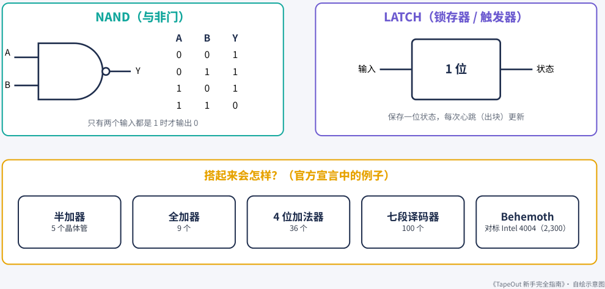
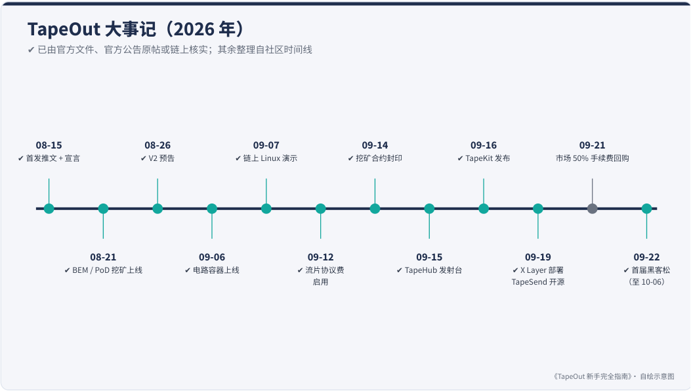

# 第 1 章：TapeOut 是什么

> 本文件由 PDF 自动转换生成，尚未完成独立校对；请结合页码回溯注释核对原文。

<!-- source: tapeout-beginner-guide-v1.5-web.pdf p.32 -->

## 第 1 章 TapeOut 是什么：一台“链上芯片厂”

### 先用一句话说清楚

**TapeOut 是运行在 BNB Chain 上的一套协议：它把“逻辑门”做成代币，让任何人都能用这些代币在链上搭电路、造处理器。**

#### 编者一句话

编者洪七公的说法更短：“BTC 让账本可信，ETH 让计算结果可信，BEM 让计算过程可信。”比特币让人信得过账，以太坊让人信得过算出来的结果，TapeOut 想让“怎么算的”也能在链上一步步查到。详见本书开头的“编者观点”。

官网 tapeout.net 的标题说得很直白：区块链上不光能放钱，还能放“谁都能验证的生产工具”，比如一块块能真正计算的电路。官网的中文副标题是“链上硬件制造商基础设施”。

#### 提示

**BNB Chain 是什么？** 一条公共区块链（也叫 BSC，BNB Smart Chain），与以太坊兼容，交易手续费用 BNB 支付。本书提到的“链上”，没有特别说明时都指 BNB Chain 主网。

### 名字从哪里来：“流片”

“Tape-out”（流片）是半导体行业的术语：芯片设计完成后，把设计交给晶圆厂去制造，这一步叫流片。

TapeOut 借用了这个词。在这里，“流片”指的是：你在网页画布上设计好电路，点下按钮， **你用掉的“晶体管代币”被销毁，链上诞生一枚代表这个电路的 NFT** 。它和真实的芯片制造没有关系——没有硅片，没有工厂，一切都是链上的数据和合约。

#### 注意

**别搜错了** ：网上搜 “tapeout” 会出来大量半导体行业的内容（例如开源芯片项目 Tiny Tapeout）。它们与本书讲的 TapeOut 协议毫无关系。

### 核心想法：一个代币 = 一颗晶体管

2026 年 8 月 15 日，TapeOut 发布了一份 5 页的中文宣言《TapeOut 链上微处理器宣言》，署名 @Blonskr。 它的开头只有几句话：

<!-- source: tapeout-beginner-guide-v1.5-web.pdf p.33 -->

我在 BNB Chain 上定义了一种新的 Token。……一个 Token，就是一颗晶体管。 ——《TapeOut 链上微处理器宣言》

#### 📄 这份文档讲了什么

#### 《TapeOut 链上微处理器宣言》（PDF）

这份 5 页的宣言是 TapeOut 的“出生证明”，2026 年 8 月 15 日发布，署名 @Blonskr。它想回答一个问题：能不能在区块链上，把一个个代币当成晶体管，搭出一台真正能算东西的计算机？宣言的回答是：能，而且谁都可以来搭。

- 一个代币就是一颗晶体管：NAND（与非门）负责“算”，LATCH（锁存器）负责“记”。

- 电路流片后变成一枚 NFT，里面存的是“哪个门连哪个门”的数据，不是可以运行的程序代码。

- 区块就是时钟：BNB Chain 约 0.45 秒出一个块，链上处理器就走一拍，大约 2.22 Hz。

- 电路永远在线，任何人都能免费、只读地调用它。

- 协议的核心是一个工厂合约，任何人都能用它开一台自己的处理器；“巨兽（Behemoth）”对标 Intel 4004。

小提示：宣言里“工厂已放弃所有权限”的说法和本书链上实测有出入，第 9 章有详细说明。

宣言里的几个关键点，我们用自己的话归纳一下：

1. **最小元件是“与非门”（NAND）** 。所有的计算都能用它搭出来。在 TapeOut 里，它是一种代币，每个只有 7 个字节。

2. **再加一种“记忆”元件：LATCH（锁存器）** 。它保存 1 位状态。宣言的原话是：“只有与非门的世界没有记忆，而没有记忆的东西不能称之为计算机。”

3. **电路是 NFT** 。流片之后，电路变成一枚 ERC-721 NFT，它的逻辑是一段“哪个门接哪个门”的数据，而不是可执行的代码。

4. **区块就是时钟** 。BNB Chain 每出一个块（宣言写的是 0.45 秒），链上处理器就前进一个时钟周期，约等于 2.22 Hz。宣言自嘲它是“全宇宙最慢的 CPU”。

5. **电路永远开着，谁都能调用** 。调用电路是一次只读查询，不产生交易、不花钱。

6. **任何人都能开一台处理器** 。宣言说协议的核心是一个工厂合约，任何人都能用它部署自己的处理器。

<!-- source: tapeout-beginner-guide-v1.5-web.pdf p.34 -->

### 一切计算的起点：NAND 与 LATCH

NAND 负责“算”，LATCH 负责“记”；每个区块（约 0.45 秒）是一次心跳

<!-- Start of picture text -->
NAND（与非门） LATCH（锁存器 / 触发器） A B Y A 0 0 1 Y 0 1 1 输入 1 位状态 B 1 0 1 1 1 0 保存一位状态，每次心跳（出块）更新 只有两个输入都是 1 时才输出 0 搭起来会怎样？（官方宣言中的例子） 半加器 全加器 4 位加法器 七段译码器 Behemoth 5 个晶体管 9 个 36 个 100 个 对标 Intel 4004（2,300） 《TapeOut 新手完全指南》· 自绘示意图 <!-- End of picture text -->

一切计算的起点：NAND 与 LATCH。数字来自官方宣言（本书自绘）。

本书自制动画 · 无声 · 1:00

#### 60 秒看懂：TapeOut 是什么

视频文件：videos/v1-what-is-tapeout.mp4（随书附带，在 dist/videos/ 文件夹；HTML / EPUB 版可直接播放）

### 它是怎么开始的

- **2026-08-15** ：创始人 @Blonskr 在 X 上发布了一台链上处理器：由 2,251 个 NAND 和 LATCH 构成、对标 Intel 4004 规格、跑通了斐波那契数列，并附了一段 30 秒的演示视频。这条推文获得了 1,131 个赞、 236 条回复（原推，数据为 2026-09-25 读取）。

- 同一天，官方宣言 PDF 发布。宣言把这台对标 Intel 4004 的处理器称为“巨兽（Behemoth）”。

- 当晚 22:49（新加坡时间），创始人 @Blonskr 又发了协议 Alpha 版上线公告，配了一段约 98 秒的视频：“人类历史上第一个真实的链上处理器的制造协议诞生啦！”

- 8 月 16 日凌晨，创始人 @Blonskr 发布首款应用：链上 SHA-256 比特币矿机，只读调用、免费试玩， 他自己打趣说这“可能是全球很拉垮的 BTC 矿机”——它是个演示，不能真挖比特币。同日下午，创始人 @Blonskr 宣布官方晶体管交易市场上线，是一个纯链上的订单簿。

- 8 月 17 日，深潮 TechFlow 发表了一篇早期深度解读，报道前 5 小时有 58.41 BNB 成交、237 个参与地址（TechFlow）。同一天，Odaily 星球日报作者 Golem（@web3_golem）的原创报道《CZ 一键三连<!-- source: tapeout-beginner-guide-v1.5-web.pdf p.35 -->后，16 岁少年做的链上 CPU 项目火了》记录了早期行情：Behemoth 的 NAND 从铸造价 0.0005 BNB 涨到 0.0085 BNB，24 小时成交约 1,300 BNB。这篇文章的视角比较冷静，第 9 章会再提到它的担忧。

<!-- Start of picture text -->
TapeOut 首发演示：链上处理器跑斐波那契 @Blonskr（X） · 2026-08-15 · 时长 0:30 ▶ https://x.com/Blonskr/status/2088542745980006876 <!-- End of picture text -->

<!-- Start of picture text -->
▶ <!-- End of picture text -->

<!-- Start of picture text -->
TapeOut Protocol Alpha 版正式上线 @Blonskr（X） · 2026-08-15 · 时长 1:38 https://x.com/Blonskr/status/2088639148660076696 <!-- End of picture text -->

**关于创始人** ：@Blonskr 在个人简介里自述是 16 岁、8 年级的开发者（“8grade coder”）。这是本人自述，本书无法独立核实。因为创始人是未成年人，本书不使用其个人照片。

**关于团队** ：GitHub 组织 TapeOutProtocol 的公司字段写的是 “TapeOut Labs”，创建于 2026-09-13。社区整理的时间线称 9 月 8 日有 2 名全职人员、9 月 18 日第 3 位成员加入——这些来自社区对创始人推文的整理，未独立核实。

GitHub 组织 TapeOutProtocol 使用的 TapeOut 标识（来源：TapeOut Labs / GitHub 组织 TapeOutProtocol 头像）。官网本身没有提供可下载的 logo 文件。

<!-- source: tapeout-beginner-guide-v1.5-web.pdf p.36 -->

### 一个半月里发生了什么

<!-- Start of picture text -->
TapeOut 大事记（2026 年） ✔ 已由官方文件、官方公告原帖或链上核实；其余整理自社区时间线 08-15 08-26 09-07 09-14 09-16 09-21 ✔ 首发推文 + 宣言 ✔ V2 预告 ✔ 链上 Linux 演示 ✔ 挖矿合约封印 ✔ TapeKit 发布 市场 50% 手续费回购 08-21 09-06 09-12 09-15 09-19 09-22 ✔ BEM / PoD 挖矿上线 ✔ 电路容器上线 ✔ 流片协议费 ✔ TapeHub 发射台 ✔ X Layer 部署 ✔ 首届黑客松 启用 TapeSend 开源 （至 10-06） 《TapeOut 新手完全指南》· 自绘示意图 <!-- End of picture text -->
<!-- reviewed: p.36; fix: ocr -->

TapeOut 大事记。打“✔”的条目已由官方文件或链上数据核实，其余来自社区时间线（本书自绘）。

### 几个重要节点（详见后面各章）

下面的时间都按新加坡时间写，能找到创始人原帖的都附了链接：

- **8 月 20 日** ：创始人 @Blonskr 发布挖矿核心公式（第 5 章）。

- **8 月 21 日** ：PoD 挖矿在 21:45 开启；创始人 @Blonskr 同时宣布放弃 0.2% 交易税及相关所有权。当晚创始人 @Blonskr 发布 $BEM 上线公告（第 5、6 章）。

- **8 月 26 日** ：创始人预告 **V2** ：“元件插槽”、BNN / LUT 等高级元件、“设备仓库”。截至 9 月 25 日，V2 还没有上线（预告推文）。

- **9 月 1 日** ：创始人 @Blonskr 宣布 PoD 新增“反例审查”，48 小时后生效（第 5 章）。

- **9 月 6 日** ：创始人 @Blonskr 宣布电路容器上线，每个电路可以拥有自己的链上账戶（第 4 章）。

- **9 月 7 日** ：创始人 @Blonskr 发布“L1 主网上跑 Linux”演示（第 7 章）。

- **9 月 9 日** ：创始人 @Blonskr 发布上线 26 天数据汇总（第 6 章）。

- **9 月 12‒14 日** ：挖矿合约经 48 小时时间锁完成封印，创始人 @Blonskr 9 月 14 日宣布执行完毕（本书也在链上核实过，第 6 章）。

- **9 月 13 日起** ：tape:// 规范 v0.2、HashPort、TapeHub（9 月 15 日）、TapeKit（9 月 16 日）、 TapeSend 相继发布（第 4、7、8 章）。

- **9 月 19 日** ：X Layer 中文台 @xlayer_zh 确认 TapeOut 已部署到 X Layer 主网（第 4、7 章）。

- **9 月 22 日** ：IGNIX（@Ignixbot）宣布 TapeOut 首届黑客松开赛，赛期到 10 月 6 日（第 8 章）。

<!-- source: tapeout-beginner-guide-v1.5-web.pdf p.37 -->

### 官方入口一览

TapeOut 官网首页（本书 2026-09-25 截图，未连接钱包）。页面列出全部“项目”（即处理器），截图时共 1,043 个。

| 入口 | 地址 | 发布方 | 说明 |
| --- | --- | --- | --- |
| 官网 dApp | www.tapeout.net | TapeOut 官方 | 画布、项目、市场、容器、挖矿都在这里 |
| 官方宣言 | TapeOut-Protocol.pdf | TapeOut 官方（Blonskr） | 唯一的“白皮书”性质文件，5 页 |
| PoD 挖矿页 | tapeout.net/pod/ | TapeOut 官方 | 挖矿规则、公式、题库 |
| 链上 Linux 演示 | tapeout.net/linux.html | TapeOut 官方 | 技术演示 |
| GitHub | github.com/TapeOutProtocol | TapeOut Labs | 开源仓库 TapeKit |
| tape:// 网关 | tapekit.org | TapeOut Labs | 用普通浏览器打开链上网站 |
| HashPort | hashport.ai | HashPort | 链上网站托管（商业服务） |
| 创始人 X | @Blonskr | Blonskr | 绝大多数公告首发于此 |

<!-- source: tapeout-beginner-guide-v1.5-web.pdf p.38 -->

#### 注意

**怎么判断“官方”？** 官网和 GitHub 都 **没有链接任何社交账号** 。目前能查到的线索有两条：X 账号 @TapeOutWorld 看起来由项目方运营——它 2026-09-22 的中秋活动帖用的是“我们 / 主办方”的口吻，有第三方教程把它列为黑客松联合主办方，但 IGNIX 的原帖没有提到它；官网和创始人都没有正式声明，本书按“未核实是否官方”处理。创始人 @Blonskr 的 X 主页“位置”一栏填的是 Telegram 群 t.me/TapeOutnet，同样没有正式声明。最稳妥的办法仍是：重要公告以官网、官方 GitHub 和创始人个人账号为准，别的账号发的“空投”“内部名额”一律先核实。

#### 本章要点

- TapeOut 是 BNB Chain 上的链上电路协议： **晶体管是代币（ERC-1155），电路是 NFT（ERC-721）** 。 “流片”就是销毁晶体管、生成电路 NFT；它与半导体行业的流片无关。

- 区块就是时钟（约 0.45 秒一次），电路可以被任何人免费调用。

- 2026-08-15 首发，创始人 @Blonskr 自述 16 岁；官方 GitHub 组织的公司字段写的是 TapeOut Labs。

官方信息以官网、宣言、GitHub 和创始人账号为准；@TapeOutWorld 和 Telegram 群 t.me/TapeOutnet 都未核实是否官方，重要公告以创始人账号为准。

#### 延伸阅读

- [O02] 《TapeOut 链上微处理器宣言》（2026-08-15） —— TapeOut 官方（Blonskr） / tapeout.net（PDF）：https://tapeout.net/TapeOut-Protocol.pdf

- [O01] TapeOut 官网 —— TapeOut 官方 / tapeout.net：https://www.tapeout.net/

- [O03] 创始人首发推文 —— Blonskr（@Blonskr） / X：https://x.com/Blonskr/status/2088542745980006876

- [M01] 《解读 TapeOut：一个小孩在链上造了一台 CPU》 —— 深潮 TechFlow / techflowpost.com：https://www.techflowpost.com/article/33302

- 创始人 @Blonskr 的 Alpha 版上线公告（2026-08-15） —— Blonskr（@Blonskr） / X：https://x.com/Blonskr/status/2088639148660076696

- 《CZ 一键三连后，16 岁少年做的链上 CPU 项目火了》（2026-08-17，偏冷静的早期报道） —— Golem

- （@web3_golem） / Odaily 星球日报：https://www.odaily.news/zh-CN/post/5212520（英文转载：https://en.theblockbeats.news/news/63416，Golem）

- 《TapeOut 里程碑回顾（2026.07.31‒09.13）》（社区整理，可和本章时间线对照；其中 9 月 10 日 UPay 合作一项未见创始人确认，见第 9 章） —— 肖战羊（@Xiao_zhanyang） / X：https://x.com/Xiao_zhanyang/status/2099309902707753061

- [M05] 《TapeOut Protocol 小白科普》 —— 新东西|Something / PANews（专栏）：https://www.panewslab.com/zh/articles/01a03820-6305-75be-9e73-12005316087a

- [S01] TapeOut 生态导航（社区时间线） —— TapeOut 生态导航 / tapeout.link（社区网站）：https://tapeout.link/
