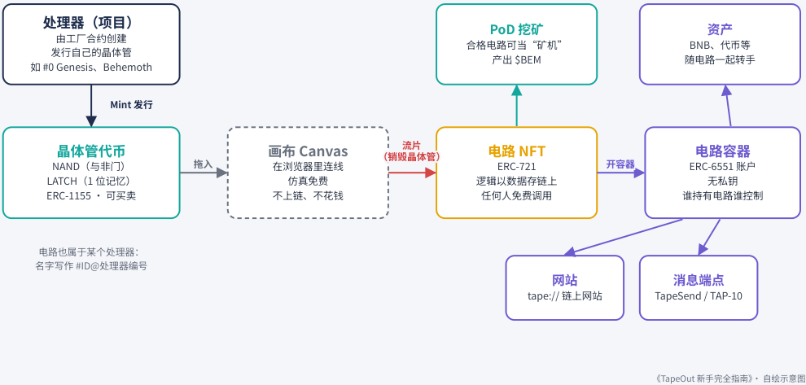
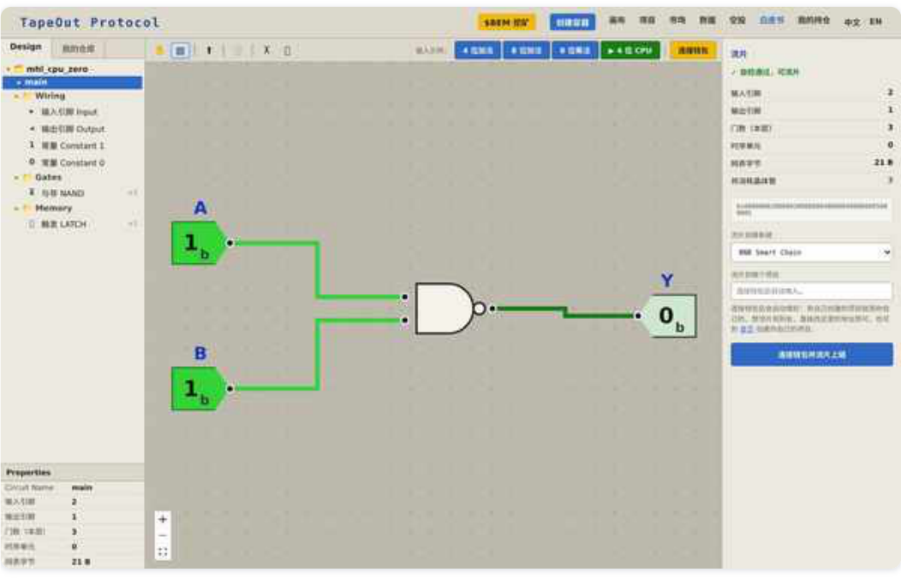

# 第 2 章：核心概念

> 本文件由 PDF 自动转换生成，尚未完成独立校对；请结合页码回溯注释核对原文。

<!-- source: tapeout-beginner-guide-v1.5-web.pdf p.39 -->

## 第 2 章核心概念：从与非门到处理器

#### ⏱ 一分钟看懂本章

这一章只讲一条链：晶体管 → 画布 → 流片 → 电路 → 处理器 → 容器。NAND 和 LATCH 是两种“积木代币”，你先在网页画布上免费把它们连成电路，满意了再烧掉积木，铸成一枚电路 NFT。

- NAND 负责算，LATCH 负责记，只靠这两样就能搭出任何电路。

- 晶体管是 ERC-1155 代币（同一种东西有很多份的代币标准），每台处理器有自己的一套，不能混用。

- 这里的“处理器”其实是一座“晶体管发行厂”，由工厂合约创建，截至 2026-09-25 共 1,043 台；能挖矿的只有 Behemoth（#1）和 TapeOut（#30）。官网把 1 号厂叫 Behemoth，名字来自创始人那台对标 Intel 4004 的链上 CPU。

- 画布仿真免费、不上链；流片会烧掉晶体管，换来一枚 ERC-721 电路 NFT，不能撤销。

- 电路谁都能免费调用；当前的挖矿规则不接受“引用别人电路（REF）”的设计。

#### ✦ 编者一句话

流片那一下，晶体管是真的被烧掉了。在编者看来，这正是 TapeOut 和“链下凭证”的根本区别：“不是映射，是一次设计动作被消耗掉，换来链上不可逆的存在。”（第 12 章 12.6）

这一章把 TapeOut 里的“积木”一块块摆出来。概念有点多，但每个都只需要一两句话就能说清。读完你会发现，它们其实是一条很顺的链条：

**晶体管 → 画布 → 流片 → 电路 → 处理器 → 容器**

<!-- source: tapeout-beginner-guide-v1.5-web.pdf p.40 -->

### TapeOut 的资产层级：从晶体管到网站

晶体管 → 电路 → 容器 → 网站 / 消息端点 / 资产

<!-- Start of picture text -->
处理器（项目） PoD 挖矿 资产 由工厂合约创建 合格电路可当“矿机” BNB、代币等 发行自己的晶体管 产出 $BEM 随电路一起转手 如 #0 Genesis、Behemoth Mint 发行 Mint 发行 NAND（与非门） 晶体管代币 拖入 拖入 画布 Canvas 在浏览器里连线 （销毁晶体管） （销毁 流片 流晶片体管） 电路 NFT ERC-721 开容器 开容器 ERC-6551 账戶 电路容器 LATCH（1 位记忆） 仿真免费 逻辑以数据存链上 无私钥 ERC-1155 · 可买卖 不上链、不花钱 任何人免费调用 谁持有电路谁控制 电路也属于某个处理器： 名字写作 #ID@处理器编号 网站 消息端点 tape:// 链上网站 TapeSend / TAP-10 《TapeOut 新手完全指南》· 自绘示意图 <!-- End of picture text -->

TapeOut 的资产层级（本书自绘）。

### 2.1 逻辑门：NAND 与 LATCH

**逻辑门** 是电子计算机最小的“判断单元”：输入几个 0 或 1，按固定规则输出一个 0 或 1。

**NAND（与非门）** 的规则只有一条： **两个输入都是 1 时，输出 0；其他情况都输出 1。** 听起来很简单，但计算机科学里有一个经典结论：只用 NAND，就能搭出任何逻辑电路——加法器、比较器，乃至整颗 CPU。

**LATCH（锁存器；宣言里叫它“触发器”）** 负责“记住”东西。它保存 1 位状态（0 或 1），在每次“心跳”时更新。没有它，电路只能算当下的输入，无法记住上一步的结果。

TapeOut 只提供这两种基础元件。官方宣言的说法是：“一颗基础元件，和一格记忆。由这两样东西可以搭建出整个宇宙。”

### 2.2 晶体管代币：NAND 和 LATCH 上链后的样子

在 TapeOut 里，NAND 和 LATCH 被做成了代币，官方称之为 **晶体管** 。

- 它们是 **ERC-1155** 代币。ERC-1155 是一种代币标准，适合“同一种东西有很多份、彼此完全一样”的资产。

- 晶体管要先 **Mint（铸造）** 出来，也可以在市场上买卖。

- 每台处理器都有 **自己的晶体管合约** 。例如本书核对过的三份：TapeOut 处理器的晶体管 0xCC42…808 7 、Behemoth 的 0xE2Df…550c 、Genesis 的 0x1d23…DFE6 。

<!-- source: tapeout-beginner-guide-v1.5-web.pdf p.41 -->

#### 注意

不同处理器的晶体管 **不是同一种东西** 。买之前要确认你买的是哪台处理器的 NAND / LATCH，否则可能流片不到你想要的地方，也可能不能用来挖矿。

### 2.3 处理器（项目）：晶体管的“发行厂”

#### ⏱ 一分钟看懂本节

- 2.3 和 2.4 两节只讲两件事：晶体管从哪儿来（处理器），电路怎么上链（画布 + 流片）。

   - “处理器”在这里不是电脑里的 CPU，而是一座 **晶体管发行厂** ：谁都能花 0.001 BNB 开一座，定好总量、单价和分成，发行自己的 NAND / LATCH。

   - 官网把 1 号厂叫 Behemoth（巨兽），它和 30 号厂 TapeOut 是唯二能挖矿的；0 号厂 Genesis 和这两台一样由管理员地址 0x571d…aF15 创建（本书读合约 creator() ，2026-09-25），其余的大多是社区开的。

   - 画布在你自己的浏览器里仿真，免费、不上链，想试多少遍都行。

   - 点“流片上链”才会烧掉晶体管、生成电路 NFT，不能撤销；电路太大（约 4 万字节以上）要拆成几张来流片。

**处理器** （官网界面上也叫“项目”）是由 **工厂合约** 创建出来的一份合约。你可以把它理解为一座“晶体管工厂 + 电路编号系统”：

- 任何人都能创建处理器。官网标注创建费为 **0.001 BNB** 。

- 创建时要定下这台处理器的 **晶体管总量** （宣言里的比喻：Intel 4004 有 2,300 个，你的呢？）、 **铸造单价** 和 **收入分成** 。这些在创建时写死。

- 别人铸造你处理器的晶体管时，收入记在你名下，需要你到详情页 **手动提取** （官网称之为“收益提现”）。

- 每台处理器按创建顺序编号， **从 0 开始，只增不改** 。

本书 2026-09-25 读取工厂合约，得到处理器总数 **1,043** 台。几台重要的处理器：

|**编号**|**链上名称**|**通常叫法**|**说明**|
|---|---|---|---|
|0|Genesis CPU|创世处理器|tape:// 示例网站 4246.0.ta pe就在它上面|
|1|Blonskr_No1|**Behemoth（巨兽）**|官网代码把这个地址标为 Behemoth；挖矿系数 P=6|
|30|TapeOut|**TapeOut**|官方默认的流片处理器；挖矿 系数 P=1|

<!-- source: tapeout-beginner-guide-v1.5-web.pdf p.42 -->

（地址：Genesis 0x50A9…9DD9 ，Behemoth 0x1F5C…f12C ，TapeOut 0xb102…a14C 。本书链上实测， 2026-09-25。）

#### 提示

**只有 Behemoth 和 TapeOut 两台处理器上的电路能参与 PoD 挖矿** （官网挖矿页）。社区里很多“某某处理器”是个人或团队创建的，官网会提示：这是一台“社区处理器（不是官方、也未经认证）”。

### 2.4 画布与流片

**画布（Canvas）** 是官网上的电路设计工具。你把 NAND、LATCH 拖到画布上，从一个输出端拉一根线到另一个输入端，就完成了一次连接。宣言说：“你看到的是一根线，在链上，这是一次指针的指定。”

画布上的一切都在 **你自己的浏览器里** 实时仿真， **不上链、不花钱** ，你可以反复试错。

官网画布（本书 2026-09-25 截图）：两个输入 A、B 接到一个 NAND 门，输出 Y。

满意之后，点“ **流片上链** ”：

你用到的晶体管代币被 **真实销毁** ；

链上生成一枚 **电路 NFT** （ERC-721，每一枚都独一无二）；

电路的逻辑以一段“哪个门接哪个门”的 **数据** （官方称为“网表”）存在链上。

<!-- source: tapeout-beginner-guide-v1.5-web.pdf p.43 -->

有两点要知道。第一，一笔流片交易装不下太大的电路：官网提示，数据超过约 4 万字节就会失败，大电路要拆成几张来流片。第二，如果你会用专业的芯片设计软件（比如 Yosys、ABC），可以把导出的 **BLIF 文件** （一种描述电路连线的通用格式）直接导进画布。

**注意**

流片 **不可逆** ：晶体管烧掉就回不来。流片前务必先在画布里验证电路逻辑（第 3 章会讲怎么做）。

### 2.5 电路：一个永远开着的函数

电路流片之后，就变成了一个 **谁都能调用的函数** ：

- 调用是 **只读查询** （区块链术语叫 view call），不发交易、不花 gas（链上手续费）、不需要连接钱包； 电路里没有“调用别人”的操作，也没有可写的状态，所以宣言说：你收下一个陌生人的电路，“最坏的结果就是它返回一个错误的答案”；

- 画布还允许把已有电路当作“黑盒”拖进新设计里复用，这叫 **引用（REF）** ——宣言称之为“乐高化的处理器制作”。

#### 提示

**REF 与挖矿** ：虽然协议允许引用，但 **当前版本的 PoD 挖矿规则禁止带引用的电路参与挖矿** （官网挖矿页 “算法”说明）。第 5 章会解释原因。

### 2.6 容器、名字与挖矿：先认识一下

电路之上还有三样东西，后面各有一章详细讲：

- **电路容器** ：每枚电路可以开一个链上账戶，存资产、挂网站、收消息（第 4 章）。

- **.tape 名字** ：比如 4246.0.tape ，表示“0 号处理器上的第 4246 枚电路”（第 4 章）。

- **PoD 挖矿** ：合格的电路可以当“矿机”，按规则分配 BEM（第 5 章）。

#### 本章要点

- **NAND** 负责计算， **LATCH** 负责记忆；只靠这两种元件就能搭出任意电路。

- **晶体管** 是 ERC-1155 代币，每台处理器有自己的晶体管合约，不同处理器的晶体管不能混用。

- **处理器** 由工厂合约创建，编号从 0 开始；截至 2026-09-25 共 1,043 台。挖矿只认 Behemoth（#1）和 TapeOut（#30）。

- **画布** 仿真免费； **流片** 会销毁晶体管、生成 ERC-721 **电路 NFT** ，不可逆。

- 电路可被任何人 **免费、只读** 地调用；当前挖矿规则 **禁止带引用（REF）的电路** 。

<!-- source: tapeout-beginner-guide-v1.5-web.pdf p.44 -->

#### 延伸阅读

- [O02] 官方宣言（晶体管、电路、工厂的原始定义） —— TapeOut 官方（Blonskr） / tapeout.net（PDF）：https://tapeout.net/TapeOut-Protocol.pdf

- [M05] 《TapeOut Protocol 小白科普：从与非门到链上挖矿》 —— 新东西|Something / PANews（专栏）：https://www.panewslab.com/zh/articles/01a03820-6305-75be-9e73-12005316087a

- [S03] 《五分钟看懂 TapeOut 怎样把逻辑变成电路》 —— TapeOut日报（编者作品） / tapeoutdaily.ai：https://tapeoutdaily.ai/learn/from-nand-to-processor

- [S07] giang.me 交互式讲解（用真实电路演示调用） —— giang.me / 个人网站：https://giang.me/tapeout

- [X14] 《TapeOut Explained: A Beginner’s Guide》（英文） —— CUPID（@cupid_elvis） / X：https://x.com/cupid_elvis/status/2098670687296843777

- 《从 Mining 到 Onchain Computing：我眼中的 TapeOut》（用“乐高城市”打比方讲清层级，2026-08-29） —— CUPID（@cupid_elvis） / X：https://x.com/cupid_elvis/status/2093526616257531954

- [M03] 《当 Token 开始变成晶体管》 —— BruceBlue / PANews（专栏）：https://www.panewslab.com/zh/articles/01a00ffa-5c18-73d1-ae5f-1d86c8661394

## 推荐阅读

想进一步理解 TapeOut 编号的价值逻辑、号码分类与新手交易检查流程，请阅读 [TapeOut DeWeb 生态靓号新手指南](08-chapter-04.md#tapeout-deweb-生态靓号新手指南)。其中包含从识别 `X.Y` 到链上核验的完整“八步走”。
