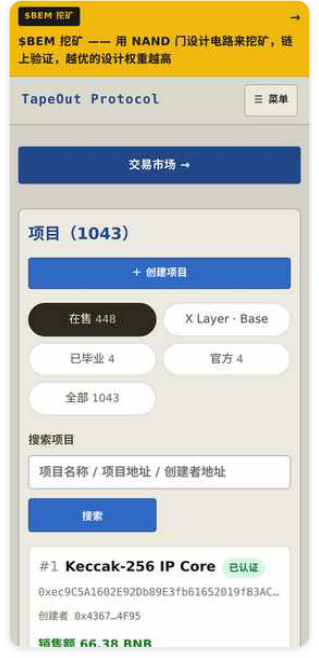
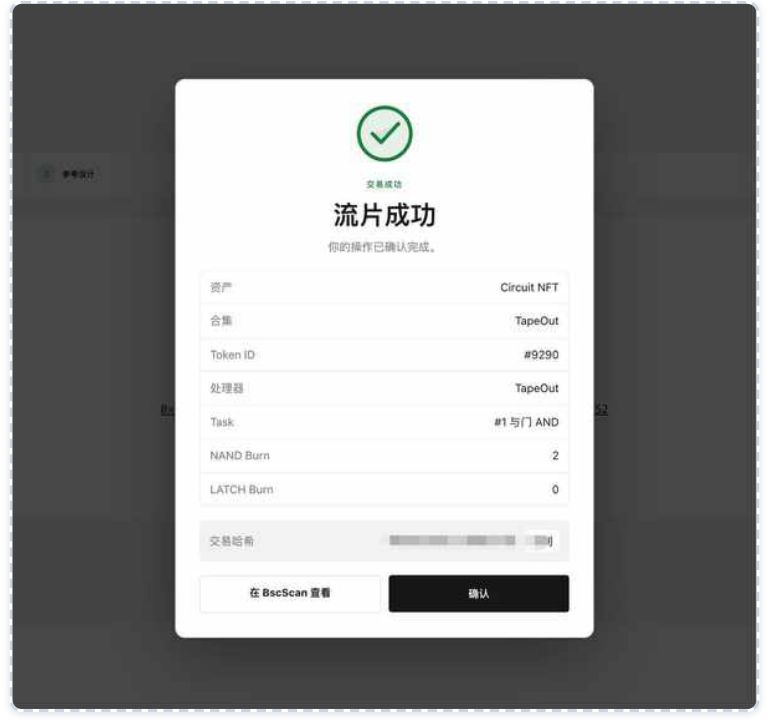

# 第 3 章：钱包与第一次上手

> 本文件由 PDF 自动转换生成，尚未完成独立校对；请结合页码回溯注释核对原文。

<!-- source: tapeout-beginner-guide-v1.5-web.pdf p.45 -->

## 第 3 章钱包与第一次上手

这一章带你走一遍“从零到第一枚电路”的流程。我们会尽量说明每一步 **花不花钱、可不可逆** 。

#### 注意

本书写作时 **没有连接钱包、没有发起任何交易** ，下面的截图都来自公开页面。链上操作的界面可能随官网更新而变化，请以你看到的实际界面为准，并先重读一遍安全清单。

### 3.1 准备一个钱包

TapeOut 运行在 BNB Chain（链 ID 56）上，你需要一个支持 BNB Chain 的浏览器钱包或手机钱包。这一节是通用的钱包常识， **TapeOut 官方没有发布钱包教程** ，也没有指定钱包。

1. **新建一个专用钱包** 。不要用存着大额资产的主钱包。

2. **抄下助记词，离线保存** 。助记词就是钱包的全部控制权，任何索要助记词的人都是骗子。

3. **切换到 BNB Chain 主网** 。大多数钱包内置了它；手动添加时，链 ID 填 56。

4. **转入少量 BNB** 。BNB 用来付 gas（交易手续费）和买晶体管。先放一点点，够试几次就行。

#### 提示

**gas 是什么？** 每次改变链上状态（买、卖、流片、领取）都是一笔交易，需要付一小笔 BNB 给网络，这就是 gas。只读查询（比如调用电路、看数据）不需要 gas。

### 3.2 认识官网

打开 www.tapeout.net。顶部导航大致有： **$BEM 挖矿、创建容器、画布、项目、市场、数据、空投、白皮书、我的持仓** ，右上角可以切换中文 / EN。

- **连接钱包** ：官网说明，连接钱包只是读取你的地址、列出你名下的电路， **不会发起任何交易** 。真正花钱的操作，钱包都会单独弹窗让你签名。

- **项目** ：列出所有处理器。截图时共 1,043 个，还能按“X Layer · Base”筛选其他链。

- **市场** ：官方的晶体管市场和电路市场。

<!-- source: tapeout-beginner-guide-v1.5-web.pdf p.46 -->

官网的手机版页面（本书 2026-09-25 截图）。

### 3.3 第一步：在画布里免费搭一个电路

1. 打开 **画布** 。

2. 拖入两个输入引脚、一个 NAND 门、一个输出引脚，把线连好。

3. 切换输入的 0 / 1，看输出是否符合 NAND 的真值表（两个都是 1 时输出 0）。

这一步 **完全免费** ，所有计算都在你的浏览器里完成。你可以一直改到满意为止。

#### 提示

**练习建议** ：先照着第 2 章的真值表搭一个 NAND，再试着用几个 NAND 搭出 AND（与门）、OR（或门）。 官方宣言提到，半加器需要 5 个晶体管、全加器 9 个——可以当作进阶练习。

### 3.4 第二步：流片前先验证

PANews 专栏作者 BruceBlue 在新手指南里提了一个好习惯： **流片之前，先“试算”几遍** 。他用的是 eval、 step 这类只读调用：喂进去一组输入，看看输出对不对，不花钱。因为电路一旦流片，逻辑就永远定下来了。

同时，他提醒官网上的“BTC 矿机”页面只是 **演示** ，不要误会成真的在挖比特币（BruceBlue《从 Mint 到流片》）。创始人 @Blonskr 发布这个演示时（原帖，2026-08-16）也打趣说，这“可能是全球很拉垮的 BTC 矿机”——它是用来展示链上电路能跑 SHA-256 的。

<!-- source: tapeout-beginner-guide-v1.5-web.pdf p.47 -->

### 3.5 第三步：准备晶体管

流片需要消耗晶体管，获取方式有两种：

- **铸造（Mint）** ：在处理器的详情页按创建者定的单价铸造。如果某台处理器的晶体管已经铸满，官网会提示“已售罄，无法在它上面流片”。 **注意：能挖矿的两台处理器 TapeOut（#30）和 Behemoth （#1）的晶体管都已经铸满了** （2026-09-25 16:04 新加坡时间读合约：TapeOut 100 万个、Behemoth 10 万个，铸造量都等于上限），所以新人想挖矿，要去市场上买。

- **在市场上买** ：官方晶体管市场是创始人 @Blonskr 8 月 16 日上线的纯链上订单簿，收取 **1%** 的手续费 （官网说明）。第三方市场也很多（第 8 章），但都不是官方背书。

流片时，官网会自动填好处理器地址：“有自己创建的项目就用你自己的；没有就默认用官方 TapeOut”。如果你想参与挖矿，要确认电路流片在 **TapeOut（#30）或 Behemoth（#1）** 上（第 5 章）。

### 3.6 第四步：流片

在画布右侧点“流片上链”，钱包会弹出交易请求。几点需要知道：

- **防抄袭保护** ：交易在正式上链前，会先在公开的“排队区”（内存池）里等几秒，有人会趁这时候偷看、 抢先复制。官网会先开好防护（业内叫“MEV 防护”），再把你的电路数据（网表）发出去。如果防护没建立，官网会停下来提醒你；只有在你明确接受“可能被抢跑”时才应继续。

- **原创存证** ：挖矿页支持先提交一个“设计承诺”再流片，防止别人抄你的设计抢“最优首创”。官网会在你电脑上存一份备份文件，里面有一串只有你知道的随机数（salt），用来证明设计是你先做的。 **开挖前别发给任何人** （第 5 章）。

- **流片成功后** ，你会得到一枚电路 NFT，可以在“我的持仓”里看到，还能把设计图铺回画布、生成分享链接。

<!-- source: tapeout-beginner-guide-v1.5-web.pdf p.48 -->

一张“流片成功”结果页示例：显示电路 NFT 的编号、所属处理器、对应题目以及烧掉的 NAND / LATCH 数量。注意：这是 **第三 方工具 TapeOut Market** 的界面，不是官网。图片来源：新东西|Something《TapeOut 协议 $BEM 初阶挖矿教程》，PANews， https://www.panewslab.com/zh/articles/01a03e64-8a61-7566-badf-f21a43a5fb35

### 3.7 费用速查

下表数字来自官网界面说明（2026-09-25 查看）和本书链上实测。 **gas 另计** ，会随网络状况变化。

|**操作**|**费用**|**是否可逆**|
|---|---|---|
|画布设计、仿真|免费|⸺|
|调用电路（只读）|免费|⸺|
|创建处理器|0.001 BNB|不可逆|
|铸造晶体管|单价 × 数量，每笔另加一小笔协议费 （单价由处理器创建者定；协议费按合 约 protocolFee() ，例如 2026-09-25 读到 TapeOut 0.0001 BNB、Behemoth 0；以钱包弹窗为准）。挖矿用的这两台 已铸满|不可逆（可再卖出）|
|官方市场成交|1% 手续费|不可逆|

<!-- source: tapeout-beginner-guide-v1.5-web.pdf p.49 -->

|**操作**|**费用**|**是否可逆**|
|---|---|---|
|流片|销毁晶体管 + 流片协议费 + gas。协议费 是官方规则：官网流片时会显示金额； 本书 2026-09-25 读合约 TAPEOUT_FEE () ，TapeOut、Behemoth、Genesis 三台处理器都是**0.0002 BNB**|**不可逆**|
|开电路容器|0.012 BNB（BNB Chain；X Layer 上是 0.08 OKB）|不可逆|
|从容器转出资产|一笔很小的协议手续费|不可逆|
|开通 .tape 名字|见第 4 章（存在说法冲突）|不退款|

#### 提示

**流片协议费是哪来的？** 创始人 @Blonskr 2026-09-12 公告：流片从“Alpha Beta”升级为“Open Beta”，当天 16:00（新加坡时间）起，第三方交易所和挖矿平台流片前要先读合约里的 TAPEOUT_FEE () ，把这笔钱随交易一起付。所以不管你在官网还是第三方平台流片，都要付这笔费用；金额以钱包弹窗为准。

### 3.8 新手最常踩的坑

- **买错处理器的晶体管** ：不同处理器的晶体管不通用，挖矿只认两台处理器。

- **电路太大流片失败** ：界面会提前拦下超限的网表；超过挖矿“门数闸门”的电路只能进收益很少的未验证池（第 5 章）。

- **卖电路忘了领收益** ：正在挖矿的电路，未领取的 BEM 会随 NFT 一起归买家。

- **挂单忘了清空容器** ：容器里的资产会随电路交出去，且不计入挂单价格。

- **点了假网址** ：永远从书签或手动输入进入官网。

#### 本章要点

- 用一个 **专用钱包** ，只放少量 BNB；助记词永不外泄。

- **画布免费、流片不可逆** ：先仿真、先用只读调用验证，再流片。

- 晶体管可以 **铸造** 或在 **市场** 购买；想挖矿就选 TapeOut（#30）或 Behemoth（#1），这两台的晶体管已经铸满，要在市场上买。

- 流片前善用官网的 **防抢跑保护** 和 **原创存证** 。

- 记住费用表：处理器 0.001 BNB、容器 0.012 BNB、市场 1%、流片协议费 0.0002 BNB（2026-09-25 实测），gas 另计。

<!-- source: tapeout-beginner-guide-v1.5-web.pdf p.50 -->

#### 延伸阅读

- [M04] 《从 Mint 到流片：TapeOut 新手第一次上手指南》 —— BruceBlue / PANews（专栏）：https://www.panewslab.com/zh/articles/01a00fff-7b7f-70ff-a188-0448b4d31797

- [X15] 《TapeOut 部署、购买与挖矿教程》 —— Mi1997_（@Mizaza1997_） / X：https://x.com/Mizaza1997_/status/2098236991246917749

- [X13] 《TapeOut 怎么玩，以及它到底值不值得看》 —— 科学家无邪（@sciencedegens） / X：https://x.com/sciencedegens/status/2089101901929517495

- [S06] 社区入门站《TapeOut 入门》 —— TapeOut 入门（社区站） / tapeout-guide-public.vercel.app：https://tapeout-guide-public.vercel.app/

- [O01] 官网（界面内的规则说明是最权威的费用来源） —— TapeOut 官方 / tapeout.net：https://www.tapeout.net/
