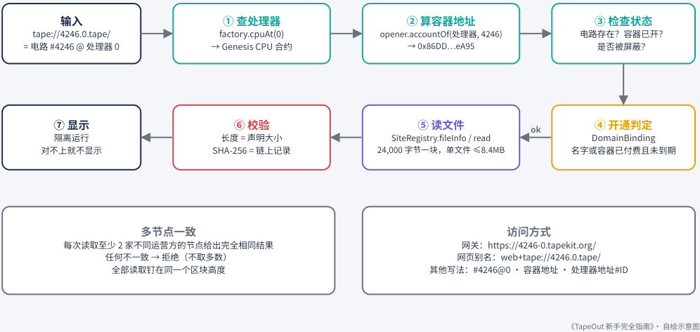
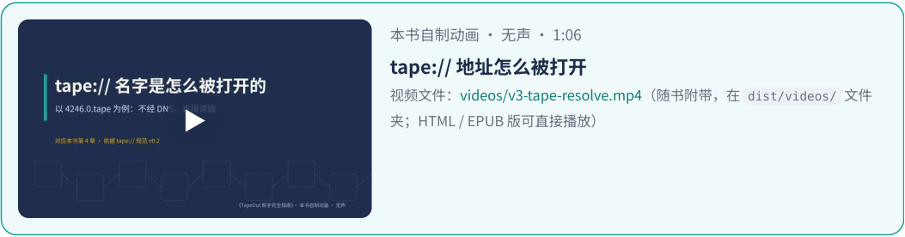
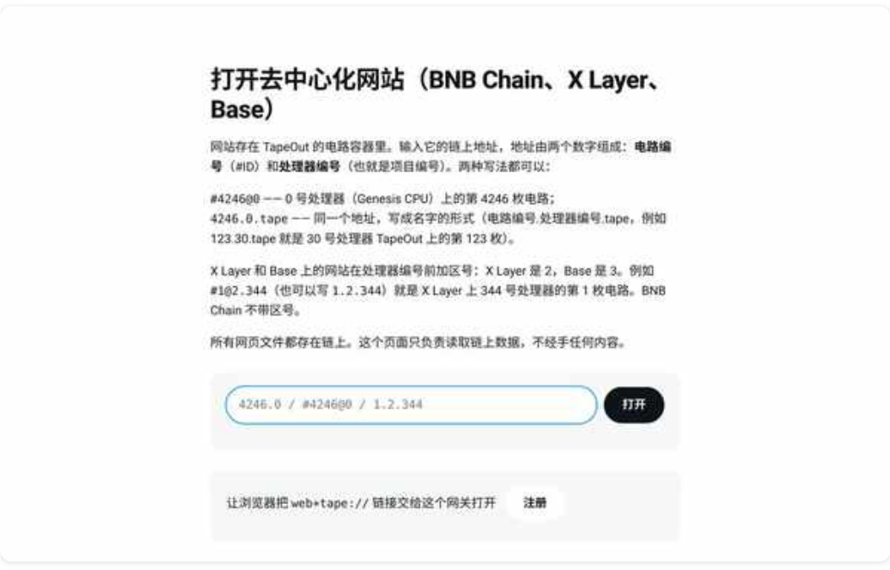
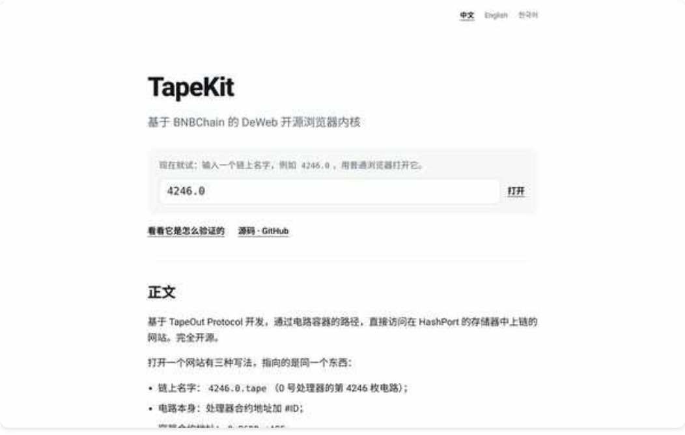
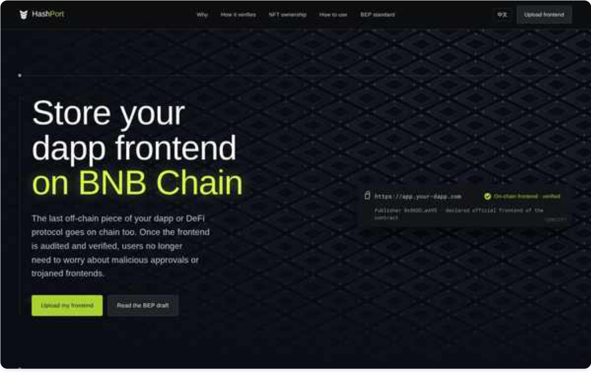

# 第 4 章：链上网站与 tape:// 地址

> 本文件由 PDF 自动转换生成，尚未完成独立校对；请结合页码回溯注释核对原文。

<!-- source: tapeout-beginner-guide-v1.5-web.pdf p.51 -->

## 第 4 章电路容器与 tape:// 地址

#### ⏱ 一分钟看懂本章

每枚电路都可以开一个自己的链上账戶，叫“电路容器”。有了它，电路就能存资产、挂网站、收发消息。网站地址长这样：tape://4246.0.tape/。打开时，网站的每个文件都由你的浏览器直接从链上读、 逐字节核对，不依赖网站主人的服务器。

- 容器是 ERC-6551 账戶（“绑在 NFT 上的钱包”），开通费 0.012 BNB（X Layer 上是 0.08 OKB）；它没有私钥，谁持有电路谁就控制它。

- 容器跟着电路走：卖电路就等于连容器一起卖；电路挂单期间容器会冻结。

- 名字格式是“电路编号.处理器编号.tape”，比如 4246.0.tape。

- 打开网站的步骤：算出容器 → 查开通状态 → 读文件 → 核对 SHA-256（文件“指纹”），并且至少两家节点结果一致。

- 最省事的打开方式是官方网关：https://4246-0.tapekit.org/，什么都不用装。

- 上传网站可以用 HashPort 托管服务，也可以自己直接调用合约；不懂电路的新人还可以用社区的 “容器工厂”一键开容器。

- 名字开通费：文档写 0.08 BNB/30 天，本书链上实测当前为 0；付款前看一眼钱包里显示的金额就好。

到目前为止，电路只是一个“能计算的 NFT”。2026 年 9 月 6 日，创始人 @Blonskr 宣布电路容器系统上线， 给每枚电路加了一个新能力： **拥有自己的链上账戶** 。他的解释很好懂：“电路是逻辑，容器是内存，这样就可以真正的组成一台机器了。链上电路第一次不只能算，还能记。”有了账戶，电路就能存钱、挂网站、收消息。这一章讲清楚它是怎么回事。

### 4.1 电路容器是什么

**电路容器** 是绑定在一枚电路 NFT 上的链上账戶，技术上遵循 **ERC-6551** （“代币绑定账戶”）标准：让一枚 NFT 拥有一个自己的智能合约钱包。

官网对容器的说明可以归纳成下面几条（2026-09-25 查看）：

- **开容器要付费** ：BNB Chain 上官网标注 **0.012 BNB** ，付给协议收款钱包——也就是管理员地址 0x571 d…aF15 （一个普通钱包，本书读工厂合约 protocolWallet() 核对）。X Layer 上的容器开通费是 **0.08 OKB** （2026-09-25 读 X Layer 开戶合约 0x536a…0106 的 FEE() ），别拿 BNB 的数字去套。之后每次从容器转出资产或“清仓”，还要付一笔很小的协议手续费。按创始人的上线公告，创建容器、转出容器、转出资产的手续费都进国库、全部换成 BEM，其中 80% 定期销毁（第 6 章）。

- **没有私钥** ：容器的控制权等于这枚电路 NFT 的 **当前持有人** 。谁拿着电路，谁就能把容器里的东西取走。 **不能“套娃”** ：容器可以持有各种链上资产，但 **不能装本协议的电路** 。

- **跟着电路走** ：电路转手时，容器里的资产和持续收益一起归新主人。

<!-- source: tapeout-beginner-guide-v1.5-web.pdf p.52 -->

**挂单即冻结** ：电路在市场上挂单期间，容器被冻结；而且容器里的资产 **不计入挂单价格** 。

#### 注意

创始人 @Blonskr 介绍 X Layer 容器时（原帖，2026-09-23）有一句话很适合记住：“注意它不是一个钱包，钱包属于人，容器属于你的那枚电路。”电路换了主人，容器里的资产、合约、网站和还在产生的收益都会一起转移。

因为“谁持有电路谁就控制容器”，官网特别提醒：容器 **承载不了锁仓、质押这类“不可反悔”的承诺** 。 卖电路之前，务必清点并转出容器里的资产。

### 4.2 容器能做什么

|**用途**|**说明**|**详见**|
|---|---|---|
|存资产、收款|任何人都能往容器地址转账|本章|
|挂一个链上网站|一个容器一个网站，地址形如 tape://4 246.0.tape/|本章|
|收发加密消息|容器就是 TapeSend 的“收件地址”|第 7 章|
|当一台机器的主人|官方链上 Linux 演示里，机器的所有者 就是一个容器|第 7 章|

### 4.3 .tape 名字怎么读

TapeKit《tape:// 规范 v0.2》规定，链上名字的规范写法是：

<电路#ID>.<处理器编号>.tape

例如 **4246.0.tape** = 0 号处理器（Genesis CPU）上的第 4246 枚电路。它的容器地址是 0x86DDaEF00401E3 F10418398D67D7189fc458eA95 。

**为什么必须带处理器编号？** 因为每台处理器的电路编号都从 1 开始，“#12”在 0 号处理器和 7 号处理器上是两枚完全不同的电路。只有“处理器 + #ID”才能唯一确定一枚电路。

规范要求地址栏接受以下写法，并统一显示成规范名字：

|**写法**|**例子**|
|---|---|
|规范名字|4246.0.tape|
|省略后缀|4246.0|
|网址|tape://4246.0.tape/docs/|
|网页别名|web+tape://4246.0.tape/docs/|

<!-- source: tapeout-beginner-guide-v1.5-web.pdf p.53 -->

|**写法**|**例子**|
|---|---|
|简写|#4246@0或 4246@0|
|容器地址|0x86DD…eA95|
|处理器合约#ID|0x50A9…9DD9#4246|

规范还明确：其他写法 **必须报错，不得猜测** 。

#### 提示

**多链名字** ：官方网关 tapekit.org 的说明写道，X Layer 和 Base 上的网站在处理器编号前加“区号”： **2 代表 X Layer，3 代表 Base** ；BNB Chain 没有区号。例如 #1@2.344 （或 1.2.344 ）是 X Layer 上 344 号处理器的 #1 电路。X Layer 中文台 @xlayer_zh 2026-09-19 公告称，处理器工厂、电路容器、网站仓库和 TapeSend 已在 X Layer 主网上线；9 月 23 日官网“容器”板块也开放了 X Layer 容器（开通费 0.08 OKB）。 **“网站仓库”这一项要多说两句** ：TapeKit 仓库里有人提了 Issue #6（TapeOut Labs 仓库， 社区提交，9 月 23 日），指出 X Layer 上查不到网站仓库合约。本书 2026-09-25 用 X Layer 公共节点复查后发现：拿 BNB Chain 上的网站仓库 SiteRegistry（ 0xd006…E5e6 ）和名字绑定 DomainBinding （ 0x861E…3DB7 ）这两个地址去 X Layer 查，确实没有合约代码；但 TapeKit 官方内核给 X Layer 配的是另一组地址（网站仓库 0xd6ef…adb6 、名字绑定 0x6880…66f9 ，9 月 19 日加入仓库），这两个地址在 X Layer 上有合约代码，X Layer 上的链上网站（比如第 8 章的游戏 1.2.231.tape ）也能用官方内核正常读出来。所以网站仓库在 X Layer 上是有的，只是地址和 BNB Chain 不一样。另一方面，官网前端写着这条链上的容器“目前只能开通和查看”，转出资产和提现还没接上；想在 X Layer 上建站，先确认你用的工具已经支持。Base 还在计划中。

### 4.4 一个 tape:// 地址是怎么被打开的

#### ⏱ 一分钟看懂本节

- 一句话：浏览器根据名字算出容器地址，从链上把文件一块块读回来，逐字节核对后才显示。

   - 容器地址是按规则算出来的，不是谁说了算，所以没人能冒充别人的网站。

   - 文件按 24,000 字节一块存在链上，单个文件最大 8.4 MB。

   - 至少问两家不同的节点，答案完全一样才算数；所有文件都按链上同一时刻的样子读，不会一半新一半旧。

   - 每个网站都关在自己的“小房间”里运行，伤不到你，也伤不到别的网站。

这是本章最“硬核”的部分，但看图就能懂。

<!-- source: tapeout-beginner-guide-v1.5-web.pdf p.54 -->

### tape:// 地址是怎么被解析的

<!-- Start of picture text -->
依据 TapeKit《tape:// 规范 v0.2》§3‒§5；以 4246.0.tape 为例 <!-- End of picture text -->

<!-- Start of picture text -->
输入 ① 查处理器 ② 算容器地址 ③ 检查状态 tape://4246.0.tape/ factory.cpuAt(0) opener.accountOf(处理器, 4246) 电路存在？容器已开？ = 电路 #4246 @ 处理器 0 → Genesis CPU 合约 → 0x86DD...eA95 是否被屏蔽？ ⑦ 显示 ⑥ 校验 ⑤ 读文件 ok ok ④ 开通判定 隔离运行 长度 = 声明大小 SiteRegistry.fileInfo / read DomainBinding 对不上就不显示 SHA-256 = 链上记录 24,000 字节一块，单文件 ≤8.4MB 名字或容器已付费且未到期 多节点一致 访问方式 每次读取至少 2 家不同运营方的节点给出完全相同结果 网关：https://4246-0.tapekit.org/ 任何不一致 → 拒绝（不取多数） 网页别名：web+tape://4246.0.tape/ 全部读取钉在同一个区块高度 其他写法：#4246@0 · 容器地址 · 处理器地址#ID 《TapeOut 新手完全指南》· 自绘示意图 <!-- End of picture text -->
<!-- reviewed: p.54; fix: ocr -->

tape:// 地址的解析流程（依据 TapeKit 规范 §3‒§5，本书自绘）。

#### 用大白话说：

1. **找到处理器** ：读工厂合约，拿到 0 号处理器的合约地址。

2. **算出容器地址** ：容器地址由“链、处理器合约、#ID”唯一算出，不是任何人自报的。

3. **检查状态** ：这枚电路存在吗？容器开了吗？有没有被这个客戶端屏蔽？

4. **检查是否“开通”** ：遵守规范的客戶端只显示已开通的名字（见 4.6）。

5. **读文件** ：从网站仓库合约 SiteRegistry 读出文件。文件按 24,000 字节一块存储，单个文件最大 8.4 MB。

6. **逐字节校验** ：长度必须等于声明的大小，SHA-256 哈希必须等于链上记录。对不上就不显示。

7. **隔离显示** ：每个网站独立运行，不能伤害用戶和其他网站。

还有两条“安全底线”贯穿全程：每次读取都要 **至少 2 家不同运营方的节点给出完全相同的结果** ，任何不一致就拒绝（不取多数）；打开一个网站时，所有文件都按链上同一时刻（同一个区块）的样子来读，这样不会一半是旧版、一半是新版。

<!-- Start of picture text -->
本书自制动画 · 无声 · 1:06 tape:// 地址怎么被打开 视频文件：videos/v3-tape-resolve.mp4（随书附带，在  dist/videos/  文件 ▶ 夹；HTML / EPUB 版可直接播放） <!-- End of picture text -->

<!-- source: tapeout-beginner-guide-v1.5-web.pdf p.55 -->

### 4.5 用什么打开

TapeKit 是创始人 @Blonskr 2026-09-16 发布的开源浏览器内核。按他的说法，输入 tape://4246.0 或 #42 46@0 回车就能打开，不经过云服务和 DNS；每读一块都同时问几家互不相干的节点，答案一致、哈希对得上才显示。TapeKit README 列出了几种打开方式：

|**在哪里**|**怎么输入**|**需要什么**|
|---|---|---|
|任何浏览器|https://4246-0.tapekit.org/ （官方 网关）|什么都不用装|
|Chrome 地址栏快捷搜索|tape+ Tab + 4246.0.tape|在搜索引擎设置里配置一次|
|Chrome 扩展|tape+ 空格 + 4246.0.tape|安装扩展|
|网页链接|web+tape://4246.0.tape/|在网关首页允许一次|
|桌面应用（计划中）|tape://4246.0.tape/|应用向系统注册协议|

#### 提示

**社区也在做“打开工具”** ：社区开发者 SpongeMochi（@spongemochi）9 月 24 日预告了原生支持 tape:// 的桌面浏览器 Wafer（Mac 版内测中）；肖战羊（@Xiao_zhanyang）在 TapeKit 插件源码基础上改了一个浏览器插件（可自定义网关、带收藏夹）。它们都是第三方作品，安装前请自己甄别来源。

官方网关 tapekit.org 首页（本书 2026-09-25 截图）：输入“#4246@0”或“4246.0.tape”即可打开。

<!-- source: tapeout-beginner-guide-v1.5-web.pdf p.56 -->

通过网关打开的示例站 4246.0.tape（本书 2026-09-25 截图）。这个站本身就是 TapeKit 的介绍页，所有文件都从链上读取并校验。

### 4.6 怎么把网站放上去

TapeKit README 里的站长指引给了两条路：

**A. HashPort 控制台** （托管服务，钱包签名）：选电路、拖入网站文件夹、签名。哈希计算、分块都由它完成。HashPort 页面说明：确认 2 次钱包签名，其余几十笔上传交易由一个 **临时钱包** 签署；上传成本只有链上 gas，约 **每 MB 0.01‒0.03 BNB** ；服务费显示为 **0 BNB** ；绑定自己的域名可选且免费。

- **B. 直接调用合约** ： putFile 写入第一块（≤24,000 字节）， appendChunk 逐块追加， setFallback 设置单页应用的回退页， removeFile 删除。

HashPort 是基于 TapeOut 的第一个商业化项目。创始人 @Blonskr 上线当天介绍（2026-09-13）：团队找他谈过很多次，他给过一些技术指导；把电路容器当 dApp 前端的存储器，用戶就不用担心按钮背后藏着恶意授权或 JS 木马。

<!-- source: tapeout-beginner-guide-v1.5-web.pdf p.57 -->

HashPort 首页（本书 2026-09-25 截图）。

#### 提示

**不懂电路，也能一分钟开个容器** ：社区作者肖战羊（@Xiao_zhanyang）做了“容器工厂” id.tapeout.li nk（介绍帖，2026-09-23）：一键选号 → 铸造 → 流片 → 开通容器，大约 1 分钟，用 1 个 NAND 流片， 成本最低；作者说搭配 @benson_doge 的上传工具“总共不到 100 元”就能有一个链上网站（这是作者的估算，本书没有复核，价格会随晶体管行情变）。另一个社区作者 SpongeMochi（@spongemochi） 的 tapeout.space 则把所有通过 TapeKit 上线的网站画成一张图，还带社区网关和一键上链工具。这些都是第三方工具，不是官方背书。

准备网站时，站长指引提醒：只能是 **纯静态文件** 、一律用 **相对路径** 、文件名最好只用英文、每个文件先算好 SHA-256；想拿到“100% 链上”标记，HTML/CSS 里不能引用任何链外地址（字体、脚本、统计代码都要自托管）。

<!-- source: tapeout-beginner-guide-v1.5-web.pdf p.58 -->

### 4.7 “开通”名字要不要钱？

#### 说法冲突

#### 说法冲突：.tape 名字的开通费

   - **TapeKit README 与规范 §3.4** 写的是：每 30 天 **0.08 BNB** ，一次可付 1‒120 个月，不退款；一个容器付一次费，它的链上名字和绑定的域名都算开通。

   - **HashPort 页面** 显示服务费 **0 BNB** ，绑定域名“可选且免费”。

   - **社区时间线** 称 9 月 19 日起免除月费。

   - **本书链上实测（2026-09-25）** ：付费合约 DomainBinding（ 0x861E…3DB7 ）的 monthlyFee() 当前读数为 **0 BNB** 。费用以后也可能调整。

- 结论：写作时开通名字的月费在链上为 0，但文档尚未同步；请以你操作时钱包显示的金额为准。

规范也说得很实在：链上的数据谁都能读。所谓“开通”，只是官方客戶端约定 **只显示开通过的网站** ，并不是把数据锁起来。

<!-- supplemental source: TapeOut DeWeb 生态靓号指南 -->

## TapeOut DeWeb 生态靓号新手指南

> 本节为补充资料，不属于原 PDF 页码范围。

### 先读懂编号

TapeOut 的编号写作 `X.Y`：

- `X` 是电路号（Circuit #）。
- `Y` 是处理器号（CPU #）。

例如，`8.888` 表示处理器 `888` 中的第 `8` 个电路；`7.0` 表示处理器 `0` 中的第 `7` 个电路。这些编号不是小数，也不是价格。

同一个电路号出现在不同处理器中，代表不同的 NFT。查看或交易前，应先确认右侧的处理器号、处理器是否来自官方或可信社区来源，以及该处理器是否具备挖矿资格，再看左侧的电路号。

### 开篇：DeWeb 靓号，为什么不是普通靓号

传统靓号包括 QQ 号、手机号、域名和车牌。它们因为好记、稀缺或能够代表身份而具有价值。DeWeb 靓号把这些特点叠加到同一个号码上，并进一步增加了可验证的链上属性。

1. **它是域名。** `8.888` 对应 `8.888.tape`，`1.888.tape` 上挂载了 TAPQQ。号码本身就是网址，也是用户进入链上网站或应用的入口。
2. **它像早年的 QQ 号。** 电路按顺序生成，越短的号码通常出现得越早、数量也越少。例如，`1.888` 是 CPU #888 中的第 `1` 枚电路。QQ 号受平台管理，而 DeWeb 靓号由持有人的钱包持有。
3. **它像手机靓号。** `8`、`6`、`9`，以及豹子号、顺子号等规律数字都容易辨认和传播，例如 `6.888`、`22.888`。协议层面没有传统号码那种定期月租或续费安排，但实际使用仍应以相关链上协议与服务入口的最新规则为准。
4. **它是链上的车牌号。** 早期号、小号和特殊号可用于公开的身份展示。例如，`8.888` 容易形成个人或项目标识，`7.0` 则能直接体现它是 CPU #0 上的第 `7` 枚电路。
5. **它全链唯一。** `电路号.CPU 号` 的组合唯一；当前持有人、转移记录等信息可以在链上查询和验证。
6. **它永久存在，是一种真正的恒产。** 编号及其所有权记录在 BNB Chain 上，没有传统域名到期或传统号码月租的机制。这里的“永久”指链上记录持续存在；持续可访问仍取决于链的运行、可用网关，以及持有人是否妥善保管私钥。
7. **它背后是互联网迁移。** DeWeb 网站与入口由持有人控制。若未来有更多网站和应用迁移到链上，简短、好记的入口可能会变得更加稀缺；这只是对使用场景的观察，不代表价格一定上涨或能够获利。

#### 其他优势

- **部分电路可用于挖矿。** 只有符合条件的处理器和电路才具备挖矿资格。CPU #888 的挖矿倍数为 `0`，因此 `8.888`、`1.888` 不能挖矿。
- **可以在链上市场交易。** 持有人可依据相关市场规则挂单或转让，但成交与流动性并无保证。
- **可以承载网站或应用内容。** 电路及其容器可作为 DeWeb 网站、应用和其他链上内容的入口。
- **信息公开可查。** 发行记录、当前持有人和成交记录等链上信息可供核验。

> **风险提醒：** 上述内容是对 DeWeb 靓号使用价值与收藏特征的观察，不是收益承诺。价格和流动性由市场决定，只应使用自己能够承受损失的资金；交易前务必按照安全清单核验网络、合约、编号、所有者、挂单状态、金额和授权内容。

### 新手常见的靓号类型

- **短号**：位数少、容易输入和记忆。
- **文化寓意号**：如 `7`、`8`、`18`、`66`、`88`、`168`、`518`、`520`、`521`、`666`、`777`、`888`、`999`、`1314`。
- **重复号**：由相同数字组成，如 `11`、`222`、`8888`。
- **顺子号与倒序号**：如 `123`、`4567`、`987`、`4321`。
- **回文号**：从前往后和从后往前相同，如 `121`、`1221`。
- **规律组合**：如 `AABB`、`ABBA`、`ABAB`。
- **幸运组合**：由个人或文化语境中的幸运数字组成。
- **整百、整千与 2 的幂**：如 `100`、`1000`、`64`、`128`、`256`、`512`、`1024`。
- **技术与加密文化号**：如 `56`、`20`、`721`、`404`、`1337`、`3141`、`2718`。
- **网络梗与年份号**：如 `69`、`420`、`2024`、`2025`、`2026`。
- **个人纪念号**：生日、纪念日或其他对持有者有意义的数字。

这些分类只是识别号码特征的工具，不是统一的价格标准。判断一个编号时，不能只看左侧电路号，还要结合右侧处理器号和对应合约。

### 新手选择靓号八步走

1. **准备钱包与 Gas。** 切换到 BSC 网络，确认 Chain ID 为 `56`，并准备足够的 Gas。任何情况下都不要泄露助记词或私钥。
2. **明确用途。** 先确定目标是收藏、身份展示、DeWeb 地址还是挖矿。收藏价值与挖矿用途应分开判断。
3. **确定目标编号。** 使用 `X.Y` 格式记录目标，同时分别记下 CPU # 和 Circuit #，避免把两者看反。
4. **识别号码类型。** 判断它属于短号、重复号、顺子号、回文号、规律组合、文化寓意号或其他类别。
5. **查找并比较挂单。** 对比同类号码、不同处理器和不同市场入口。卖方要价不等于实际成交价，也不等于公允估值。
6. **交易前完成五项核验。** 核对 CPU 合约、Circuit #、当前所有者、挂单是否仍然有效，以及钱包最终显示的成交金额与 Gas。CPU 名称可能重名，不能只凭名称判断。
7. **确认风险与钱包提示。** 再次检查网络、合约和金额。电路容器中的资产或尚未领取的收益，不应默认计入号码价格。
8. **交易后链上复核。** 确认所有者已经在链上更新，再进行容器管理、网站部署或重新挂单。

### 必须知道的风险

- CPU 名称可能重复，应以链上编号和合约为准。
- 靓号不等于可挖矿；挖矿能力取决于具体处理器和电路。
- 电路编号通常按顺序产生，不能自由挑选。Circuit # 通常从 `1` 开始，CPU # 从 `0` 开始。
- 挂单状态和当前所有者可能随时变化，交易前必须重新核验。
- 第三方页面只是查询或交易入口，最终状态以链上记录为准。
- 链上交易不可逆。不要批准来源不明的授权，不要向任何人泄露助记词或私钥。
- 收藏品价格和流动性都存在风险，号码稀有或好记不代表一定能按预期价格出售。
- 本指南仅用于信息说明，不构成投资建议。

### 延伸查看

可在 [8.888 靓号商城](https://8-888.tapekit.org) 浏览相关分类；进行任何交易前，都应独立核验合约、编号、所有者、挂单状态和钱包最终金额。

#### 本章要点

- **电路容器** = 绑定在电路 NFT 上的 ERC-6551 账戶，开通费 0.012 BNB（X Layer 上 0.08 OKB）；无私钥，谁持有电路谁控制。

- 容器 **不能装电路** 、 **挂单时冻结** 、资产 **不计入挂单价** 。

- 名字格式 <#ID>.<处理器编号>.tape ；X Layer 区号 2（9 月 19 日已部署，网站仓库地址和 BNB Chain 不同）、Base 区号 3（计划中）。

- 打开网站时：算出容器 → 检查开通 → 读文件 → **SHA-256 逐字节校验** → **≥2 家节点一致** 。

- 最简单的打开方式是官方网关 https://<ID>-<处理器>.tapekit.org/ 。

- 开通费存在文档与链上不一致：文档 0.08 BNB/30 天，链上当前读数 0。

#### 延伸阅读

- [O12] 《tape:// 纯链上网站规范 v0.2》 ⸺ TapeOut Labs / GitHub：https://github.com/TapeOutProtocol/TapeKit/blob/main/SPEC.zh.md

- 创始人 @Blonskr 的电路容器上线公告（2026-09-06） —— Blonskr（@Blonskr） / X：https://x.com/Blonskr/status/2096372599714681190

- 创始人 @Blonskr 的 TapeKit 发布帖（2026-09-16） —— Blonskr（@Blonskr） / X：https://x.com/Blonskr/status/2100131602714288258

- 《TapeOut 容器工厂》一键开容器 —— 肖战羊（@Xiao_zhanyang） / X：https://x.com/Xiao_zhanyang/status/2102646836960141721

- [O10] TapeKit README（含站长指引） —— TapeOut Labs / GitHub：https://github.com/TapeOutProtocol/TapeKit

- [O21] 官方网关 —— TapeOut Labs / tapekit.org：https://tapekit.org/

- [O22] HashPort —— HashPort / hashport.ai：https://hashport.ai/

<!-- source: tapeout-beginner-guide-v1.5-web.pdf p.59 -->

- [X08] 《TapeKit：不只是“一个新工具”，而是互联网底层的一次重新设计》 —— YW（@ywweb3） / X：https://x.com/ywweb3/status/2100188153416126908

- [《TapeOut DeWeb 生态靓号新手指南》](#tapeout-deweb-生态靓号新手指南) —— 介绍 DeWeb 靓号为什么不是普通靓号及其价值逻辑、常见类型、新手八步走，以及交易前后的链上核验和风险。

- [V-4NNB2m7mPbM] 视频：TapeOut 上线 X Layer 容器 —— 人人美丽说 / YouTube：https://www.youtube.com/watch?v=4NNB2m7mPbM
