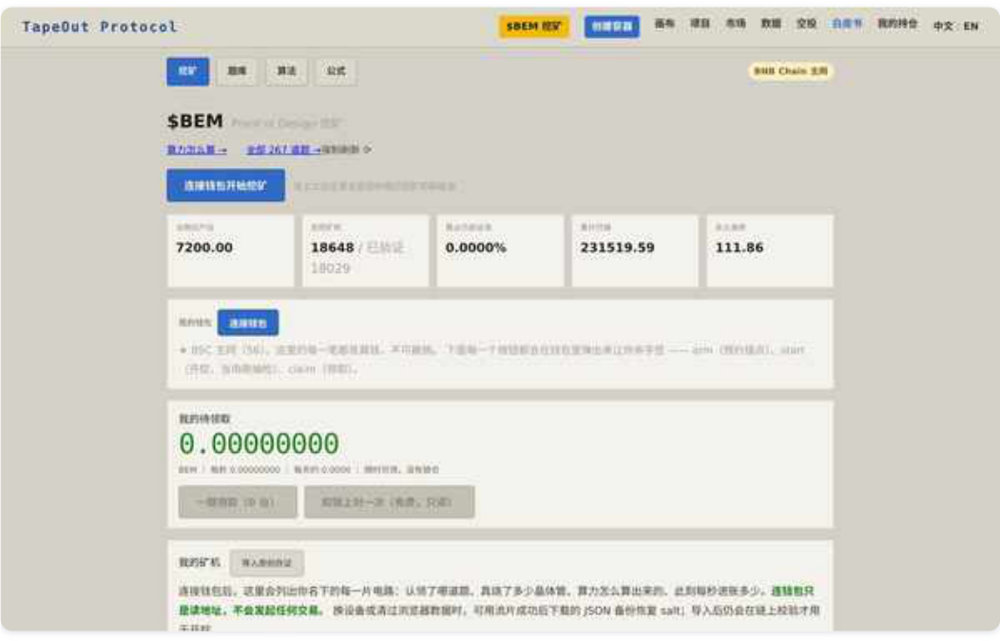
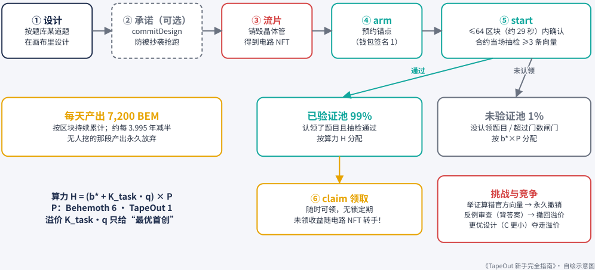
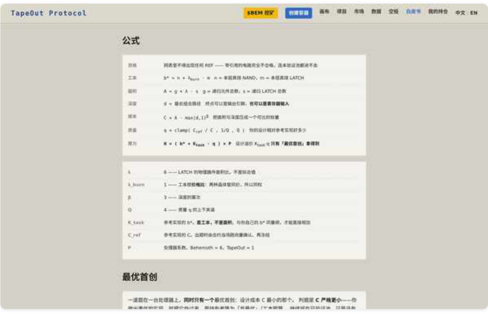
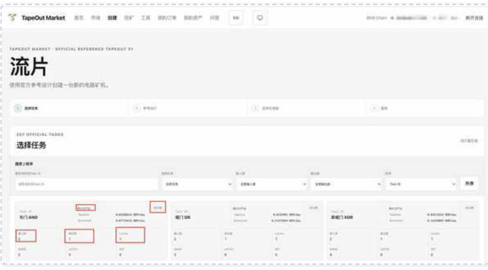
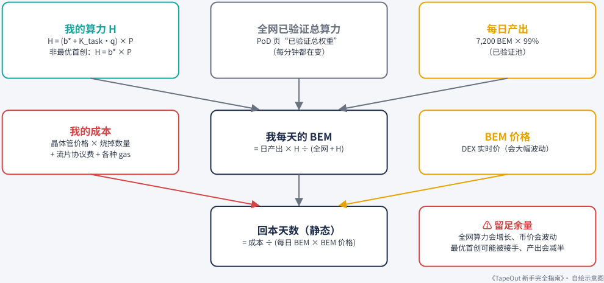

# 第 5 章：PoD 挖矿（第 1 部分）

> 本文件由 PDF 自动转换生成，尚未完成独立校对；请结合页码回溯注释核对原文。

<!-- source: tapeout-beginner-guide-v1.5-web.pdf p.60 -->

## 第 5 章 PoD 挖矿：矿机、算力与回本测算

#### ⏱ 一分钟看懂本章

PoD（设计证明）挖矿不用显卡。你的算力由两部分组成：烧掉的晶体管（工本，要花 BNB 买），加上设计比参考答案好多少（溢价，只给每道题的最优设计），两者相加再乘上处理器系数。所以烧掉的晶体管是人人都有的基础，好设计能在此之上多拿一份溢价，这份溢价可能很大，甚至超过基础那份（见 5.6 的示例：溢价约 70.6，工本 44）。全网每天 7,200 枚 BEM，按算力（已验证池）分给大家。

- 只有 Behemoth（系数 6）和 TapeOut（系数 1）两台处理器上的电路能挖，而且不能带引用 （REF）。

- 流程：设计 →（可选承诺）→ 流片 → arm 预约 → start 合约当场抽检 → 随时 claim 领取。

- 算力 H = (b* + K_task·q) × P；设计溢价只给每道题的“最优首创”。

- 99% 的产出给已验证池（按算力分），1% 给未验证池（按工本 × 处理器系数分）。

- 回本天数 ≈ 成本 ÷（每天分到的 BEM × BEM 价格）；成本里别忘了流片协议费。全网算力和币价每天都在变，估算时留足余量。

- 挖矿合约已经封印，公式和参数现在谁也改不了；任何人都能免押金举报算错的矿机。

- 两个好习惯：卖矿机前先 claim；记住最优首创随时可能被更好的设计接手。

#### ✦ 编者一句话

编者对 PoD 的概括：“比的不是电费，是谁电路设计得好。”

TapeOut 的挖矿叫 **PoD（Proof of Design，设计证明）** 。它和比特币挖矿很不一样： **没有显卡，没有矿机硬件，没有质押。** 官网的一句话总结是：

算力 = 你永久烧掉的工本 + 你的设计比参考实现好多少，再乘处理器系数。 ——tapeout.net/pod/ “算法”页

本章所有规则都来自官网挖矿页的“挖矿 / 题库 / 算法 / 公式”四个页签（tapeout.net/pod/，2026-09-25 查看）。PANews 上新东西|Something 的挖矿教程给出的公式与官网一致，可以对照阅读。

<!-- source: tapeout-beginner-guide-v1.5-web.pdf p.61 -->

#### 📄 这份文档讲了什么

#### 官网挖矿页 tapeout.net/pod/

官网挖矿页是 PoD 挖矿的“说明书”，分“挖矿、题库、算法、公式”四个页签。它把怎么挖、奖励按什么分、参数取多少、为什么这么定，全都摆在了台面上，连参数是“拍的”都写得明明白白。先记住一句：公式里的“工本”就是你真金白银买来、再烧掉的晶体管。

- 题库共 267 道官方题目，每道题都有一份链上验证过的参考实现。

- 流程：设计 →（承诺）→ 流片 → arm → start 抽检（至少 3 条测试向量）→ claim。

- 算力公式 H = (b* + K_task·q) × P，参数 λ = 6、β = 3、Q = 4。

- 奖励池：99% 已验证池按 H 分，1% 未验证池按 b*×P 分；没人挖的时段产出永久作废。

- 每天 7,200 BEM，约 3.995 年减半，上限 2,100 万枚。

- 任何人都能提交反例挑战“算错的矿机”，不需要押金。

- 页面上早期写过“后续可能有小规模的参数调优”，这是挖矿合约封印前的旧说法；9 月 14 日封印后，链上参数已经没人能改（见 5.8）。

- 页面上还有实时数据：活跃矿机数、全网已验证总权重、已铸造总量。

PoD 挖矿页（本书 2026-09-25 截图，未连接钱包）。页面显示全网日产出 7,200 BEM、活跃矿机数、已铸造总量等实时数据。

### 5.1 什么是“矿机”

社区说的“矿机”，就是 **一枚正在参与 PoD 挖矿的电路 NFT** 。要成为合格的矿机，需要满足：

<!-- source: tapeout-beginner-guide-v1.5-web.pdf p.62 -->

1. **在合格处理器上** ：只有 **Behemoth（#1）** 和 **TapeOut（#30）** 上的电路能挖。

2. **不含引用（REF）** ：官网“算法”页写明，这一版“带引用的电路完全不合格，连未验证池都进不去”。

3. **不超过“门数闸门”** ：门数太多的电路，链上抽检跑不完，认领不了题目，只能进未验证池。具体上限以挖矿页显示为准。

**为什么禁止引用？** 官网解释得很坦白：引用别人的电路时，你并没有再烧一次晶体管，但电路的“面积”会把被引用的那部分也算进去。如果允许引用，一个几乎不烧晶体管的“空壳”电路就能继承别人的设计成绩。官网称安全审核在本地链上实测，14 个“零烧壳”就能把真实设计者的份额从 100% 压到 28%。所以现在的规则是：每一份算力背后，都必须有等量、不可逆销毁的晶体管。

### 5.2 挖矿的完整流程

### PoD（设计证明）挖矿怎么运作

官方规则整理自 tapeout.net/pod/ 算法与公式页（2026-09-25 查看）

<!-- Start of picture text -->
① 设计 ② 承诺（可选） ③ 流片 ④ arm ⑤ start 按题库某道题 commitDesign 销毁晶体管 预约锚点 ≤64 区块（约 29 秒）内确认 在画布里设计 防被抄袭抢跑 得到电路 NFT （钱包签名 1） 合约当场抽检 ≥3 条向量 通过 通过 未认领 未认领 每天产出 7,200 BEM 已验证池 99% 未验证池 1% 按区块持续累计；约每 3.995 年减半 认领了题目且抽检通过 没认领题目 / 超过门数闸门 无人挖的那段产出永久放弃 按算力 H 分配 按 b*×P 分配 算力 H = (b* + K_task·q) × P ⑥ claim 领取 挑战与竞争 P：Behemoth 6 · TapeOut 1 随时可领，无锁定期 举证算错官方向量 → 永久撤销 反例审查（背答案）→ 撤回溢价 溢价 K_task·q 只给“最优首创” 未领收益随电路 NFT 转手！ 更优设计（C 更小）夺走溢价 《TapeOut 新手完全指南》· 自绘示意图 <!-- End of picture text -->
<!-- reviewed: p.62; fix: ocr -->

PoD 挖矿流程（依据官网挖矿页整理，本书自绘）。

1. **选题并设计** ：官方 **题库共 267 道题** （官网挖矿页，2026-09-25；创始人 @Blonskr 8 月 20 日公布题库时写的是 278 道，8 月 21 日上链时改为 267 道）。每道题都有一份已上链、经过验证的参考实现。你按某道题的规格在画布里设计电路。不会画电路也没关系：创始人 @Blonskr 8 月 22 日上线了“一键流片”，267 道题每道都配好了官方示例模板，点一下就能做成矿机电路。

2. **（可选）提交设计承诺** ：用 commitDesign 先登记一个承诺，防止别人看到你的交易后抢先复制。官网会生成一份含 salt（只有你知道的随机数）的备份， **开挖前不要分享** ；换设备时可在挖矿页导入。流片时看到的“原创已存证”标签就是它的成果，创始人 @Blonskr 9 月 3 日说明这是为了“打掉科学家抢跑最优承诺”。

3. **流片** ：销毁晶体管，得到电路 NFT。

4. **arm（预约锚点）** ：钱包签名第 1 次。

<!-- source: tapeout-beginner-guide-v1.5-web.pdf p.63 -->

5. **start（开挖）** ：钱包签名第 2 次，必须在 **64 个区块（约 29 秒）** 内确认。合约会当场从官方的“标准考题”（ **测试向量** ，就是一组组“输入 → 标准答案”）里抽几道，拿你的电路逐位对答案；抽检条数随电路规模自动确定，但 **永远不少于 3 条** 。

6. **claim（领取）** ：随时可以领，没有锁定期。

两个奖池：

- **已验证池（99%）** ：认领了题目且抽检通过的电路，按 **算力 H** 分配。

- **未验证池（1%）** ：没认领题目、或超过门数闸门的电路，按 **b*×P** 分配（“没解出题的也拿得到工本那一份”）。

本书自制动画 · 无声 · 1:06

#### PoD 挖矿怎么运作

视频文件：videos/v2-pod-mining.mp4（随书附带，在 dist/videos/ 文件 ▶ 夹；HTML / EPUB 版可直接播放）

### 5.3 算力公式，一个一个拆开

#### ⏱ 一分钟看懂本节

公式看着吓人，其实只问三件事：你这一层烧了多少晶体管（b*，要花钱买），你的设计比参考答案省多少（q），你在哪台处理器上（P）。

- 你的算力 = 烧掉的晶体管数（工本）+ 设计溢价，再乘处理器系数（Behemoth 6，TapeOut 1）。

- 设计溢价只给每道题里“设计成本 C 最小”的那一枚电路（最优首创）；其他合格电路只拿工本那一份：H = b* × P。

- C = 面积 × 深度³：元件越少、层数越浅，C 越小；q = 参考成本 ÷ 你的成本，限制在 ¼ 到 4 之间。 只有 Behemoth / TapeOut 上、不带引用的电路能挖；门数超过上限的只能分 1% 的未验证池。

- 挖矿合约已经封印，公式和参数现在谁也改不了；任何人都能免押金举报算错的矿机。

#### 官网“公式”页给出的定义如下（符号照抄，解释是我们写的）：

|**名称**|**公式**|**大白话**|
|---|---|---|
|工本|b* = n + λ_burn·m|你**这一层真正烧掉**的晶体管：n 个 NAND + m 个 LATCH（λ_burn = 1，两种同价 同权）|
|面积|A = g + λ·s|电路的“大小”：元件总数 g，加上 LATCH 数 s 乘 6（λ = 6，LATCH 物理上 更大）|

<!-- source: tapeout-beginner-guide-v1.5-web.pdf p.64 -->

|**名称**|**公式**|**大白话**|
|---|---|---|
|深度|d|信号从输入走到输出，最多要穿过几层 门。层数越多，电路越“慢”|
|成本|C = A · max(d,1)^β|把面积和深度合成一个数，β = 3：深度 越大越“贵”，鼓励并行结构|
|质量|q = clamp(C_ref / C, 1/Q, Q)|你的设计比参考实现好多少，限制在 [1/4, 4] 之间（Q = 4）|
|算力|H = (b* + K_task·q) × P|工本加上“设计溢价”，再乘处理器系数|

官网挖矿页的“公式”标签（本书 2026-09-25 截图，未连接钱包）。上半部分是公式，下半部分是各参数的取值和说明。

#### 其中：

- **K_task** ：这道题参考实现的工本。

- **C_ref** ：这道题参考实现的成本。出题时由合约当场跑向量确认后冻结，“出题人填不了假数”。

- **P** ：处理器系数， **Behemoth = 6，TapeOut = 1** 。同一份设计放在 Behemoth 上，算力正好是 6 倍。

这套公式最早是创始人 @Blonskr 8 月 20 日在 X 上发布的，他特别强调：“这是一场永远持续的竞赛，不是先到先得就占死这个位置。”同一天他公布题库时补充：每道题参考实现的工本 b* 就是这道题的 K_task，成本 C 就是 C_ref。

**“最优首创”与设计溢价** ：公式里的设计溢价 K_task·q **只有“最优首创”才拿得到** 。一道题在一台处理器上，同时只有一个最优首创—— **设计成本 C 最小的那一个** 。谁做出 C 更小的实现，谁就把它夺过去；原来的持有者降为“非最优”，只保留工本部分：

<!-- source: tapeout-beginner-guide-v1.5-web.pdf p.65 -->

最优首创：H = (b* + K_task·q) × P

非最优：H = b* × P

官网说明：如果你的设计和参考实现一样大（工本相同、q = 1），最优首创的算力正好是非最优的 2 倍。一般情况下，倍数 = (b* + K_task·q) ÷ b。比如 5.6 的例子里 b = 44、K_task = 60，q 取 1 时是 (44 + 60) ÷ 44 ≈ 2.36 倍；例子里 q ≈ 1.176，算出来约 2.6 倍。如果两个设计的 C 完全一样，则按“有效承诺 > 更早承诺 > 更早流片”仲裁。

**挑战与撤销** ：任何人、任何时候都可以提交一条“反例向量”，证明某台矿机算错了官方向量， **不需要质押** 。 一旦举证成立，这台矿机的资格被 **永久撤销** 。另外，“kick”操作只会移除最优首创身份和设计溢价，基础挖矿照常。

为什么要有这一条？创始人 @Blonskr 9 月 1 日宣布新增“反例审查”时讲了原因：挖矿时只抽检 3〜32 条官方向量，有人会“背答案”——全网 534 个最优槽里，官方逐条穷举，发现 80 个电路能通过抽检，却在全部输入上和参考实现不符，占已验证池权重的 13.99%。反例审查 9 月 3 日 00:14（新加坡时间）生效后，这类电路一旦被举报就会被撤回设计溢价；诚实矿工完全不受影响。

在第三方工具中选择题目的界面示例，可以看到“267 OFFICIAL TASKS”和每道题的参考数据。注意：这是 **第三方工具 TapeOut Market** 的界面，不是官网。图片来源：新东西|Something《TapeOut 协议 $BEM 初阶挖矿教程》，PANews， https://www.panewslab.com/zh/articles/01a03e64-8a61-7566-badf-f21a43a5fb35

### 5.4 产出与减半

根据官网“公式”页：

**硬顶** ：2,100 万枚 BEM（8 位小数）。

**首期产出** ：每天 7,200 枚。

**减半** ：每 210,000 × 600 秒 ≈ **3.995 年** 减半一次。

<!-- source: tapeout-beginner-guide-v1.5-web.pdf p.66 -->

**没人挖的时段** ：那段产出 **永久放弃** ，不补发、不顺延。

全网挖矿是 2026-08-21 21:45:32（新加坡时间，即 UTC 13:45:32）开启的。创始人 @Blonskr 开挖当天宣布放弃 BEM 的 0.2% 交易税和相关所有权，“所有人同权参与挖矿，没有任何额外特权”；只保留了部署时 30 分钟的锁定窗口，用来把 267 道题上链、在 PancakeSwap 完成定价和添加流动性。

**实时快照（2026-09-25，挖矿页显示，未连接钱包）** ：活跃矿机 18,648 台（其中已验证 18,029 台）；已验证总权重 1,517,905；未验证总权重 40,630；永久放弃约 111.86 BEM。这些数字每分钟都在变。已经铸造了多少 BEM，全书统一用合约读数：约 23.18 万枚（截至 2026-09-25 15:21，见第 6 章）。

### 5.5 回本测算：方法

#### ⏱ 一分钟看懂本节

算回本只要四步：算你的算力、算每天能分到多少 BEM、算你一共花了多少钱、两者相除。难的不是算术，而是这些输入每天都在变。

每天的 BEM ≈ 7,200 × 99% × 你的 H ÷（全网已验证总算力 + 你的 H）。

- 成本 = 晶体管花费 + 流片协议费 + 流片、arm、start、claim 的 gas。

- 回本天数 ≈ 成本 ÷（每天的 BEM × BEM 价格）。

- 全网算力翻倍，回本天数也跟着翻倍；按保守的价格去估。

#### 注意

**这一节只教方法，不构成投资建议。** 下面的计算都是“静态”估算：它假设全网算力、币价和你的最优首创身份都不变。现实里这三样每天都在变，所以估算时请留足余量：算力按翻倍算、币价按保守价算，心里就有底了。

<!-- source: tapeout-beginner-guide-v1.5-web.pdf p.67 -->

### 回本测算：只讲方法，不给结论

所有输入都要自己从链上 / 官方页面取实时值；完整示例见第 5 章

<!-- Start of picture text -->
我的算力 H 全网已验证总算力 每日产出 H = (b* + K_task·q) × P PoD 页“已验证总权重” 7,200 BEM × 99% 非最优首创：H = b* × P （每分钟都在变） （已验证池） 我的成本 我每天的 BEM BEM 价格 晶体管价格 × 烧掉数量 = 日产出 × H ÷ (全网 + H) DEX 实时价（会大幅波动） + 流片协议费 + 各种 gas ⚠ 留足余量 回本天数（静态） 全网算力会增长、币价会波动 = 成本 ÷ (每日 BEM × BEM 价格) 最优首创可能被接手、产出会减半 《TapeOut 新手完全指南》· 自绘示意图 <!-- End of picture text -->

回本测算的思路（本书自绘）。

计算分四步：

1. **算你的算力 H** ：用 5.3 的公式。非最优首创就只算 b* × P。

2. **算你每天能分到多少 BEM** ：

每日 BEM ≈ 7,200 × 99% × H ÷（全网已验证总算力 + H）

3. **算你的总成本** ：晶体管花费（单价 × 烧掉的数量）+ 流片协议费（2026-09-25 链上读数 0.0002 BNB/ 次）+ 流片和开挖的 gas + 其他手续费。

4. **算静态回本天数** ：

回本天数 ≈ 总成本 ÷（每日 BEM × BEM 价格）

<!-- source: tapeout-beginner-guide-v1.5-web.pdf p.68 -->

### 5.6 回本测算：一个完整的例子

#### 示例数字，非实际数据

- **⚠ 以下全部是示例数字，非实际数据。** 它们只用来演示计算步骤，不代表任何真实电路、真实价格或真实收益。

#### 第 1 步：算算力

- 你的电路烧了 40 个 NAND、4 个 LATCH：b* = 40 + 1×4 = **44**

- 面积 A = 68，深度 d = 5：成本 C = 68 × 5³ = **8,500**

- 这道题的参考成本 C_ref = 10,000：q = 10,000 ÷ 8,500 ≈ **1.176** （在 0.25~4 之间，不用截断）

- 这道题的 K_task = 60，处理器是 TapeOut（P = 1）

- 如果你是 **最优首创** ：H = (44 + 60 × 1.176) × 1 ≈ **114.6**

- 如果 **不是** 最优首创：H = 44 × 1 = **44**

**第 2 步：算每天的 BEM** （假设全网已验证总算力 = 2,000,000）

- 最优首创：7,128 × 114.6 ÷ (2,000,000 + 114.6) ≈ **0.408 BEM/天**

- 非最优：7,128 × 44 ÷ (2,000,000 + 44) ≈ **0.157 BEM/天**

**第 3 步：算成本** （假设晶体管 0.0002 BNB/个，流片协议费和 gas 合计 0.003 BNB）

- 44 × 0.0002 + 0.003 = **0.0118 BNB**

- （为了简单，这里把流片协议费算进 0.003 BNB 的“gas 和手续费”里。）

顺手验算一下 5.3 的倍数：最优首创 114.6 ÷ 非最优 44 ≈ 2.6 倍。这比“正好 2 倍”多，是因为这里 b* （44）比 K_task（60）小、q 又大于 1。

**第 4 步：算回本天数** （假设 BEM = 0.001 BNB）

- 最优首创：0.0118 ÷ (0.408 × 0.001) ≈ **29 天**

- 非最优：0.0118 ÷ (0.157 × 0.001) ≈ **75 天**

**敏感性** ：如果全网算力翻倍到 4,000,000，最优首创的回本天数也会翻倍到约 58 天；如果币价腰斩，天数再翻倍。如果你的最优首创被别人夺走，就要按 75 天那一行算。

### 5.7 代入你自己的真实数字

|**变量**|**去哪里找**|**注意**|
|---|---|---|
|n、m、g、s、d|画布 / 挖矿页对你电路的统计|只算**本层真烧**，引用不算（且当前禁止 引用）|
|K_task、C_ref|挖矿页“题库”|每道题不同，出题后冻结|
|P|Behemoth 6，TapeOut 1|看你流片在哪台处理器|

<!-- source: tapeout-beginner-guide-v1.5-web.pdf p.69 -->

|**变量**|**去哪里找**|**注意**|
|---|---|---|
|全网已验证总算力|挖矿页“已验证总权重”|**每分钟都在变**（官网举过例子：未验证 池的总算力一小时内能差 5%），估算时 请取保守值|
|晶体管价格|市场成交价（其他处理器可看详情页铸 造价）|挖矿用的两台处理器（Behemoth、 TapeOut）晶体管截至 2026-09-25 已铸 满，只能看市场成交价；不同处理器差 别很大|
|gas 与流片协议费|钱包签名前显示的预估值|流片、arm、start、claim 都要 gas；流 片还要协议费（2026-09-25 为 0.0002 BNB）|
|BEM 价格|DEX（如 PancakeSwap）实时价|波动剧烈，务必保守估计|

挖矿页连接钱包后还会显示“按此刻全网算力估算约 X BEM/天”。官网自己也强调：这“只是此刻的实时估算，不是承诺”。

想看全网趋势，可以打开 Dune 用戶 ekonomeest 做的 TapeOut Mining Intelligence 看板，或第 8 章列的其他数据站。

#### 提示

**矿机怎么比价？** 社区作者 Benson（@benson_doge）在长文《当 NFT 开始持续产出：一种按日产能定价的 AMM 思路》（2026-09-23）里提了一个好用的思路：别只比单台售价，要比“买到 1 BEM/日产能要花多少 BNB”。BruceBlue（@BruceBlue）的回应也提醒：q 值和验证状态会变，按固定产能定价有风险。两篇都是研究讨论，不是交易建议。

### 5.8 挖矿必知的坑

- **先领再卖** ：未领取的收益会随电路 NFT 一起归买家。而且官网提醒，“领取”谁都可以调用，收益发给 **领取那一刻的持有人** ——买电路时要留意卖家可能在你成交前领走。

- **停挖冷静期** ：停挖后要等 1,200 个区块（约 9 分钟）才能重新开挖。

- **锚点过期** ：arm 和 start 之间超过 64 个区块，要重来。

- **最优首创不是永久的** ：别人做出更优设计，你的溢价就归零。

- **规则已经冻结** ：官网公式页早期写过“后续可能有小规模的参数调优，但不会改动主体结构”，创始人 8 月 20 日发公式时也说过“不排除存在小规模细节调优”——这些都是 **封印前的旧说法** 。9 月 14 日挖矿合约 PodMining 已经封印（ isSealed = true ，owner 变成零地址，第 6 章），而且公式在出题后就锁死了（setFormula），所以现在链上已经没人能再改参数。官网那句旧话以链上状态为准。

- **“背答案”会被举报** ：只拟合了抽检点、没真正解出题的电路，谁都可以提交反例审查，设计溢价会被撤回。
