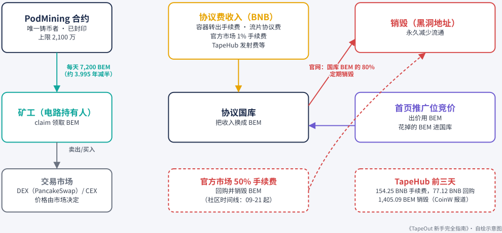
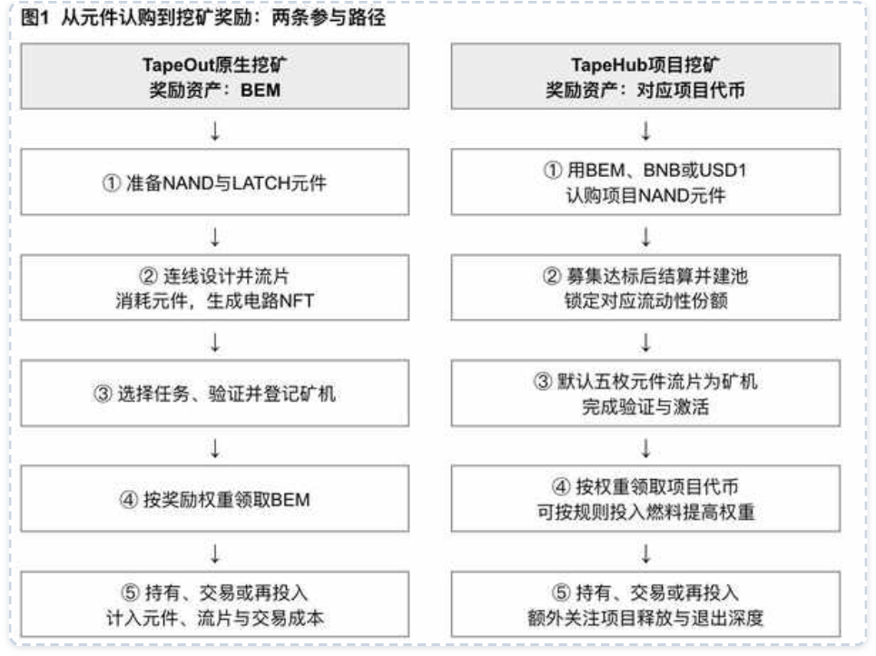

# 第 6 章：BEM 铸造

> 本文件由 PDF 自动转换生成，尚未完成独立校对；请结合页码回溯注释核对原文。

<!-- source: tapeout-beginner-guide-v1.5-web.pdf p.71 -->

## 第 6 章 BEM 代币：发行、封印与回购销毁

#### ⏱ 一分钟看懂本章

BEM 是 PoD 挖矿产出的代币。它的规则很“硬”：总量封顶 2,100 万枚，只有挖矿合约能产出，而挖矿合约已经永久封印，谁也改不了。协议的收入会换成 BEM，其中大部分定期销毁。

- 合约地址 0x5ce0…695a，8 位小数；已铸造约 23.18 万枚（合约 totalSupply，本书链上实测，截至 2026-09-25 15:21 新加坡时间），约为上限的 1.1%。

- 每天产出 7,200 枚，约 3.995 年减半；没人挖的那段产出永久作废。

- 挖矿合约 PodMining 9 月 14 日已封印、owner 为零地址（创始人公告 + 本书链上实测），挖矿规则、产出曲线和上限都改不了。

- 官网规则：协议费进国库、换成 BEM，其中 80% 定期销毁。

- 创始人公告：TapeHub 国库收入的 50% 用于回购并销毁 BEM。社区与媒体报道：官方市场 50% 手续费用于回购销毁；TapeHub 前三天拿出 77.12 BNB 回购，销毁 1,405.09 BEM。

- V2 的经济设计还只是预告，尚未上线。

- 买之前核对合约地址，认准 BEM 本尊。

**BEM** 是 PoD 挖矿产出的代币，也是 TapeOut 生态里最常被交易的资产。这一章讲它从哪里来、到哪里去，以及哪些规则已经“锁死”、哪些还只是公告。本章不讨论价格。

### 6.1 基本信息（本书链上实测）

以下数据由本书于 **2026-09-25** 直接读取 BNB Chain 合约得到（总供应量读于 15:21 新加坡时间，区块 123,908,049）：

|**项目**|**数值**|
|---|---|
|合约地址|0x5ce033B2bFCa3Af30b3e8C8457DeaF776A8b695a|
|名称 / 符号|BEM / BEM|
|小数位|8|
|最大供应量 MAX_SUPPLY|21,000,000|
|唯一铸币者 minter|PodMining 挖矿合约 0x7E2E…7b46|
|当前总供应量 totalSupply|约 231,830（即约 23.18 万枚，截至 2026-09-25 15:21 新加坡 时间）|
|有没有管理员|没有管理员，代币合约本身改不了|

也就是说， **截至写作时，只铸造了上限的约 1.1%** ，而且除了挖矿合约，没有其他地址能铸造 BEM。这和创始人 @Blonskr 8 月 21 日的 $BEM 上线公告对得上：总量 2,100 万、8 位小数、标准 ERC20，“铸造权在挖矿合<!-- source: tapeout-beginner-guide-v1.5-web.pdf p.72 -->约手里，没有任何钱包能手动增发”，合约源码已在 BscScan 验证。

**“销毁”不会让总供应量变小** ：BEM 合约没有销毁函数（本书查了合约字节码，没有 burn / burnFrom ）， 所以 totalSupply 就是累计铸造量；平时说的“销毁”，是把 BEM 转进黑洞地址 0x…dEaD ，并不会让 totalSupply 变小。2026-09-25 16:04（新加坡时间）本书读到黑洞地址里有约 **1,827 枚** BEM（1,826.99），它们仍算在 totalSupply 里（上面那 23.18 万是 15:21 的读数）。

#### 提示

**怎么自己核对？** 在区块浏览器 BscScan 打开 BEM 代币页，在“Read Contract”里查 totalSupply 、 MAX_SUPPLY 、 minter ，不需要连接钱包。

### 6.2 发行节奏

BEM 只能通过 PoD 挖矿产出（第 5 章）：

- 每天 7,200 枚，其中 99% 进已验证池、1% 进未验证池；

- 约每 3.995 年减半；

- 没人挖的时段，产出永久放弃（写作时累计放弃约 111.86 枚）；

- 社区报道称“无预挖、无团队预留”。本书能核实的是：代币的唯一铸币者就是挖矿合约。

- 没有交易税：创始人 @Blonskr 开挖当天（8 月 21 日）宣布彻底放弃 BEM 原定的 0.2% 交易税，并放弃相关所有权，只保留部署时 30 分钟的锁定窗口（把题目上链、在 PancakeSwap 定价和加流动性）。

### 6.3 “封印”：挖矿规则已经锁死

#### ⏱ 一分钟看懂本节

- “封印”就是管理员把改规则的钥匙永久扔掉。挖矿合约的封印分三步走，每一步都能在链上查到。 9 月 12 日，管理员把“封印挖矿合约”这个操作交给时间锁合约排队，规定 48 小时后才能执行，所有人都能提前看到。

   - 据创始人公告，9 月 14 日 17:38（新加坡时间）封印执行；9 月 25 日本书链上读数：isSealed = true，owner = 零地址。

   - 从此挖矿规则、产出曲线和 2,100 万上限都改不了，包括团队自己。

   - 封印的只是挖矿合约，不代表整个协议都不能改了（见第 9 章）。

#### ✦ 编者一句话

编者最早的一篇 TapeOut 长帖里写过：“真正能长期约束强大东西的，往往不是更强大的东西，而是那种 「我就不怎么聪明，但我绝对不改主意」的存在。”封印以后的挖矿合约，就是这样一个“不改主意”的存在。

<!-- source: tapeout-beginner-guide-v1.5-web.pdf p.73 -->

**封印（seal）** 是 TapeOut 的一个重要概念：合约管理员调用 seal() 后，就永久放弃了升级和修改的权力。

挖矿合约的封印过程，创始人发了公告，本书也在链上核对过：

1. **2026-09-12 16:08（新加坡时间）** ，管理员地址 0x571d…aF15 向一份 **时间锁合约** （TimelockController， 0xbc95…4876 ）提交了封印操作（交易 0xd516cc79…360b9 ，区块 121,419,273）。时间锁要求等待 **48 小时** 才能执行。25 分钟后，创始人 @Blonskr 发了公告：挖矿合约平稳运行，他手里的管理权“就是最后的风险隐患”，所以决定彻底放弃；按他的说法，封印后关于 BEM 的合约“永久不能升级、不能暂停、不能修改任何题目与答案，BEM 的总量与产出曲线永久固定”。

2. **2026-09-14 17:38（新加坡时间）** ，封印在链上执行。创始人 @Blonskr 当天宣布：“PodMining 合约目前 isSealed = true 没有 owner 了……BEM 属于所有人。”他给出的执行交易是 0xb42998…a300d ， 区块 121,815,032（这笔交易的细节本书没有单独复核，但下一条的链上状态和它吻合）。

3. **2026-09-25 实测** ：PodMining 的 isSealed() 返回 true ， owner() 为零地址。

### BEM 从哪里来、到哪里去

实线：官网/链上可核；虚线：社区时间线或媒体报道（未独立核验）

<!-- Start of picture text -->
PodMining 合约 协议费收入（BNB） 唯一铸币者 · 已封印 容器转出手续费 · 流片协议费 销毁（黑洞地址） 永久减少流通 上限 2,100 万 官方市场 1% 手续费 TapeHub 发射费等 每天 7,200 BEM 每天 7,200 BEM 官网：国库 BEM 的 80% 官网：国库 BEM 的 80% （约 3.995 年减半） （约 3.995 年减半） 定期销毁 定期销毁 首页推广位竞价 矿工（电路持有人） 协议国库 出价用 BEM claim 领取 BEM 把收入换成 BEM 花掉的 BEM 进国库 卖出/买入 卖出/买入 交易市场 官方市场 50% 手续费 TapeHub 前三天 DEX（PancakeSwap）/ CEX 回购并销毁 BEM 154.25 BNB 手续费，77.12 BNB 回购 价格由市场决定 （社区时间线：09-21 起） 1,405.09 BEM 销毁（CoinW 报道） 《TapeOut 新手完全指南》· 自绘示意图 <!-- End of picture text -->

BEM 从哪里来、到哪里去（本书自绘）。实线为官网或链上可核实的规则，虚线为社区时间线或媒体报道。

#### 注意

**封印的是挖矿合约（晶体管市场也已封印）。** “BEM 的发行规则已锁死”不等于“整个协议都不能改了”，具体见第 9 章。

<!-- source: tapeout-beginner-guide-v1.5-web.pdf p.74 -->

### 6.4 BEM 流向哪里：协议费、国库与销毁

官网界面写明的规则（2026-09-25 查看）。先说清楚钱去了哪：协议收款钱包是管理员地址 0x571d…aF15 （一个普通钱包，本书读工厂合约 protocolWallet() 核对），兑换和销毁由官方定期执行，可以在黑洞地址 0x…dEaD 的 BEM 余额上自己核对。

- **协议费进入国库，并兑换成 BEM** 。协议费来源包括：容器转出手续费、流片协议费、官方市场 1% 手续费等。

- **国库中 80% 的 BEM 定期销毁** （转入无法取出的“黑洞”地址）。

**首页推广位用 BEM 竞价** ，花掉的 BEM 进入国库。

创始人公告里写明的补充：

- **电路容器** ：创始人 @Blonskr 9 月 6 日的容器上线公告说，创建容器、转出容器、转出资产的手续费都直接打入国库，全部换成 BEM，国库里 80% 的 BEM 定期销毁。

- **TapeHub 发射台** ：创始人 @Blonskr 9 月 15 日发布 TapeHub 时写明，流片电路的收入、项目发射拿到的 1% 底池币、购买 3 倍燃料的 BNB 收入都进 TapeHub 国库，国库所有收入的 50% 用于回购 BEM 并永久销毁；用 BEM 做底池的项目，回购力度和锁定时间还会加大。

社区时间线与媒体报道的补充（未独立核实）：

- **9 月 21 日起** ，官方晶体管与电路市场的 **50% 手续费** 用于回购并销毁 BEM（社区时间线；YouTube 频道“人人美丽说”也有一期视频解读此公告）。

- **TapeHub 发射台** ：CoinW 研究院的文章引用开发者披露，TapeHub 上线前三天取得 **154.25 BNB** 协议手续费，其中 **77.12 BNB** 用于公开市场回购，购得的 **1,405.09 BEM** 已转入销毁地址（CoinW 研究院）。

<!-- source: tapeout-beginner-guide-v1.5-web.pdf p.75 -->

CoinW 研究院整理的两条参与路径：TapeOut 原生挖矿（奖励 BEM）与 TapeHub 项目挖矿（奖励项目代币）。图片来源：CoinW 研究院《16 岁少年创建的 Blonskr 走红，TapeOut 机制与风险解析》，PANews， https://www.panewslab.com/zh/articles/01a0c86f-6cb0-7373-83a4-d0fbfaa58aae

### 6.5 协议有多“热”：官方数据

这组数字的原始出处是创始人 @Blonskr 9 月 9 日发的《TapeOut 协议上线 26 天数据汇总通告》（统计区间 8 月 14 日至 9 月 9 日，数据截至 9 月 9 日 11:46 UTC；口径包含官方市场和 Firsto、TapeOut.Market 两个第三方市场）。CoinW 研究院的文章也转引了它。这是官方发布的快照，本书没有逐笔复核：

- 协议总成交额：截至 9 月 9 日约 **34,054 BNB** （官方 26 天数据），其中晶体管 / 电路 / Mint 成交 7,578 BNB， **$BEM 成交 26,476 BNB** （约占 78%，成交明显偏向 BEM）；

- **3,120,984** 笔链上转账、 **8,879** 个去重钱包；

- 创建项目 855 个， **24,360** 片流片电路；

PoD 上线 19 天后登记矿机 **14,964** 台，其中 14,367 台（约 96%）进入已验证池。

作为对比，本书 2026-09-25 在挖矿页看到的活跃矿机为 18,648 台。

### 6.6 在哪里交易

- **链上** ：去中心化交易所 PancakeSwap（BNB Chain 上最大的链上兑换平台）V3 版本的 BEM/USDT 池 （ 0x2f5e…ea38 ，可在 DexScreener 查看）。

<!-- source: tapeout-beginner-guide-v1.5-web.pdf p.76 -->

**中心化交易所** ：社区时间线称 9 月 14 日起上线 MEXC、LBank、Gate、URBit、Ourbit。其中 MEXC 的上币公告和 CoinCarp 的 LBank 上线记录可以佐证，其余本书未逐一核实。

#### 注意

在任何地方买 BEM 之前，都要核对合约地址 0x5ce0…695a 。名字里带 “TapeOut” 的其他代币（比如 TAPEOUTX） **不是** BEM，也与本协议无关（第 9 章）。另外，行情聚合站的数据可能严重滞后（比如流通量、价格停在几天前），看数以链上和 DEX 为准。

### 6.7 V2 的经济设计（仅是预告）

#### 📄 这份文档讲了什么

#### Protocol V2 核心预告（创始人推文）

这是创始人 2026 年 8 月 26 日在 X 上发的 V2 预告。核心意思是：以后的处理器不只是一堆门，还能 “装设备”；第三方开发者也能做设备、上架、拿分成。

- 元件插槽：开发者可以按协议规则做新元件，比如 BNN（二值神经网络）、LUT（查找表）。

- 新元件经官方审核后，上架到“设备仓库”。

- 处理器买设备需要销毁 BEM——这给 BEM 多了一个用途。

- 用戶在 V2 处理器上铸造时，协议从厂商的 BNB 收入里抽 1%；如果铸造的是第三方开发的元件，这 1% 里的一半会换成 BEM，分给这个元件的开发者。

- 截至 2026-09-25，V2 尚未上线，细节可能调整。

创始人 8 月 26 日的 V2 预告描述了未来的经济模型：

- **元件插槽** ：第三方开发者可以按协议规则开发新元件（如 BNN 二值神经网络、LUT 查找表），经官方审核后在“设备仓库”上架；

- **设备仓库** ：一台处理器能造什么，取决于它“买了什么设备”，购买设备需要 **销毁 BEM** ；

- **1% 协议费** ：用戶在 V2 处理器上铸造时，协议从厂商的 BNB 收入里抽 1%。如果铸造的是第三方开发

- 的元件，这 1% 里的一半会自动换成 BEM，分给这个元件的开发者；铸造基础晶体管的那 1% 不分给开发者。

截至 2026-09-25，V2 **尚未上线** ，以上内容可能在正式发布时改变。

V2 里的“BNN 元件”已经有原型：创始人 @Blonskr 8 月 23 日演示了第一个完全跑在 BNB Chain 上的二值神经网络元件，34,048 个二值权重存在合约里，256 位输入、128 个神经元，识别手写数字的测试准确率 93.15%（官方给出的数字）。

<!-- source: tapeout-beginner-guide-v1.5-web.pdf p.77 -->

#### 本章要点

- BEM：8 位小数、上限 2,100 万、唯一铸币者是挖矿合约；已铸造约 23.18 万枚（合约读数，截至 2026-09-25 15:21）。

- 每天 7,200 枚，约 3.995 年减半，无人挖的产出永久放弃。

- 挖矿合约已通过 **48 小时时间锁** 于 9 月 14 日完成封印（创始人公告 + 链上可核），挖矿规则谁也改不了。

- 截至 9 月 9 日约 34,054 BNB（官方 26 天数据）等“热度”数字出自创始人的数据通告，是官方快照。 官网规则：协议费 → 国库 → 换成 BEM → **80% 定期销毁** 。

- TapeHub 国库 50% 回购销毁 BEM 是创始人公告；市场 50% 手续费回购、TapeHub 前三天回购数字来自社区与媒体报道；V2 经济模型仍是预告。

#### 延伸阅读

- [D01] BEM 代币合约 —— BscScan / bscscan.com：https://bscscan.com/token/0x5ce033B2bFCa3Af30b3e8C8457DeaF776A8b695a

- [D02] PodMining 挖矿合约 —— BscScan / bscscan.com：https://bscscan.com/address/0x7E2E0DC66a3bD9103E69b766afA62d9f7b697b46

- [M08] 《TapeOut 机制与风险解析》 —— CoinW研究院 / PANews（专栏）：https://www.panewslab.com/zh/articles/01a0c86f-6cb0-7373-83a4-d0fbfaa58aae

- [M09] 《CZ 两次点赞、Bonk Guy 买入的 BEM 是什么？》 —— Foresight News / Foresight News（BlockWeeks 转 载）：原站 https://foresightnews.pro/article/detail/100335（可能无法直接访问）；Foresight News 文章的 BlockWeeks 转载：https://blockweeks.com/view/317967

- 创始人 @Blonskr《$BEM 上线 BNB Chain》（2026-08-21） ⸺ Blonskr（@Blonskr） / X：https://x.com/Blonskr/status/2090829481946869800

- 创始人 @Blonskr《TapeOut 协议上线 26 天数据汇总通告》（2026-09-09） —— Blonskr（@Blonskr） / X：https:// x.com/Blonskr/status/2097705846339973461

- 创始人 @Blonskr 挖矿合约封印执行公告（2026-09-14） —— Blonskr（@Blonskr） / X：https://x.com/Blonskr/status/2099438049138737228

- 《TapeHub 的方向与 DeWEB：AMA 整理》（2026-09-24） —— alda（@nat_poprika） / X：https://x.com/nat_poprika/status/2103001847619559746

- [X02] 《The Day TapeOut Launchpad Gave BEM a Second Clock》（英文） —— BruceBlue（@BruceBlue） / X：h ttps://x.com/BruceBlue/status/2099774044023542173

- [O05] 创始人 V2 预告 —— Blonskr（@Blonskr） / X：https://x.com/Blonskr/status/2092551495392825791
