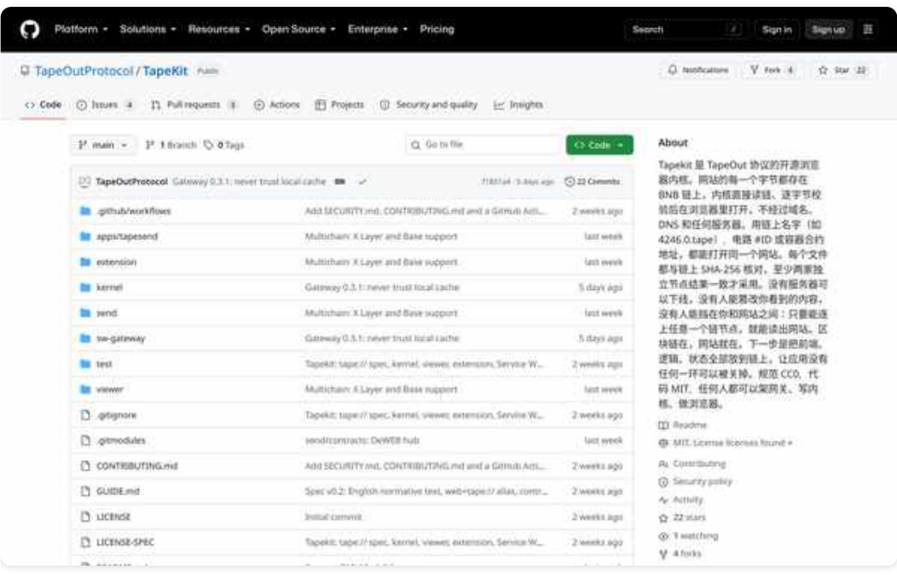
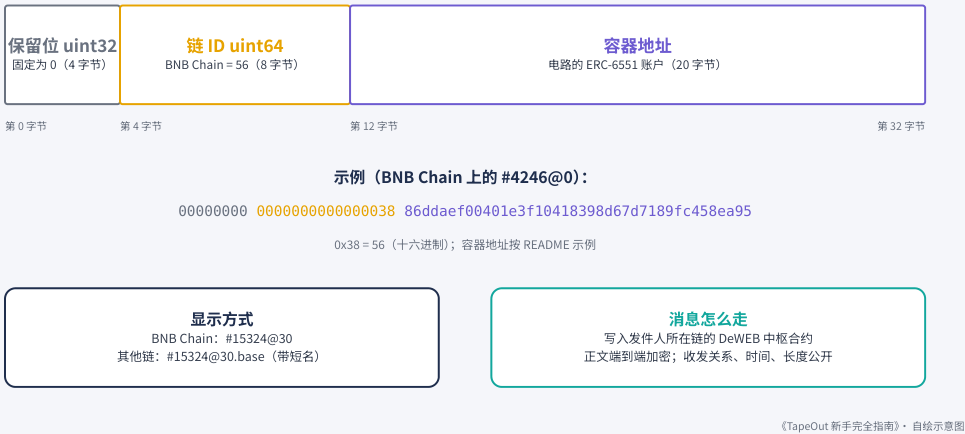
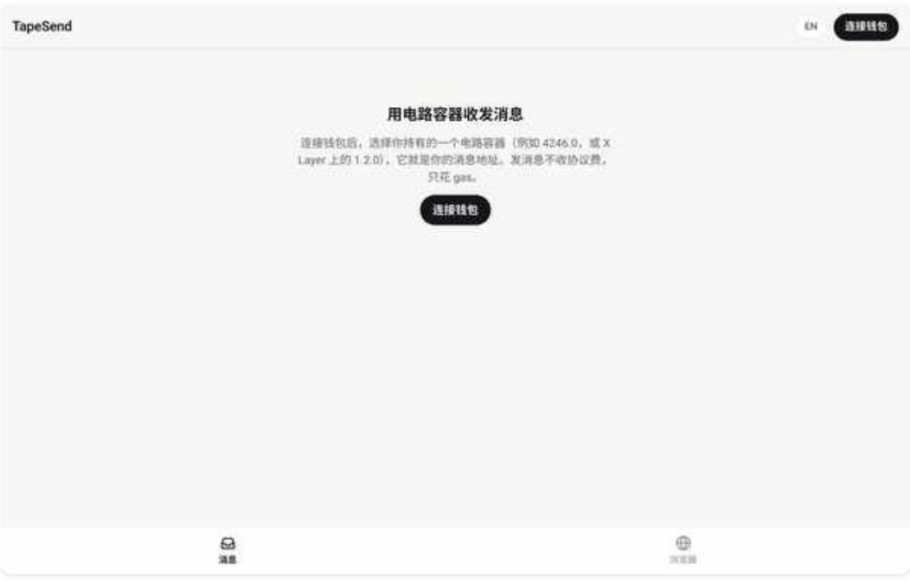
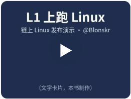
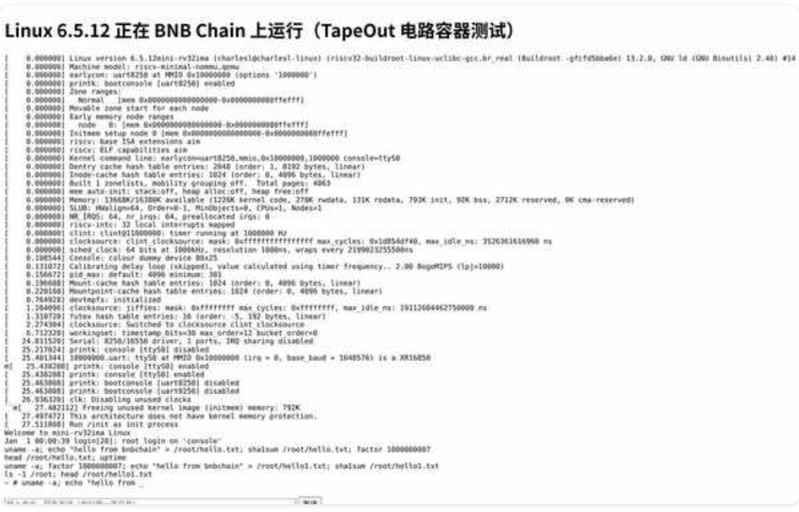

# 第 7 章：开发者工具（第 1 部分）

> 本文件由 PDF 自动转换生成，尚未完成独立校对；请结合页码回溯注释核对原文。

<!-- source: tapeout-beginner-guide-v1.5-web.pdf p.78 -->

## 第 7 章开发者工具：TapeKit、tape:// 规范与 TapeSend

#### ⏱ 一分钟看懂本章

这一章写给想动手做东西的人。只想用的人记住一条就够：链上网站用 https://<编号>-<处理器 >.tapekit.org/ 打开，什么都不用装；下面几条读完就能跳到第 8 章。TapeKit 是官方开源的工具箱，负 责把 tape:// 网站从链上读出来、核对、显示；tape:// 规范定下了名字和校验的规矩；TapeSend 让容 器之间互发加密消息，它的规范叫 TAP-10；HashPort 是帮你把网站传上链的托管服务。

四层名字：TapeOut（协议）、tape://（网址与规范）、TapeKit（开源工具）、HashPort（商业服务）。

- TapeKit 代码用 MIT 许可、规范用 CC0，任何人都可以自己做网关、内核和浏览器。

- 用内核几行代码就能打开 4246.0.tape，并且每个文件都逐字节核对。

- TAP-10 端点号 = 保留位 + 链 ID + 容器地址；消息正文加密，谁给谁发是公开的。

- DeWEB 中枢已在 BNB Chain 上线，还是很新的东西，重要消息先别只靠它传。

- Protocol V2（元件插槽、设备仓库）还在预告阶段，见第 6 章 6.7。

- 链上 Linux 演示说明：计算过程本身也可以公开验证。

#### ✦ 编者一句话

编者眼里的 DeWEB：网站存进链上的电路容器，“谁也关不掉，一站开三代，你走了他还在”；前端也上了链，Web2 的黑箱就变成了“明厨亮灶”。社区已经做出的 41 个链上应用，见本章 7.7。

如果你只是想挖矿或收藏电路，这一章可以粗读。如果你想在 TapeOut 上 **做点东西** ——链上网站、消息应用、读链工具——这一章会告诉你官方已经开源了什么、写到了什么程度、还有哪些没做完。

### 7.1 先分清四个名字

TapeKit README 专门列了一张命名表，我们照着翻译：

|**层**|**名字**|**管什么**|
|---|---|---|
|协议|**TapeOut**|晶体管、处理器、电路容器：链上那一 层|
|网址与规范|**tape://**|用戶在地址栏输入的东西；规范就叫 “tape:// 规范”|
|开源工具|**TapeKit**（仓库里写作 Tapekit）|所有读取 tape:// 的东西：内核、网关、 扩展、命令行、未来的桌面应用|

<!-- source: tapeout-beginner-guide-v1.5-web.pdf p.79 -->

|**层**|**名字**|**管什么**|
|---|---|---|
|商业服务|**HashPort**|由 HashPort 团队运营的托管控制台、域 名绑定和收费|

官方 GitHub 仓库 TapeOutProtocol/TapeKit（本书 2026-09-25 截图）。

### 7.2 TapeKit 仓库里有什么

仓库地址（维护方：TapeOut Labs）：github.com/TapeOutProtocol/TapeKit。代码采用 **MIT** 许可，规范文本采用 **CC0** （放弃版权）。README 的原话是：“任何人都可以架自己的网关、写自己的内核实现、做自己的浏览器。我们写的这一份只是参考。”

<!-- source: tapeout-beginner-guide-v1.5-web.pdf p.80 -->

#### 📄 这份文档讲了什么

#### TapeKit README

TapeKit README 是整个开源仓库的“总目录”，有中、英、韩三种语言。它先讲清四层命名，再告诉你每个文件夹是干什么的、怎么跑起来，以及站长怎么把网站放上链。

- 仓库地图：内核 kernel、网关 sw-gateway、浏览器扩展 extension、查看器 viewer、消息层 send、客戶端 apps/tapesend。

- 快速开始：几条 npm 命令就能跑测试、启动本地网关。

- 站长指引：用 HashPort 上传，或直接调用合约（putFile、appendChunk 等）。README 路线图里把正式的“站长手册”列为待办。

- 名字开通费写的是 0.08 BNB/30 天（本书链上实测当前为 0，见第 4 章）。

- 路线图：发布到 npm、开源合约与命令行工具、桌面应用。

- 许可：代码 MIT，规范文本 CC0。

|**目录**|**是什么**|
|---|---|
|kernel/|**内核** @tapekit/kernel ：零依赖的 ES 模块，负责名字解析、 多节点一致、钉住区块、钉住实现、逐文件 SHA-256 校验、缓 存|
|sw-gateway/|**Service Worker 网关**：让普通浏览器不装任何东西就能打开 链上网站，每个网站一个独立来源|
|extension/|**浏览器扩展**（Chrome MV3）：地址栏关键词 tape ；还能核对 当前 https 页面是否与链上字节一致|
|viewer/|**网页查看器**（预览模式）：沙箱 iframe，作为没有扩展和网关 时的兜底|
|send/|**TapeSend · DeWEB 消息层**：合约、模块和设计文档|
|apps/tapesend/|**TapeSend 客戶端**：网页、桌面（Electron，内置 tape:// 浏览 器）、iOS / Android|
|SPEC.zh.md/ SPEC.md|**tape:// 规范 v0.2**（中英文）|
|GUIDE.md|中文技术说明：怎么运行、测试、部署各组件，已知限制|

#### 在自己的代码里用内核，只需要几行（README 示例）：

import { createKernel } from './kernel/src/index.js'; const kernel = createKernel();                    // 默认 4 个公共节点，2 个必须一致 const res = await kernel.resolve('4246.0.tape');  // res.status === 'ok' | 'unpaid' | … const site = await kernel.openSite(res);          // 只读文件清单 const file = await site.get('index.html');        // 字节已与链上 SHA-256 核对

<!-- source: tapeout-beginner-guide-v1.5-web.pdf p.81 -->

resolve 返回的状态码有： ok （已开通）、 unpaid （未开通或已到期）、 not-opened （电路还没开容器）、 no-such-cpu 、 no-such-token 、 not-tapeout 、 blocked 、 store-changed （仓库合约实现与钉住的不符，拒绝读取）。

#### 提示

**“钉住实现”是什么意思？** 网站仓库 SiteRegistry 和付费合约 DomainBinding 这两个合约的“内芯” 可以被管理员换掉。所以客戶端每次都会先看一眼内芯是不是自己认识的那一版（放在一个固定的位置，叫 ERC-1967 实现槽）。不认识就先不读，等客戶端更新了名单再说。这样合约哪天被悄悄换了芯， 你的浏览器也不会跟着读到新逻辑。

### 7.3 tape:// 规范 v0.2 讲了什么

#### 📄 这份文档讲了什么

#### tape:// 规范 v0.2（SPEC.zh.md）

《tape:// 规范 v0.2》（2026-09-13，草案）只管四件事：网址怎么写、名字怎么解析成容器、读到的文件怎么核对、链上网站怎么被隔离运行。怎么上传、钱包怎么做，它都不管。

- 名字写成“电路#ID.处理器编号.tape”，还接受 #4246@0、容器地址等几种写法。

- 所有读取钉在同一个区块，至少两家不同运营方的节点结果完全一致才算数。

- 文件按 24,000 字节分块，单个文件最大 8.4 MB，每个文件都核对 SHA-256。

- “钉住实现”：合约内芯一旦被换，客戶端先停下，确认新版本可信后再读。

- 网站隔离：每个网站一个独立来源，伤不到用戶和别的网站；全部干净才显示“100% 链上”。

- 只显示已开通的名字——“收费”靠的是客戶端规则，而不是把数据锁起来。

规范（2026-09-13，草案）一开头就说清楚：它只管四件事—— **网址格式、地址解析、校验、网站隔离** ；不管文件怎么上传、普通浏览器怎么访问、钱包怎么实现。

第 4 章已经讲了网址和解析。这里补充规范里开发者最关心的三块内容：

- **网站隔离（§7）** ：链上网站可能是恶意的，外壳必须保证它伤害不到用戶、别的网站和外壳自己。例如每个网站一个独立来源、不在有特权的地方运行站点代码、网络请求和弹窗受限、钱包交互要显示身份。

- **“纯链上”标记（§8）** ：静态扫描和运行时检查都干净的网站才显示“100% 链上”。

- **永不改变的承诺（§15.1）** ：规范区分了“永远不变的东西”和“会变的东西”，并规定了版本号规则。

<!-- source: tapeout-beginner-guide-v1.5-web.pdf p.82 -->

### 7.4 TapeSend 与 TAP-10：容器之间的加密消息

TapeSend 应用图标（来源：TapeOut Labs / TapeKit 仓库，MIT 许可）。

**TapeSend** 让电路容器之间互相发消息。按 TapeOut Labs 的 send/README 的描述：

- 像 #4246@0 这样的容器就是一个 **收件地址** ，持有电路的人以容器身份发消息；

- 每条消息写进发件人所在链上的一个小合约—— **DeWEB 中枢** （Hub）， **端到端加密** ；

- 消息路径上 **没有跨链桥、没有索引器、没有服务器** ，每个客戶端都自己去链上核对读到的内容。

它的规范编号是 **TAP-10** 。

#### 📄 这份文档讲了什么

#### TapeSend / TAP-10（send/README.md）

send/README 是 TapeSend 和 TAP-10 的设计说明（草案）。一句话概括：给每个电路容器配一个“链上信箱”，消息加密后写进发件人所在链的中枢合约，路上不经过服务器、跨链桥或索引器。

- 端点号 = uint32(0) ‖ uint64(链 ID) ‖ 容器地址，共 32 字节，全网唯一。

- 加密：消息在你自己的设备上锁好，只有收件人能打开；开锁的钥匙由钱包签名生成（技术上用 X25519 + XChaCha20-Poly1305）。

- 元数据公开：谁给谁发、什么时候、多长，链上都看得到，只有内容是加密的。

- 中枢 0xe61A…E25ee 于 2026-09-18 在 BNB Chain 上线，各链地址相同。

- 已知限制：陌生人可以往信箱里“刷”消息；被授权过电路的合约可以代发。

**端点号（Endpoint ID）** 是 TAP-10 的核心：

<!-- source: tapeout-beginner-guide-v1.5-web.pdf p.83 -->

### TAP-10 端点号（Endpoint ID）的结构

uint32(0) ‖ uint64(chainId) ‖ 容器地址 ⸺ 共 32 字节，全网唯一

<!-- Start of picture text -->
保留位 uint32 链 ID uint64 容器地址 固定为 0（4 字节） BNB Chain = 56（8 字节） 电路的 ERC-6551 账戶（20 字节） 第 0 字节 第 4 字节 第 12 字节 第 32 字节 示例（BNB Chain 上的 #4246@0）： 00000000 0000000000000038 86ddaef00401e3f10418398d67d7189fc458ea95 0x38 = 56（十六进制）；容器地址按 README 示例 显示方式 消息怎么走 BNB Chain：#15324@30 写入发件人所在链的 DeWEB 中枢合约 其他链：#15324@30.base（带短名） 正文端到端加密；收发关系、时间、长度公开 《TapeOut 新手完全指南》· 自绘示意图 <!-- End of picture text -->
<!-- reviewed: p.83; fix: ocr -->

TAP-10 端点号的结构（依据 send/README，本书自绘）。

- 端点号 = uint32(0) ‖ uint64(chainId) ‖ 容器地址 ，一共 32 字节，全网唯一；

- 在 BNB Chain 上显示为 #15324@30 ，在其他链上带短名，如 #15324@30.base ；

- 加密：消息在你自己的设备上就锁好了，只有收件人能打开（技术上用的是 X25519 + XChaCha20Poly1305，载荷格式 0x02 ）。开锁用的钥匙由你的钱包签名生成，不用另外记密码；对应的“公钥” 公开放在中枢上，别人用它给你发加密信；

- **元数据公开** ：谁给谁发、什么时候、多长，在链上都看得到， **只有内容是加密的** ；

- 附件：小图片放在加密内容里；资产附件是转进对方容器的转账，由收件方客戶端到链上核对。

**部署状态** （send/README，2026-09-18）：中枢已在 BNB Chain 主网上线，代理地址 0xe61A…E25ee ，当前实现 v3 0x80aF…EE85 ， **各链地址相同** 。README 当时写的是 Base、X Layer 在计划中；仓库 2026-09-19 的提交加入了“X Layer 和 Base 支持”。同一天，X Layer 中文台 @xlayer_zh 确认 TapeOut 已在 X Layer 主网完成部署：处理器工厂、电路容器、网站仓库、TapeSend 跨链加密消息通道四个模块全部上线，X Layer 和 BNB Chain 之间可以直接互发端到端加密消息，不需要跨链桥；公告同时说明，PoD 挖矿经济体系不受影响， 仍以 BNB Chain 为中心。本书 2026-09-25 用 X Layer 公共节点复查：中枢地址在 X Layer 上有合约代码；网站仓库和名字绑定在 X Layer 上用的是和 BNB Chain 不同的地址（TapeKit 内核里写着），也有代码——所以 Issue #6 里“用 BNB 的地址查不到”是真的，但不等于没部署（见第 4 章）。X Layer 开容器是 0.08 OKB。 Base 还在计划中。

创始人 @Blonskr 同一天发了一段约 104 秒的视频，讲他对 DeWEB 的设想：做成横跨所有主流公链的去中心化广域网；TapeSend 已在 GitHub 以 MIT 协议完全开源，还附带网页、Mac、iOS、Android 四个平台的客戶端，任何开发者都能拿去商用。

<!-- source: tapeout-beginner-guide-v1.5-web.pdf p.84 -->

#### 注意

**已知限制** （send/README 原文要点）：任何有已开通容器的人都能往别人信箱里“刷”消息（客戶端对陌生人每页只显示 3 条）；被授权过电路 NFT 的合约（例如交易市场）可以在一笔交易里借用电路、以容器身份发消息（客戶端会标出）。

本书在本机运行的 TapeSend 网页客戶端（本书 2026-09-25 截图，未连接钱包）。首页提示“用电路容器收发消息”。

TapeSend 开源后，社区一天之内就做出了好几个客戶端。社区作者 YW（@ywweb3）的长文《TapeSend 诞生 24 小时：三款产品爆发，狂欢背后的机遇与隐忧》（2026-09-20）记录了这段热闹，也聊了留存问题。

#### 提示

上面这篇文章提到的客戶端里有 TAPQQ，它是本书编者洪七公的作品（见第 8 章“编者的作品”）。

### 7.5 链上 Linux：一个技术演示

2026 年 9 月 7 日，创始人 @Blonskr 发布了这个演示，称这是“历史上第一次在 L1 主网上跑 Linux”：每条指令都由 BNB Chain 主网交易执行、全部状态都存在链上。他拿它和 Cartesi 做了对比——Cartesi 的 Linux 在链下节点上跑，L1 只在有争议时才重算一步。按他的公告，从上电到 root 登录一共 44,988 拍、9,000 余笔交易。

<!-- source: tapeout-beginner-guide-v1.5-web.pdf p.85 -->

<!-- Start of picture text -->
▶ <!-- End of picture text -->

#### 在 L1 主网上跑 Linux（发布演示）

@Blonskr（X） · 2026-09-07 · 时长 1:11 https://x.com/Blonskr/status/2096956123765264474

官网的链上 Linux 页面展示了这个演示：在 BNB Chain 上运行主线 **Linux 6.5.12** （rv32ima 指令集、无 MMU、busybox 用戶空间）。按页面说明：

- 16 MB 内存存放在 **16,384 个页合约** 里；

- 每次调用 tick() 最多执行 1,024 条指令；

- 从开机到出现 root 登录提示，一共执行了约 **4,180 万条** 指令（页面说法；创始人公告里说的是 44,988 拍、9,000 余笔交易，两个数字的统计单位不同）；

- 这台“机器”的所有者是一个 **电路容器** 。

链上 Linux 演示页（本书 2026-09-25 截图）：Linux 6.5.12 启动日志。

它不是为了跑得快，而是为了证明：每一步计算都能摆在链上，让所有人核对（BruceBlue 对此有一篇专门解读，见延伸阅读）。

### 7.6 还没做完的事

TapeKit README 的“状态与路线”部分列出了下一步计划（2026-09 版本）：

<!-- source: tapeout-beginner-guide-v1.5-web.pdf p.86 -->

- 网关域名进入公共后缀列表（Public Suffix List）——官方组织里 fork 的 list 仓库可能与此有关；

- @tapekit/kernel 发布到 npm，补齐 API 参考和类型定义；

- **开源合约源码和发布命令行工具** ；

- 注册 tape:// 协议的 **桌面应用** ；

- web3:// （ERC-4804 / ERC-6860）只读适配。

GitHub 上的 TapeKit Issues（TapeOut Labs 仓库，社区提交）也能看到正在推进的事（2026-09-25 查看）：

- **#4** ：主网阻塞项——验证 DeWEB 中枢合约，并解决 MetaMask 钱包对 publishKey 操作弹出的警告 （钱包弹警告时怎么办，见第 9 章）；

- **#5** ：直接通过 ERC-6551 注册表创建的容器会静默变成“只收不发”， open() 可以被绕过。说白了： 不走官网、直接用底层合约开的容器，只能收不能转出，开发者别这样开；

- **#6** ：X Layer 是否部署 SiteRegistry / DomainBinding。提问者拿 BNB Chain 上的地址去 X Layer 查， 没有代码；本书复查发现 TapeKit 内核给 X Layer 配的是另一组地址，那里有代码（见第 4 章）。写作时这个 Issue 还开着，没有维护者回复；

- **#7** ：tape:// 站点的请求 / 响应与 WebMCP 工具发现的标准化讨论，说白了就是讨论怎么让 AI 工具能自动调用链上网站的功能。提案人是社区开发者 Alphana（@0xAlphana），他在 9 月 24 日的提案长文里演示了 AI 通过网页自报的工具打完一局链上塔防游戏。创始人 @Blonskr 9 月 25 日发帖邀请大家一起评审：提案通过的话，他个人拿出 50 BEM 奖励提案人 @0xAlphana，另外给提出有效建议的开发者每人 5 BEM（只认在该帖下引用或直接评论的建议）。

#### 提示

**创始人的“前端上链”呼吁（2026-09-25）** ：创始人 @Blonskr 9 月 25 日 12:05（新加坡时间）发了一条“郑重呼吁”。他举的例子是 Bitget 这次和 Bybit 上次被盗，说问题大都出在第三方工具或多签等系统的前端被篡改；所以他呼吁所有 DeFi 和第三方工具把前端部署到 TapeOut 可验证的 DeWEB（tape://） 上，并表示会个人无偿赞助所有前端上链的大型第三方工具（包括 Safe 多签等）做前端上链的安全资金。他给的理由是：前端上链后没法被偷偷篡改，浏览器还会自动比对哈希，一旦有被篡改的风险就立刻提示。这是创始人的个人承诺和呼吁，具体怎么申请、哪些工具已经响应，本书写作时还没有看到公开信息。

**编者注** ：按 Bitget 目前的官方说法，这次是钱包后台系统被入侵、伪造数据触发了授权流程，并不是网页前端被篡改（前端被调包是 Bybit 那次的情况）。前端上链能防网页被调包，但防不了后台被控。详见第 9 章 9.5。

另外，README 提到 TAP-10 规范“正在作为 DeWEB 标准的一部分重写，之后单独发布”。 **截至写作时，没有找到独立发布的 TAP 标准文本** ，也没有发现 TAP-1 ~ TAP-9 之类的其他编号文档。

### 7.7 社区 DeWEB 应用大全

tape:// 上线才两个多星期，社区已经把一大批游戏、工具和小应用搬上了链。截至 2026 年 9 月 25 日 18:40 （新加坡时间）前后，本书把 BNB Chain 和 X Layer 上网站仓库合约的全部链上记录扫了一遍，一共找到 **51<!-- source: tapeout-beginner-guide-v1.5-web.pdf p.87 --> 个写了文件的链上网站**：

- **社区真实应用 39 个** （BNB Chain 36 个、X Layer 3 个），其中 3 个是编者洪七公的作品，下表用 ★ 标出；

**官方站点 2 个** （TapeKit 主页和它的一份副本）；

其余 10 个是测试页、空页或模板（比如只写了一句“hello”的页面），不算作应用。

社区的 TapeWeb 索引（web.tapeout.link）是别人独立扫链得到的，它列出的 BNB Chain 站点和本书的结果一一对应。9 月 25 日当天新上的有 @0xkEvinC 的《小孩哥 · 电路远征 99》（ tape://16.68 ，14:12 上链）；编者的 8.888 靓号商城也在当天 17:11 正式发布。

表里的地址点开就是官方网关： tape://A.B 对应网址 A-B.tapekit.org ，普通浏览器就能打开，不用装任何东西。“上链”一栏是链上第一次写入文件的日期（新加坡时间）。作者一栏只写能从作者本人帖子或页面里确认的 X 账号，确认不了的写“作者未知”。

#### 注意

这些应用绝大多数是社区个人作品，不是官方产品，本书也没有逐个试用。只打开看看最安全；需要连接钱包、签名、借贷或下注的，先用一个只放少量资金的新钱包。

#### 游戏（15 个）

|**应用**|**地址**|**作者**|**上链**|**简介**|
|---|---|---|---|---|
|TAPE STRIKE · 清 除芯片里的 Bug|tape://1.894|@spongemochi|09-17|TAPE STRIKE：TapeOut 首个链上第一人称射击游 戏，约 600KB 全部写进 BNB Chain，玩法是清除从 晶圆里爬出的 Bug。|
|躺平大师 · TP 流片 铸卡|tape://1.899|作者未知|09-18|“躺平大师”：拖动小人摆出各种躺平姿势，然后用 TP 流片铸成卡面。|
|RAIDEN 雷电|tape://5182.30|@blueshirt666|09-18|RAIDEN 雷电：用 AI 写的竖版飞行射击游戏，有关 卡、无尽和 BOSS 模式。|
|TAPE HOLD’EM · 链上德州|tape://2.894|@spongemochi|09-19|TAPE HOLD’EM：100% 跑在 BNB Chain 上的德州 扑克，四个 AI 陪练随时开桌，筹码只供娱乐。|
|BURNBEM 游戏厅 ★|tape://1688.0|编者洪七公|09-19|编者作品：Burnbem 小游戏合集，附 BEM 销毁数 据统计；内含《摸鱼达人》和 TapeOut 容器上传器 入口（见 8.9）。游戏厅还收录了 KallyGame 的 Nibble（见表下说明）。|
|黑神话巨兽 · Black Myth: Behemoth|tape://12123.3 0|未确认（疑为 @benson_doge）|09-20|黑神话巨兽 Black Myth: Behemoth：操作悟空挑战 由电路板控制的牛来和牛妈（网址尚未付费激活）。|
|BEM ROYALE · TapeOut 链上大逃 杀|tape://14031.3 0|@dc_cap|09-20|BEM ROYALE：链上大逃杀、搜刮撤离、迷宫逃脱三 合一游戏，以 gate（BEM 的最小单位）计价。|

<!-- source: tapeout-beginner-guide-v1.5-web.pdf p.88 -->

|**应用**|**地址**|**作者**|**上链**|**简介**|
|---|---|---|---|---|
|NEON CITADEL ― The Last Light|tape://40.865|@0xAlphana|09-22|NEON CITADEL：霓虹塔防生存游戏，接入 DeWebMCP，人和 AI Agent 都能玩（商业化作 品）。|
|喵喵德州俱乐部 · 大厅|tape://1.1031|作者未知|09-22|喵喵德州俱乐部：和真人打德州扑克，可以用 BEM 或免费积分，没有庄家，每手打完公开底牌（绑定 meowtopia.club）。 涉及真实下注，请先了解当地 法律和风险。|
|链上中国象棋 · 122.6.tape|tape://122.6|作者未知|09-23|链上中国象棋：本地人机对弈或双人同屏，没有服务 器，也没有追踪。|
|营造 · 在五台山下 盖一座唐代大殿|tape://3.894|@spongemochi|09-23|营造：在五台山下亲手搭一座唐代木构大殿（南禅 寺），规矩对了它立住，错了它当场塌掉。|
|NEON RELIQUARY ― Oath Expedition （霓虹圣物：誓约 远征）|tape://1.2.231 （X Layer）|@0xAlphana|09-24|四人小队动作远征 3D 游戏：队长和三个队友席位都 可以交给外部 AI 或战术芯片。免费玩，不需要钱 包，也不需要懂电路。|
|喵喵彩票|tape://2.1031|作者未知|09-24|喵喵彩票：用 BEM 买注，每 30 分钟、每天、每月 各开一期，用区块哈希开奖，奖池 90% 归中奖者、 5% 销毁（绑定 lottery.meowtopia.club）。 涉及真 实下注，请先了解当地法律和风险。|
|BITMAP Runtime V0.2.1|tape://335.0|作者未知|09-24|BITMAP Runtime V0.2.1：连接 OKX 比特币钱包， 进入 3D BITMAP 空间，用 WASD 漫游。|
|小孩哥 · 电路远征 99 ｜ V0.0.3|tape://16.68|@0xkEvinC|09-25 （9 月 25 日新 上）|小孩哥 · 电路远征 99 /《B神的超级冒险电路之 旅》：以小孩哥为 IP 的原创横版闯关解谜游戏，9 大 主题、99 关、9 位 Boss。|

**Nibble（作者 KallyGame）** ：BURNBEM 游戏厅收录的实时吞噬竞技小游戏，作者 KallyGame （@KallyGame），地址 burnbem.ai/nibble，目前是演示版。它是普通网页，没有单独写进链上容器，所以不计入上面的 39 个链上应用。

#### 金融与支付（6 个）

|**应用**|**地址**|**作者**|**上链**|**简介**|
|---|---|---|---|---|
|BEM · 抵押借贷|tape://979.30|@DigitalBeggar_c|09-17|零手续费的 BEM 矿机抵押借贷平台：用矿机 NFT 抵 押借入稳定币，可以随时部分或全额还款。|
|TapeOut Fun|tape://4451.0|@TapeOutFun|09-19|TapeOut Fun：只支持 BEM 配对的联合曲线代币发 射台，项目毕业后进入 PancakeSwap 并永久锁定流 动性（公开测试中）。|
|gradfi · fair- launch mining|tape://3114.0|作者未知|09-20|gradfi：BSC 上的公平发射挖矿协议，交易 grad、 达到交易量目标即可获得挖矿奖励（绑定 i|
|protocol on bsc||||gradfi.org）。|
