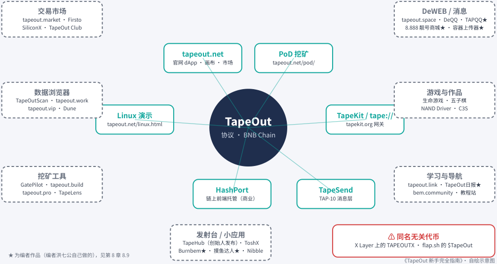

# 第 8 章：生态地图

> 本文件由 PDF 自动转换生成，尚未完成独立校对；请结合页码回溯注释核对原文。

<!-- source: tapeout-beginner-guide-v1.5-web.pdf p.92 -->

## 第 8 章生态地图：市场、数据、工具与作品

TapeOut 上线才一个多月，社区就已经做出了几十个网站和工具：交易市场、数据面板、挖矿助手、链上网站、聊天应用，还有能免费玩的链上游戏。这说明很多人是真心想在上面做东西。这一章按用途把它们分门别类，帮你知道“想做某件事时去哪里找”——也许读完，你就想亲手做下一个。

#### 注意

**逛生态前的小提醒** ：除了标注“官方”的条目，本章列出的都是社区或第三方做的产品——这正是生态热闹的地方，但它们不代表官方背书，也不代表本书推荐。遇到要连接钱包、签名或授权的，先核对完整域名，只授权你看得懂的操作，就能玩得很安心。以下链接均为 2026-09 期间可访问的状态，出版后可能失效。

### TapeOut 生态地图（2026-09）

内圈：官方 / 官方相关；外圈：社区与第三方（非官方背书）；红框：同名无关项目

<!-- Start of picture text -->
交易市场 DeWEB / 消息 tapeout.market · Firsto tapeout.space · DeQQ · TAPQQ★ SiliconX · TapeOut Club 8.888 靓号商城★ · 容器上传器★ tapeout.net PoD 挖矿 官网 dApp · 画布 · 市场 tapeout.net/pod/ 数据浏览器 游戏与作品 TapeOutScan · tapeout.work 生命游戏 · 五子棋 tapeout.vip · Dune NAND Driver · C3S Linux 演示 TapeKit / tape:// tapeout.net/linux.html TapeOut tapekit.org 网关 协议 · BNB Chain 挖矿工具 学习与导航 GatePilot · tapeout.build tapeout.link · TapeOut日报★ tapeout.pro · TapeLens HashPort TapeSend bem.community · 教程站 链上前端托管（商业） TAP-10 消息层 发射台 / 小应用 ⚠ 同名无关代币 TapeHub（创始人发布）· ToshX X Layer 上的 TAPEOUTX · flap.sh 的 $TapeOut Burnbem★ · 摸鱼达人★ · Nibble ★ 为编者作品（编者洪七公自己做的），见第 8 章 8.9 《TapeOut 新手完全指南》· 自绘示意图 <!-- End of picture text -->

#### TapeOut 生态地图（本书自绘）。

最完整的生态盘点来自 Odaily 上黑色马里奥的《深度纵览 TapeOut 生态图景》（2026-09-20；PANews 转载时题为《TapeOut 生态全景盘点》），本章的分类参考了它，并补充了我们自己核对过的链接。早期的工具清单还可以看新东西|Something（@something_labs）8 月 28 日的《TapeOut 社区生态工具一览》，它按交易、 挖矿、数据分类点了早期工具和作者。

<!-- source: tapeout-beginner-guide-v1.5-web.pdf p.93 -->

### 8.1 官方与官方相关

|**名称**|**地址**|**用途**|
|---|---|---|
|TapeOut 官网|tapeout.net|画布、项目、市场、容器、挖矿（官方）|
|PoD 挖矿页|tapeout.net/pod/|挖矿、题库、公式（官方）|
|tape:// 网关|tapekit.org|打开链上网站（官方）|
|HashPort|hashport.ai|上传链上网站（TapeKit README 称其为 商业服务）；创始人 @Blonskr 称它是第 一个基于 TapeOut 的商业化项目，他提 供过技术指导|
|TapeHub|tapehub.ai|矿币发射台：创始人 @Blonskr 2026- 09-15亲自发布，称它为“TapeOut 发 射平台”（运营主体本书未核实）；按公 告，国库收入的 50% 回购销毁 BEM|

#### 首届黑客松（进行中）

- **谁办的** ：IGNIX（@Ignixbot）9 月 22 日宣布开赛。X Layer 的 Zakk（@zakk_okx）转发时说“很高兴和 @Blonskr 一起，揭幕 TapeOut 的首届黑客松”。

- **比什么** ：TapeOut Genesis Transistor Hackathon——在 X Layer 主网上通过 TapeOut 部署自己的处理器，设定晶体管供应量和价格，按做出来的东西排名，不只看成交量或币价；刷量、对敲会被取消资格。

- **时间和奖金** ：2026-09-22 12:00 至 10-06 12:00（香港时间，和新加坡时间相同）；前三名奖金 8,000 / 4,000 / 2,000 美元，第一名的晶体管会成为“Ignix 创世晶体管”。

- **怎么参赛** ：按活动页（Ignix）的要求，处理器要通过 TapeOut 工厂部署在 X Layer 主网上；部署时公开设定晶体管供应量、单价和上限；截止前这台处理器上至少要有一条电路完成流片（活动页 FAQ 说自己流或别人流都算）；项目要有明确用途；最后通过表单提交处理器合约地址、部署钱包、产品演示和项目说明。

想要手把手的步骤，可以看 Venz（@wenzherunze）的保姆级参赛教程（教程把 @TapeOutWorld 也列为联合主办方，但 IGNIX 原帖没有提到它）。93.bitmap（@93bitmap）的科普第 20 集也专门讲了参赛细节（见第 11 章）。

### 8.2 交易市场

|**名称**|**地址**|**说明**|
|---|---|---|
|TapeOut Market|tapeout.market|第三方晶体管 / 电路市场，有 FAQ 和开 放 API；PANews 挖矿教程的截图来自这 里|
|Firsto|tapeout.firsto.ai|第三方交易与链上数据面板|
|SiliconX|siliconx.top|第三方交易终端|

<!-- source: tapeout-beginner-guide-v1.5-web.pdf p.94 -->

|**名称**|**地址**|**说明**|
|---|---|---|
|TapeOut Club|tapeout.club|一次比较多个市场的价格，钱始终留在 你自己的钱包里|
|芯市|yuequan123.com/bem|第三方 TapeOut 交易终端（页面标题 “芯市 · TapeOut 交易终端”）|

### 8.3 数据与浏览器

|**名称**|**地址**|**说明**|
|---|---|---|
|TapeOutScan|tapeoutexplorer.com|公开数据浏览器：承诺、流片、开挖、 榜首、转移、地址算力|
|TapeOut Protocol 数据|tapeout.work|公开数据终端；社区导航称其属于 TapeOut Labs，站点自述为公开数据分 析，官方性未核实|
|tapeout.vip|tapeout.vip|第三方数据面板|
|Dune 看板|TapeOut Mining Intelligence|Dune 用戶 ekonomeest 做的挖矿数据看 板（第三方）|

### 8.4 挖矿辅助工具

|**名称**|**地址**|**说明**|
|---|---|---|
|GatePilot|tapeout.vibedegens.com|门级电路优化、设计搜索，现在还加了 **矿机租赁**（页面标题“PoD 挖矿·租赁 一站式平台”）。租赁类合约要授权电 路，授权前看清对方合约能不能升级、 授权范围多大|
|算力画布|tapeout.build|第三方电路 / 算力设计工具|
|Verifier|tapeout.pro/verifier|测试向量验证|
|TapeLens|tapelens.xyz|电路与矿机数据查看|
|TapeStar|tapestar.org|漫谈Coin（@mantancoin）团队做的 “一键成矿”聚合器（介绍帖，2026- 09-23，早期 Beta）：按预算比较买料和 流片方案，自称资产留在你自己钱包 里。涉及签名，第一次用先小额试|

<!-- source: tapeout-beginner-guide-v1.5-web.pdf p.95 -->

### 8.5 DeWEB：链上网站与消息

|**名称**|**地址**|**说明**|
|---|---|---|
|tapeout.space|tapeout.space|SpongeMochi（@spongemochi）做的 链上网站“电路图”、社区网关和一键上 链工具（作者说明）。作者写明它是社区 网关、不是官方入口，能打开还没开通 的网站|
|TapeWeb|web.tapeout.link|全网链上站点查看器（页面标题 “TapeWeb · TapeOut 全网链上站点查 看器”）|
|容器工厂|id.tapeout.link|肖战羊（@Xiao_zhanyang）做的一键 开容器工具：选号 → 铸造 → 流片 → 开 通容器（介绍帖）|
|TapeChat|chat.tapeout.link|肖战羊（@Xiao_zhanyang）基于 TapeSend 二次开发的链上消息工具，支 持 BNB Chain、X Layer、Base 互发 （发布帖）|
|DeQQ|deqq.pages.dev|基于 TapeSend 的第三方聊天客戶端|
|TAPQQ（1.888.tape）|1-888.tapekit.org|复古 QQ 窗体风格的链上聊天应用（编者 作品，见8.9）|

#### 提示

上面肖战羊的 TapeChat 发布帖里也提到了 TAPQQ，帖中给的地址是 1688-0.tapekit.org。那其实是编者的另一个站点 BURNBEM 游戏厅（ tape://1688.0 ，见 8.9）；TAPQQ 本身在 tape://1.888 （1888.tapekit.org）。两个地址本书都在 2026-09-25 用 TapeKit 官方内核读链核对过。

想了解 TapeSend 开源后这些客戶端是怎么冒出来的，可以读 YW（@ywweb3）的《TapeSend 诞生 24 小时》（文中也提到了 TAPQQ）。

### 8.6 游戏与链上作品

这些作品展示了“链上电路能做什么”，很适合新手打开看看（大多只读、无需钱包）：

|**作品**|**地址**|**看点**|
|---|---|---|
|Perpetua|h805846716.github.io/perpetua|用 14,592 个门实现的“生命游戏”|
|NAND Driver|jogjohgoeg.github.io/nand-driver|Joooooo（@zhuoning293）的链上自 动驾驶小车：只靠 21 个 NAND 门开车，|
|||流片成作者自己处理器上的 279 号电 路，每次转向都由 BNB Chain 节点算出 来（作者原帖）|

<!-- source: tapeout-beginner-guide-v1.5-web.pdf p.96 -->

|**作品**|**地址**|**看点**|
|---|---|---|
|C3S Reflex Circuits|brucelanlan.github.io/c3s-reflex-circui ts|受果蝇反射启发的电路研究对象|
|BEM Clock|fashen002.github.io/bem-clock|链上电路时钟|
|NANDPU|nandpu.app|NAND 处理器实验|
|TapeOutScan 小游戏|tapeoutexplorer.com|站内有“黑神话”“五子棋”等电路小游 戏|
|GateCraft|gatecraft.fun|BruceBlue（@BruceBlue）送给社区的 中秋实验：在浏览器里把一个小判断做 成可逐格检查的 NAND 电路（介绍长 文，作者写明是个人研究、不代表 TapeOut）|
|Neon Reliquary: Oath Expedition|1-2-231.tapekit.org|Alphana（@0xAlphana）9 月 24 日发 布的四人小队动作游戏，部署在 X Layer 的链上网站上（地址里的 2 是 X Layer 区 号）；可以自己当队长，也可以把队长位 交给外部 AI，免费玩、不用钱包。创始 人 @Blonskr转发推荐。预告片见第 11 章|
|TAPE STRIKE|1.894.tape|SpongeMochi（@spongemochi）的链 上射击游戏，600KB 全部写进 BNB Chain（介绍帖）|

还有两个值得一看的“大工程”：JayChen（@0xJayChen）在长文《16.67 万个神经元，我把一只果蝇做上了 BNB Chain》里，把一只果蝇的神经网络编译成 10,419 个电路，目前部署在 BNB **测试网** ，正在筹备主网，并邀请社区一起参与；CUPID（@cupid_elvis）也在尝试用 NAND 和 LATCH 表达果蝇神经反射的简化模型。上面表里 Joooooo（@zhuoning293）的链上自动驾驶小车，创始人 @Blonskr 也转发介绍过。

### 8.7 发射台与小应用

- **TapeHub** ：创始人 @Blonskr 9 月 15 日亲自发布、称为“TapeOut 发射平台”的矿币发射台（运营主体本书未核实）。任何人都能创建矿币项目，选 BEM / BNB / USD1 做底池币，设定晶体管总量和单价； Mint 满了就“毕业”，自动在 PancakeSwap 建池并永久锁定流动性，项目代币靠挖矿产出。国库收入的 50% 回购销毁 BEM（第 6 章）。alda（@nat_poprika，社区称其为早期团队成员，身份未经官方确认）在 AMA 后发了一篇方向整理：TapeHub 想帮技术团队从发行走到长期建设，当前最优先的是让 DeWEB 真正好用。

- **ToshX** ：第三方发射台，首个代币是 $TO。YW（@ywweb3）的点评（2026-09-23）认为第三方发射台多起来说明生态在长，但要看它能不能讲清代币用途、把回购销毁执行到位。第三方发射台不是官方产品，参与前自己多看看。

- **Burnbem / 摸鱼达人** ：编者的 BURNBEM 游戏厅（ tape://1688.0 ），专门收录会销毁 BEM 的链上小游戏，编者作品，见 8.9。游戏厅里还收录了 KallyGame（@KallyGame）做的竞技小游戏 **Nibble（作者 KallyGame）** （burnbem.ai/nibble），它不是编者作品。

<!-- source: tapeout-beginner-guide-v1.5-web.pdf p.97 -->

### 8.8 学习、导航与社群

|**名称**|**地址**|**说明**|
|---|---|---|
|TapeOut 生态导航|tapeout.link|中英双语入口汇总，含文章、里程碑时 间线、路线图|
|TapeOut日报|tapeoutdaily.ai|面向国内用戶的 TapeOut 信息聚合，给 每条信息标注来源等级（编者作品，见 8.9）|
|BEM Community|bem.community|独立英文门戶|
|TapeOut 入门|tapeout-guide-public.vercel.app|中文新手站|
|giang.me|giang.me/tapeout|越 / 英 / 中交互式讲解|
|Blonskr Fans|blonskr.com|社区做的作品档案站（自称粉丝站，不 是官方），每页都附创始人原帖链接，找 公告很方便|
|黑客松参赛教程|Venz 的教程|Venz（@wenzherunze）写的图文参赛 步骤（见 8.1）|
|Telegram|t.me/TapeOutnet|TapeOut 的 Telegram 社群（约 1,821 人，2026-09 数据）。导航站标注为官 方，创始人 @Blonskr 的 X 主页“位置” 一栏也填的是这个群；但官网和创始人 都没有正式声明，本书按“未核实是否 官方”处理，和 @TapeOutWorld 一样|

### 8.9 编者的作品

本书编者洪七公（@CryptoLoser9）是 RWA University 创始人（并担任校长）、Crypto 自由投资人，也是 TapeOut 社区最早的一批参与者、开发者和建设者之一。最近两周，他用 AI 编程（vibe coding）一口气做了六个小应用，并在 2026-09-24 的 X 帖里自己列了出来。下面的清单照编者的原话整理；最后一行的 Nibble 是 KallyGame 的作品，也收在编者的游戏厅里。这些是编者本人的作品，不是 TapeOut 官方产品，用不用由你自己判断。

#### 注意

**编者自己的提醒** ：“都是半成品，体验请一定用新钱包”。

|**作品**|**地址**|**说明**|
|---|---|---|
|1. TapeOut日报|tapeoutdaily.ai（普通网站）|面向国内用戶的 TapeOut 信息聚合，暂时还没运营。编 者 2026-08-31发帖上线|
|2. 摸鱼达人|1688-0.tapekit.org（ tape://1688.0 ，游 戏页是 /moyu.html）|休闲小游戏，测试版可玩|

<!-- source: tapeout-beginner-guide-v1.5-web.pdf p.98 -->

|**作品**|**地址**|**说明**|
|---|---|---|
|3. Burnbem|1688-0.tapekit.org（ tape://1688.0 ）； Web2 同款：burnbem.ai|销毁 $BEM 的小游戏合集，附带销毁数据统计|
|4. TapeOut 容器上 传器|从 1688-0.tapekit.org 首页的“打开文件上 传器”进入（页面在burnbem.ai/uploade r）|把文件传进 TapeOut 容器的工具。编者嫌 HashPort 的上 传器不好用，自己做了一个|
|5. TAPQQ|1-888.tapekit.org（ tape://1.888 ）|情怀之作，暂时只有点对点聊天。新手教程可看 YW （@ywweb3）的《TAPQQ 新手入门》|
|6. 8.888 靓号商城|8-888.tapekit.org（ tape://8.888 ）|刚上线的半成品，还在测。编者 2026-09-25正式发布|
|Nibble（作者 KallyGame）|burnbem.ai/nibble（普通网页，从 BURNBEM 游戏厅进入）|实时吞噬竞技小游戏：吞噬、成长、争夺排名，目前是演 示版。作者是 KallyGame（@KallyGame），不是编者作 品，因为收在编者的游戏厅里，一并列在这里|

第 2、3、4 件都在同一个链上站点 tape://1688.0 （BURNBEM 游戏厅）上，所以按链上站点算是 3 个 （1688.0、1.888、8.888），按作品算是 6 个。编者原帖里把地址写成了“1688-0tapekit.org”，少了一个点， 正确地址是 1688-0.tapekit.org。三个链上站点本书 2026-09-25 都用 TapeKit 官方内核读链核对过，首页标题分别是“BURNBEM · DeWeb 游戏厅（效果稿）”“TAPQQ”“8.888 · DeWeb 靓号商城”。它们也都收进了第 7 章 7.7 社区 DeWEB 应用大全。

#### 本章要点

- 官方入口只有少数几个：tapeout.net、/pod/、tapekit.org，以及 README 认可的 HashPort； TapeHub 由创始人亲自发布、称为“TapeOut 发射平台”（运营主体本书未核实）。

- 首届黑客松 9 月 22 日 12:00 至 10 月 6 日 12:00（新加坡时间），在 X Layer 主网部署处理器、至少流片一条电路并提交表单即可参赛，细则见 8.1。

- 市场、数据、挖矿工具、DeWEB 应用、游戏大多是 **社区或第三方** 做的， **不是官方背书** 。

- 想了解“链上电路能做什么”，从只读的游戏和作品看起最安全。

- 使用任何需要签名的第三方工具前，核对域名、看清授权内容。

- 编者洪七公自己的六件作品（TapeOut日报、摸鱼达人、Burnbem、TapeOut 容器上传器、TAPQQ、

- 8.888 靓号商城）集中放在 8.9“编者的作品”；用他自己的话说，都是半成品，体验请用新钱包。

#### 延伸阅读

- [M07] 《深度纵览 TapeOut 生态图景》（PANews 转载题为《TapeOut 生态全景盘点》） —— 黑色马里奥 / Odaily 星 球日报：https://www.odaily.news/zh-CN/post/5213070

- 《TapeOut 社区生态工具一览》（2026-08-28） —— 新东西|Something（@something_labs） / X：https://x.com/something_labs/status/2093240501604601900

- 《进度拉满！TapeOut 近期新进展、新产品与我的真实看法》（9 月下旬生态快照） —— YW（@ywweb3） / X：https://x.com/ywweb3/status/2102475330036678997

- TapeOut Genesis Transistor Hackathon 公告 —— Ignix（@Ignixbot） / X：https://x.com/Ignixbot/status/2102254346172051730

<!-- source: tapeout-beginner-guide-v1.5-web.pdf p.99 -->

- [S01] TapeOut 生态导航 —— TapeOut 生态导航 / tapeout.link（社区网站）：https://tapeout.link/

- [S02] TapeOut日报（编者作品） —— 洪七公 / tapeoutdaily.ai：https://tapeoutdaily.ai/

- [S11] TapeOutScan —— TapeOutScan / tapeoutexplorer.com：https://tapeoutexplorer.com/

- [M14] 《TapeOut 生态：链上芯片与 BEM 挖矿》 —— 青岚 / qinglan.org：https://www.qinglan.org/tapeout-ecosystem-onchain-chip-bem-mining
