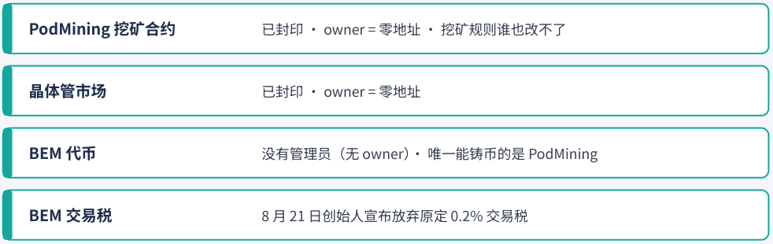

# 第 9 章：安全部分

> 本文件由 PDF 自动转换生成，尚未完成独立校对；请结合页码回溯注释核对原文。

<!-- source: tapeout-beginner-guide-v1.5-web.pdf p.100 -->

## 第 9 章安全上手：风险提示与自我保护

#### ⏱ 一分钟看懂本章

任何新生态都有成长中的不完美，知道要注意什么，你就能玩得更安心。这一章把合约权限、经济模型的讨论、常见骗局一次讲清，并告诉你怎么自己核对。

- 创始人已经放弃、链上能确认的权限：挖矿合约 PodMining 和晶体管市场已经封印（owner 是零地址），挖矿规则谁也改不了；BEM 代币没有管理员，只有挖矿合约能铸币。

- 文档和链上有一处出入：.tape 月费（文档写 0.08 BNB，链上读数是 0）。

- 全网算力上升会拉长回本期，估算留足余量，只投入闲钱。

- 认准 BEM 合约 0x5ce0…695a；私信“帮你组矿机”的一律不理；用完及时撤销授权；卖矿机前先领奖励。

- 9.5 借 Bitget 被盗讲清楚：前端上链（DeWEB）能防网页被调包，防不了后台被控。

前面几章讲的是“它怎么运作”，这一章是一份“安全上手手册”。把这些点弄清楚，不是为了吓退你，而是让你玩得更踏实、更长久。我们把要注意的事分成三类： **合约权限** 、 **经济模型** 、 **诈骗与操作失误** ，最后借 9 月 25 日的 Bitget 被盗事件，聊聊“前端上链”能防什么。每一条都尽量给出你自己能去核对的方法——自己会查， 才是真的放心。

#### 提示

**本章所有“链上实测”** 均由本书在 **2026-09-25** （新加坡时间约 14:05‒15:21，BNB Chain 区块约 123,897,904‒123,908,049）通过公共 RPC 节点只读查询得到，没有发送任何交易。合约状态可能随时改变，请以你查看时的链上数据为准。

### 9.1 合约权限：创始人已经放弃了哪些权限

#### ⏱ 一分钟看懂本节

这一节只回答一个问题：哪些规则已经定死、谁也改不了。

- “封印” = 管理员把改规则的钥匙扔了；封印之后，谁都改不了。

- 已封印：挖矿合约 PodMining、官方晶体管市场。BEM 代币本身没有管理员，只有挖矿合约能铸币。

- 这些状态你可以在 BscScan 上免费自查（Read Contract → isSealed / owner），不用连钱包。

**先解释一个词：封印（seal）。** TapeOut 的合约普遍带一个 seal() 函数。一旦调用，就永久放弃升级权， i sSealed() 从 false 变成 true ，owner（管理员）变成零地址。

<!-- source: tapeout-beginner-guide-v1.5-web.pdf p.101 -->

### 创始人已经放弃了哪些权限？

前三行为本书 2026-09-25 链上只读实测，交易税一行来自创始人公告；只列能确认的部分，不代表所有合约都已放弃权限

<!-- Start of picture text -->
PodMining 挖矿合约 已封印 · owner = 零地址 · 挖矿规则谁也改不了 晶体管市场 已封印 · owner = 零地址 BEM 代币 没有管理员（无 owner）· 唯一能铸币的是 PodMining BEM 交易税 8 月 21 日创始人宣布放弃原定 0.2% 交易税 <!-- End of picture text -->

《TapeOut 新手完全指南》· 自绘示意图

创始人已经放弃的权限（本书 2026-09-25 链上实测 + 创始人公告，自绘）。

|**合约 / 权限**|**链上状态（2026-09-25）**|**含义**|
|---|---|---|
|PodMining 0x7E2E…7b46|**已封印**，owner = 零地址|挖矿规则已冻结，谁也改不了|
|晶体管市场 0xA6a8…16E4|**已封印**，owner = 零地址|规则已冻结|
|BEM 代币 0x5ce0…695a|没有管理员；铸币者 = PodMining|只有挖矿合约能铸币，总量封顶 2,100 万|
|BEM 交易税|创始人 8 月 21 日宣布放弃原定 0.2% 交 易税（第 6 章）|买卖 BEM 没有交易税|

PodMining 的封印经过了 48 小时的 **时间锁** （TimelockController 0xbc95…4876 ）：2026-09-12 提交排程交易 （链上可查），2026-09-14 17:38（新加坡时间）执行，创始人 @Blonskr 当天发了公告。

社区时间线 8 月 18 日有“市场合约 admin 已放弃”的说法，链上能确认的是 **晶体管市场** 已封印、owner 为零地址。

#### 提示

**读的时候注意一点** ：这里只列链上能确认、创始人已经放弃的权限。宣言里“已放弃所有权限”的说法本书没能在链上逐一确认，所以 **不要理解成所有合约都已放弃权限** 。其他合约的状态，你随时可以按上面的方法在 BscScan 上自查。

<!-- source: tapeout-beginner-guide-v1.5-web.pdf p.102 -->

#### 说法冲突

**文档与链上的一处出入：.tape 名字到底要不要月费？**

- TapeKit README 与规范：激活费 0.08 BNB / 30 天，可一次付 1‒120 个月，不退款。 HashPort 页面：“0 BNB 服务费”，并说域名绑定“可选、免费”。社区时间线称 09-19 起免除月费。

链上实测：DomainBinding 合约 monthlyFee() 返回 **0** 。

**本书结论** ：写作时链上费率为 0，文档尚未同步，费用以后也可能调整。付费前请再查一次。

### 9.2 经济模型：听听不同的声音

一个健康的生态，欢迎不同的声音。了解质疑者在担心什么，能帮你更清醒地做决定。早在 8 月 17 日， Odaily 星球日报作者 Golem（@web3_golem）的报道就提出过冷静的看法：协议本质上仍接近 EVM 上的 “矿机游戏”模式，电子电路知识门槛不低，金融化以后可能出现亏损纠纷。CoinW 研究院的文章（2026-0922，PANews 转载）则比较系统地整理了市场上的“庞氏”质疑。我们把核心逻辑转述如下（观点属于原作者）：

1. 购买元件、做矿机、追加投入，能让你拿到更多代币，但 **不会自动增加承接卖盘的 BNB 或稳定币** 。

2. 如果手续费主要来自认购、挖矿和内部交易，那么回购实际上是 **把参与者的钱重新投回市场** ，而不是引入外部收入。

3. 新增资金放缓时，老矿工和持币者要卖出兑现， **谁来接** 就成了问题。流动性锁定只能防止撤池， **不能阻止集中卖出造成价格冲击** 。

4. 元件价格上涨后，新人追加投入可能只能维持原有份额， **越热越难回本** 。

文章也承认，协议已有一定交易量和链上活动，并建议关注“有多少电路被持续调用、产生多少独立付费”。 这其实也是生态最值得期待的方向：电路被真正用起来，价值就有了源头。

#### 提示

对照第 5 章的回本计算：全网权重每翻一倍，你的日产出就减半，回本天数就翻倍。这正是上面第 4 点的数学含义。另外，回本天数是按“币价不变”算的。币价可能大起大落，估算时用保守的价格，只投入闲钱，心态会轻松很多。

### 9.3 认准正版：避开仿冒与误报

项目一火，蹭热度的就会来。好在分辨起来并不难，记住下面几条就够用。

#### 同名但无关的代币

X Layer 上的 **TapeOut X（TAPEOUTX）** ，合约 0x16aa672dda63f5acd0de098c04c4a3e957d1eeee 。 Bitrue 博客对它有介绍，但它 **与 TapeOut 协议和 BEM 无关** 。

<!-- source: tapeout-beginner-guide-v1.5-web.pdf p.103 -->

flap.sh 上的 **$TapeOut** meme 币，自称与开发者无关。

- BNB Chain 上还有一个名字和符号都叫 “TapeOut” 的代币，合约 0x3142892d1ae4b98eaf9e0471445 f5474be0e7777 （本书 2026-09-25 链上读到 name / symbol 均为 TapeOut）。它和上面 flap.sh 的 $TapeOut 是不是同一个、谁发的，本书没能查清；可以确定的是，它 **不是 BEM** 。

- 真正的 BEM 合约是 0x5ce033B2bFCa3Af30b3e8C8457DeaF776A8b695a （BNB Chain，8 位小数）。 **买之前核对合约地址** ，别只看名字。

9 月 22 日市场热闹时，社区作者 Martin_sen（@martin23_sen）发了提醒，YW（@ywweb3）随后转述扩散：TapeOut 唯一官方代币是 $BEM（上面这个地址），小心假币、蹭名字的 meme 币，以及“一堆20U kol 宣发”的项目。

#### 常见的五种骗局话术

社区作者 @93bitmap 8 月 28 日写过一篇很实用的防骗帖，总结了热度起来后最常见的套路：

1. 私信说“我帮你设计矿机”“代组电路”；

2. 假官网、假客服、假空投；

3. 仿盘：名字故意靠近 TapeOut、Behemoth、Genesis、BEM 的代币；

4. 第三方工具的授权陷阱：无限额授权（Approve）、可升级的租赁 / 代领合约；

5. “先打过来，我帮你组”。

他还把转账、Approve、签名登录、SetApprovalForAll 分别在签什么讲了一遍，最后一句很好记：“会设计， 不会保证。会报价，不会代持。会做工具，不会要你的种子。”

#### 抽奖类玩法

有的社区应用是开奖 / 抽奖类玩法，比如 tapeout.cc.cd（页面标题“Tapeout 芯火夺宝”）。作者策略老陈 （@ZxzxbdSdRw7565）的介绍说，它用 Behemoth 上的一枚电路来算开奖结果。这类玩法本质上带有博彩性质，参与前先了解你所在地区的规定，只用娱乐预算。

#### 第三方“合作”宣传

第三方账号宣布“与 TapeOut 合作”时，先看创始人或官方有没有确认。比如 UPay 官方账号 9 月 10 日宣布与 TapeOut 合作，写作时本书没有看到创始人方面的确认。

#### 钱包弹出“钓鱼网站”警告怎么办

用 MetaMask 等钱包打开 tapeout.net 时，有时会弹出“钓鱼网站”之类的警告。说白了，这是因为这个钱包的团队 **还没有把 TapeOut 协议加进它的名单** ，TapeOut 还很新，这种情况并不少见。

最省事的办法： **直接换用 OKX 钱包（OKX Wallet）** 。不管用哪个钱包，都记得核对网址和官网 tapeout.net 一字不差，只从官网或创始人 @Blonskr 公告里的链接进入。

#### 二手资料的错误

<!-- source: tapeout-beginner-guide-v1.5-web.pdf p.104 -->

KuCoin 博客的科普文里有明显错误（例如“供应不足 4 万”），请不要直接引用它的数字。本书遇到数字时， 尽量回到链上或官网原文核对。

### 9.4 五个好习惯：你自己就能掌控

下面这几条全在你自己手里，养成习惯，就能避开绝大多数的坑。

- **授权（approve）** ：很多第三方市场和工具需要你授权它们操作你的 NFT 或代币。授权后，对方合约可以在你不再确认的情况下转走资产。用完及时撤销（可用 BscScan 的 Token Approval Checker 等工具查询）。

- **第三方流片平台** ：9 月 12 日起流片要付协议费（第 3 章）。创始人 @Blonskr 的升级公告要求第三方平台先读合约的 TAPEOUT_FEE() 再带上这笔钱。如果某个第三方平台让你付的钱明显多于协议费 + 晶体管 + gas，先停下来问清楚。

- **挂单期间的奖励** ：官网说明，未领取的挖矿奖励会跟着 NFT 一起转移； claim 任何人都能调用，奖励打给 **调用时的持有人** ，而且 **不受挂单冻结保护** 。卖矿机前先领奖励。

- **容器里的资产** ：容器（ERC-6551 账戶）里的资产跟着电路 NFT 走。卖掉电路，容器里的东西也跟着卖掉。

- **TapeSend 的元数据公开** ：谁给谁发消息、什么时候发，链上都看得到。

**私钥和助记词** ：任何人、任何网站、任何“客服”要你的助记词，一律是骗局。

### 9.5 从 Bitget 被盗说起：前端上链能防什么、防不了什么

#### ⏱ 一分钟看懂本节

- 9 月 25 日凌晨（新加坡时间），交易所 Bitget 的部分热钱包、温钱包被转走约 3.5 亿美元。按 Bitget 目前的说法，是 **钱包后台系统被入侵** ，不是私钥丢了，也不是网页被改。

- 当天创始人和社区借这件事讲 DeWEB（前端上链）。YW 的长文把“能补哪几环、补不上哪几环”都写了，值得一读。

- 编者的看法：DeWEB 主要防的是“网页被调包”（Bybit 那一类）；Bitget 这种后台被控的情况，光靠前端上链挡不住。

#### 先说发生了什么（只写公开报道里有的）

- **时间和规模** ：Bitget 官方安全通告说，9 月 24 日 18:31 UTC（新加坡时间 9 月 25 日 02:31）系统发现部分交易所热钱包有未授权转出，约 3.516 亿美元受影响；冷钱包安全；损失由超过 4.64 亿美元的用戶保护基金承担；充值和交易照常，提币暂停。

- **怎么被盗的** ：据 CoinDesk 的报道，CEO Gracy Chen 在 X 上说，攻击者攻破了钱包体系里的一套关键后台系统，用它伪造转账数据，再触发交易所自己的授权流程把钱转走； **已排除私钥泄露** ；具体怎么入侵的还在调查，确认后会发完整技术报告。

<!-- source: tapeout-beginner-guide-v1.5-web.pdf p.105 -->

- **和 Bybit 那次有什么不同** ：链新闻 ABMedia 的报道转述 Chen 的直播：2025 年 Bybit 被盗，核心是 Safe 多签钱包的前端被入侵、界面被篡改，签名的人以为在做正常交易；Bitget 这次则是后台授权流程本身被利用。黑客是谁，目前也还没有定论。

用大白话说：保险柜钥匙没丢，是“开提款单的办公室”被人占了，假单子走的是真流程。

#### TapeOut 圈子当天说了什么

- 12:05，创始人 @Blonskr 发了“郑重呼吁”，请 DeFi 和第三方工具把前端部署到 DeWEB，并表示个人赞助前端上链的安全费用（详见第 7 章）。13:53 他又转发了当晚 21:00 的 Space 预告，主题是“谴责黑客、为行业找更安全的方案”（转发帖）。这场 Space 由本书编者洪七公（@CryptoLoser9）发起。 15:43，社区作者 YW（@ywweb3）发了长文《从 Bitget 被盗，谈为什么币圈应该多看一眼 TapeOu t》，创始人 15:54 引用转发。

- @TapeOutWorld（本书按未核实是否官方处理）当天发了两条英文帖：一条说前端不只是界面，还会影响你最终签下什么，DeWEB 能让前端文件和版本更容易公开核对；另一条说一笔交易在链上有效， 不等于它在业务上合理，安全不该只靠“相信服务器、相信更新、相信看起来没问题的页面”。

#### YW 的长文说了什么（作者观点）

文章的核心一句是： **链很硬，链下面那一层很软。** 区块链只保证后半段：签好的交易上链后谁也改不了。但前半段它管不到，比如这张单是谁开的、屏幕上显示的和送去签名的是不是同一份、出金规则有没有在服务器里被人改了一行。

作者认为，像 TapeOut 这样的方向可能补上“签名生效之前”的五环：

1. **出金规则写到链上** ：只许打到事先登记的地址、大额要等一段时间、超额要第二套条件。这样一来，假指令就不再自动等于合法指令。作者也说，严格的多签和资金策略合约同样能做到，TapeOut 不是唯一解。

2. **你看到的页面就是链上登记的那一份** ：TapeKit 打开网站时按哈希核对，防的是 Bybit 那种“屏幕撒谎”。作者明说，这补的不是 Bitget 后台那一刀，而是同一类里更常见的前端被调包。

3. **关键逻辑不能偷偷换** ：把管钱的判断固化成链上电路，逻辑被换掉就成了全网看得见的事。

4. **钱和规则放在一起** ：容器把一段逻辑和一笔资产绑在同一个账戶里。

5. **签名时看到的是链上身份** ，而不是网页自己起的名字。

作者也把补不上的部分写得很坦白：链上电路是公开的， **不能存私钥** ；一条链上的电路 **替不了** 交易所在 XRP 等其他链上的热钱包签字；如果规则本身就是“相信官方那把钥匙”，钥匙一丢照样出事；已经上链的转账 **撤不回** 。他还提醒，TapeOut 上线还不到两个月，执行慢、生态小，“关注它，不等于买它、吹它”。

<!-- source: tapeout-beginner-guide-v1.5-web.pdf p.106 -->

#### 提示

**编者注：前端上链防的是哪一种攻击。** 按 Bitget 目前公布的说法，这次是钱包 **后台系统** 被入侵、假数据走了真实的授权流程，而不是用戶或签名人打开的网页被篡改；具体入侵方式官方还在调查。DeWEB 做的事，是保证你打开的网页文件和链上登记的一致，它对付的主要是 Bybit 那一类“前端被调包”。所以，创始人“问题大都出在前端被篡改”的说法更贴合 Bybit 那次，放在 Bitget 身上目前还没有依据； 他引用 YW 长文时说的“部署在 DeWEB 就能彻底解决这个问题”，也说得太满了。另外，已封印的合约保护的是链上合约自己的规则，管不到中心化交易所自己的热钱包。前端上链是有用的一层防护，但它替代不了后台安全和权限管理。等 Bitget 发布完整技术报告后，再下结论更稳妥。

#### 本章要点

- 创始人已放弃、链上可确认： **PodMining、晶体管市场已封印** （owner 为零地址）；BEM 代币没有管理员，只有挖矿合约能铸币；BEM 没有交易税。这不代表所有合约都已放弃权限。 .tape 月费：文档写 0.08 BNB，链上实测为 0，可能再变。

- 认准官方代币、不理私信“代组矿机”，抽奖类玩法只用娱乐预算。

- 经济模型的主要质疑是“回本依赖后续资金”；全网权重上升会直接拉长回本期。

- 认准 BEM 合约地址 0x5ce0…695a ，警惕同名币；及时撤销授权，卖矿机前先领奖励。

- Bitget 被盗（2026-09-25）：按官方说法是钱包后台被入侵、不是私钥泄露，也不是网页被改。DeWEB 主要防“前端被调包”，是有用的一层，但挡不住后台被控，也替代不了后台安全管理。

#### 延伸阅读

- [M08] 《TapeOut 机制与风险解析》 —— CoinW研究院 / PANews（专栏）：https://www.panewslab.com/zh/articles/01a0c86f-6cb0-7373-83a4-d0fbfaa58aae

- [O02] TapeOut 宣言 PDF —— TapeOut 官方（Blonskr） / tapeout.net（PDF）：https://tapeout.net/TapeOut-Protocol.pdf

- [D03] 处理器工厂 —— BscScan / bscscan.com：https://bscscan.com/address/0x68224F668083c29e9800Be2a646d42d18cedF7e2

- [D02] PodMining 与 Timelock —— BscScan / bscscan.com：https://bscscan.com/address/0x7E2E0DC66a3bD9103E69b766afA62d9f7b697b46

- [D01] BEM 代币 —— BscScan / bscscan.com：https://bscscan.com/token/0x5ce033B2bFCa3Af30b3e8C8457DeaF776A8b695a

- [W01] TAPEOUTX 同名币（反面案例） —— Bitrue Blog / bitrue.com：https://www.bitrue.com/blog/tapeout-x-tapeoutx-price-contract-address-how-to-buy

- 防骗帖：热度起来后最常见的五种话术（2026-08-28） —— 93.bitmap（@93bitmap） / X：https://x.com/93bitmap/status/2093269641229738263

- 紧急风险提示：唯一官方代币 $BEM（2026-09-22） ⸺ YW（@ywweb3） / X：https://x.com/ywweb3/status/2102279391695053145

- [O18] TapeKit 安全声明 —— TapeOut Labs / GitHub：https://github.com/TapeOutProtocol/TapeKit/blob/main/SECURITY.md

<!-- source: tapeout-beginner-guide-v1.5-web.pdf p.107 -->

- [X49] 从 Bitget 被盗，谈为什么币圈应该多看一眼 TapeOut（2026-09-25） ⸺ YW（@ywweb3） / X（长文）：https://x.com/ywweb3/status/2103389804402495793

- [M22] Bitget 安全通告：热钱包事件 —— Bitget（官方公告） / bitget.com：https://www.bitget.com/support/articles/12560603896024

- [M23] Bitget 被盗：伪造转账、并非私钥泄露 —— CoinDesk（Omkar Godbole） / CoinDesk：https://www.coindesk.com/markets/2026/09/25/bitget-s-usd351-million-hack-happened-via-spoofed-transfers-not-private-keys-ceo-gray-chen-says

- [M24] Gracy 回应 Bitget 被骇细节 —— 链新闻 ABMedia（Neo） / abmedia.io：https://abmedia.io/gracy-chen-bitget-wallet-bybit
